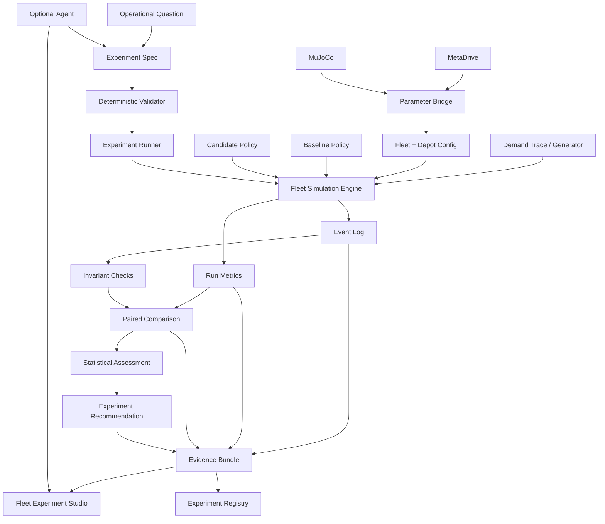

# Hermes Phase 9 — Fleet Simulation & Pre-Production Experimentation Platform
## Product Requirements Document + System Design + Implementation Handoff

**Working name:** Hermes FleetLab  
**Status:** Design proposal / implementation handoff  
**Repository:** Hermes  
**Primary objective:** Build hands-on experience in fleet-wide simulation, pre-production experimentation, ML/OR policy evaluation, developer experience, and operational systems  
**Primary audience:** Fleet Simulation PM/Engineering, Data Science, Operations Research, Operations, Developer Platform, Claude / ChatGPT Desktop coding agents  
**Scope:** Simulation-only; synthetic or explicitly labeled public/replay inputs; no production vehicle control  
**Date:** 2026-08-22

---

# 0. Executive Summary

Hermes already has strong foundations in **vehicle-level simulation, deterministic evidence, ADAS evaluation, reproducibility, failure-to-regression workflows, and simulator abstraction**.

The next phase should deliberately solve a different problem:

> **How can internal teams safely and quickly evaluate offboard fleet and operational changes before launch?**

This phase adds a new **fleet-level discrete-event simulation and experimentation platform** above the existing Hermes evidence architecture.

The product will simulate:

- rider demand,
- vehicle availability,
- dispatch,
- pickup and trip execution,
- repositioning,
- battery / charging,
- depot queues,
- cleaning / inspection / maintenance turnaround,
- vehicle outages,
- service-area constraints,
- demand surges,
- operational policy changes,
- ML / OR policy candidates.

The core workflow becomes:

```text
Operational Question
        ↓
Experiment Specification
        ↓
Demand + Fleet + Depot Scenario
        ↓
Baseline Policy vs Candidate Policy
        ↓
Paired Fleet Simulation Runs
        ↓
Commercial + Operational Metrics
        ↓
Statistical Comparison
        ↓
Front-End Review / Investigation
        ↓
Advance / Hold / Inconclusive
        ↓
Experiment Registry + Reproducible Evidence
```

This is intentionally different from Hermes's autonomous-driving safety gate.

The fleet layer must answer questions such as:

- What happens to rider wait times if a charging policy changes?
- Does a new dispatch objective reduce deadhead without hurting service levels?
- What is the fleet-wide effect of longer depot turnaround time?
- How does a demand surge interact with charger capacity?
- Would an ML demand forecast improve repositioning before launch?
- What operational KPI changes if a software release changes average trip duration or vehicle availability?
- Can an OR policy outperform a simple baseline under the same demand trace?

The central product thesis is:

> **The right simulation is the lowest-cost model with enough fidelity to answer the decision.**

Hermes should therefore become a **multi-resolution simulation platform**:

```text
Fleet / commercial operations
    → FleetLab discrete-event simulation

Driving behavior / traffic interaction
    → MetaDrive

Contact-rich / actuator-level / articulated physics
    → MuJoCo

Shared:
    experiment registry
    provenance
    reproducibility
    comparison
    evidence
    developer experience
```

MetaDrive and MuJoCo remain valuable, but neither should be forced to answer fleet-operations questions for which they are the wrong abstraction.

---

# 1. Why This Phase

## 1.1 Current Hermes strengths

Hermes already demonstrates:

- simulator-neutral interfaces,
- deterministic / reproducible execution discipline,
- MetaDrive driving simulation,
- ADAS controller and evaluation work,
- scenario definition,
- fault injection,
- baseline/candidate comparison,
- non-compensatory safety evaluation,
- traceable evidence bundles,
- read-only review workflows,
- failure-to-regression automation,
- agent-assisted workflow orchestration.

The current MuJoCo exploration additionally demonstrates:

- pinned physics-engine versions,
- explicit physics options,
- model hashing,
- same-host / same-version replay determinism,
- importance of capturing full integration state,
- contact / actuator configuration pitfalls,
- adapter conformance to the Hermes seam,
- the distinction between reproducibility and physical validity.

## 1.2 The missing experience

The major remaining simulation-product gap is **fleet-wide operational experimentation**.

Vehicle simulation answers:

> "How does the vehicle or policy behave?"

Fleet simulation answers:

> "What happens to the service and operation when a system-level policy changes across hundreds or thousands of vehicles and requests?"

That requires a different simulation model:

- discrete events,
- queues,
- resource constraints,
- demand processes,
- policy optimization,
- repeated stochastic experiments,
- operational KPIs,
- developer workflows,
- experiment governance.

## 1.3 What done looks like

Phase 9 is done when this description is true of the system that exists:

> FleetLab is a fleet simulation and experimentation platform for synthetic autonomous ride-hailing operations. It models rider demand, vehicle state, dispatch, charging and depot operations; lets ML/OR policies plug into a stable interface; runs paired baseline/candidate experiments across controlled stochastic seeds; reports service, utilization, wait-time and depot metrics; and gives developers a self-service UI and a reproducible experiment registry.

This remains a personal simulation prototype. It is not production experience and must never be described as such.

---

# 2. Product Vision

## Vision

Make complex fleet and operational decisions **testable before launch** through a self-service simulation platform that lets Engineering, Data Science, OR, Operations, and Product teams run trusted experiments without rebuilding infrastructure.

## North-star promise

> **An internal user should be able to go from "What if we change this fleet policy?" to a reproducible baseline-vs-candidate answer with operational tradeoffs in under 10 minutes for a standard experiment.**

This is a prototype target, not a production SLA.

## User value

Instead of:

```text
question
→ custom notebook
→ hand-built simulator
→ one-off script
→ screenshots
→ conflicting interpretation
```

FleetLab should provide:

```text
question
→ experiment template
→ policy plug-in
→ paired runs
→ shared metrics
→ comparison
→ reproducible evidence
→ decision record
```

---

# 3. Product Principles

1. **Simulate the decision, not everything.**
2. **Use the cheapest fidelity that can answer the question.**
3. **Baseline and candidate see the same exogenous world.**
4. **Stochastic simulation requires distributions, not a single run.**
5. **No cherry-picked seeds.**
6. **Operational invariants are hard constraints.**
7. **Commercial tradeoffs are multi-dimensional; no magic composite score.**
8. **An experiment can be inconclusive.**
9. **Synthetic data must be labeled synthetic.**
10. **Calibration state must be visible.**
11. **Developer experience is a product requirement, not documentation cleanup.**
12. **Policies plug into the platform; teams should not fork the simulator.**
13. **ML/OR models are candidates, not authorities.**
14. **Simulation results do not imply production performance.**
15. **The experiment definition must be frozen before results are inspected when used for a decision claim.**
16. **Every result must be reproducible from a resolved experiment specification and seed set.**
17. **Multi-resolution simulation should exchange parameters or distributions, not pretend different engines produce identical trajectories.**
18. **Physical authority is measured, not assumed.**

---

# 4. Explicit Scope and Honesty Boundary

## 4.1 In scope

- synthetic ride-hail demand,
- discrete-event fleet simulation,
- depot operations,
- charging queues,
- vehicle service / cleaning / maintenance queues,
- dispatch policies,
- repositioning policies,
- charging policies,
- simple route / travel-time models,
- ML / OR policy plug-ins,
- Monte Carlo / repeated experiments,
- paired baseline/candidate evaluation,
- experiment registry,
- developer CLI / SDK,
- local front-end experiment studio,
- integration with MetaDrive-derived summary parameters,
- optional MuJoCo-derived physical calibration parameters,
- reproducible evidence bundles,
- agent-assisted experiment authoring.

## 4.2 Out of scope

- real Waymo data,
- Waymo proprietary algorithms,
- production fleet forecasting,
- actual commercial revenue forecasts,
- public-road deployment,
- real vehicle control,
- CAN bus,
- production dispatch,
- production charging infrastructure,
- safety certification,
- claims of real AV fleet performance,
- claims that the simulator accurately represents Waymo's operations,
- claims of production-equivalent fidelity.

## 4.3 Required labels

Every experiment surface should expose:

```text
SIMULATION_ONLY
SYNTHETIC_OR_EXPLICITLY_SOURCED_INPUTS
NOT_CALIBRATED_TO_WAYMO_OPERATIONS
NOT_PRODUCTION_FORECAST
NO_DEPLOYMENT_AUTHORITY
```

When a parameter is empirically calibrated from Hermes's own simulator probes, mark:

```text
CALIBRATED_TO_LOCAL_SIMULATOR_MEASUREMENT
```

not "real-world calibrated."

---

# 5. Target Users

## Persona A — Operations / Fleet Product Manager

### Questions

- What happens if depot turnaround time increases?
- What if charger capacity changes?
- What if we alter vehicle availability policy?
- Which changes improve service without creating operational bottlenecks?

### Needs

- meaningful commercial KPIs,
- scenario templates,
- easy comparison,
- clear assumptions,
- ability to explain results.

---

## Persona B — Operations Research Scientist

### Questions

- Does a new optimization policy outperform the baseline?
- Under which demand and capacity regimes?
- Is the improvement robust across stochastic demand?

### Needs

- policy plug-in interfaces,
- controlled random seeds,
- batch experiments,
- raw metrics,
- confidence intervals,
- exportable data.

---

## Persona C — Data Scientist / ML Engineer

### Questions

- Does a demand forecast improve repositioning?
- Does a learned ETA or availability model improve fleet outcomes?
- Where does the model fail operationally?

### Needs

- stable model interfaces,
- feature/data contracts,
- replay inputs,
- experiment registry,
- reproducible evaluation.

---

## Persona D — Simulation Platform Engineer

### Needs

- typed schemas,
- deterministic event semantics,
- isolation between engine and policy,
- observability,
- scale benchmarks,
- reusable templates,
- versioning.

---

## Persona E — Developer / Internal Customer

### Needs

- time-to-first-experiment measured in minutes,
- discoverable CLI,
- guided UI,
- understandable errors,
- templates,
- minimal platform-team tickets.

---

## Persona F — Product / Executive Reviewer

### Needs

- what changed,
- hypothesis,
- experiment scope,
- baseline/candidate,
- KPI deltas,
- confidence,
- guardrail regressions,
- assumptions,
- recommendation,
- limitations.

---

# 6. Core Product Jobs

FleetLab must enable five jobs:

## Job 1 — Model the fleet

Represent vehicles, requests, zones, depots, chargers, service resources, and time.

## Job 2 — Plug in policy

Swap dispatch, repositioning, charging, and service policies without rewriting the simulation.

## Job 3 — Run controlled experiments

Run baseline and candidate under matched exogenous demand and disruption traces.

## Job 4 — Measure operational impact

Measure service, availability, wait time, utilization, queues, empty travel, energy and reliability.

## Job 5 — Make experimentation self-service

CLI + SDK + front-end workflow for non-platform developers.

---

# 7. Simulation Fidelity Architecture

This is a foundational design decision.

## 7.1 Lane 0 — Analytical / Unit Models

Use for:

- queue sanity checks,
- conservation laws,
- known closed-form fixtures,
- controller / policy unit tests.

Examples:

- M/M/1 queue reference case,
- fixed request / fixed fleet assignment,
- deterministic charging queue.

Purpose:

> Catch simulator bugs before interpreting complex experiments.

---

## 7.2 Lane 1 — FleetLab Discrete-Event Simulation

**Primary Phase 9 lane.**

Use for:

- dispatch,
- fleet availability,
- demand,
- depot operations,
- charging,
- repositioning,
- maintenance,
- service-level experiments.

This lane answers:

> "What is the fleet / commercial effect of this offboard policy change?"

---

## 7.3 Lane 2 — MetaDrive

Use for:

- vehicle / traffic behavior,
- trip-level dynamics,
- driving scenario sensitivity,
- ADAS experiments,
- local travel-time / behavior distributions when useful.

This lane answers:

> "How does a driving policy behave in a traffic scenario?"

FleetLab may consume **summary distributions or parameters** derived from MetaDrive.

Example:

```text
MetaDrive experiment
→ trip-duration multiplier distribution
→ FleetLab candidate parameter
→ fleet-wide operational impact
```

Do not couple FleetLab to a live MetaDrive simulation for every trip in P0.

---

## 7.4 Lane 3 — MuJoCo

Use only for questions requiring:

- contact-rich physics,
- actuator-level dynamics,
- articulated mechanisms,
- physical interaction,
- higher-fidelity system calibration.

This lane answers:

> "What happens physically under this modeled interaction?"

MuJoCo should not be used as a generic ride-hailing fleet engine.

Possible future bridge:

```text
MuJoCo calibration
→ physical service-time / actuation / interaction distribution
→ FleetLab parameter
```

This is P2, not P0.

---

## 7.5 Fidelity Router

Add a lightweight "simulation question classifier":

```text
Question type                       Preferred lane
---------------------------------------------------------------
fleet dispatch / charging           FleetLab
depot queue / capacity               FleetLab
service-area demand                  FleetLab
driving interaction                  MetaDrive
AEB / traffic challenge              MetaDrive
contact / articulated mechanism      MuJoCo
known queue sanity check             analytical fixture
```

The router need not be AI-powered.

The product lesson:

> **Choosing the right simulation abstraction is itself a platform capability.**

---

# 8. Fleet Domain Model

## 8.1 Vehicle

```text
Vehicle
  id
  zone
  status
  battery_soc
  seats
  available_at
  depot_id?
  current_request_id?
  accumulated_trip_km
  accumulated_empty_km
  service_due?
```

### Vehicle states

```text
OFFLINE
IDLE
ENROUTE_PICKUP
ON_TRIP
REPOSITIONING
QUEUED_CHARGE
CHARGING
QUEUED_SERVICE
IN_SERVICE
```

State transition invariants must be explicit.

---

## 8.2 Rider Request

```text
Request
  id
  request_time
  origin_zone
  destination_zone
  party_size
  max_wait_s
  assigned_vehicle_id?
  pickup_time?
  dropoff_time?
  terminal_state
```

### Request states

```text
CREATED
WAITING
ASSIGNED
PICKED_UP
COMPLETED
CANCELLED
UNSERVED
```

---

## 8.3 Zone

```text
Zone
  id
  centroid
  demand_profile
  travel_time_to_zone
  service_allowed
```

P0 can use a zone-to-zone travel-time matrix.

---

## 8.4 Depot

```text
Depot
  id
  zone
  parking_capacity
  charger_count
  service_bay_count
  cleaning_bay_count
  operating_hours
```

---

## 8.5 Charging Resource

```text
Charger
  id
  depot_id
  power_kw
  status
```

P0 may simplify charging as duration-to-target-SOC rather than electrochemical modeling.

---

## 8.6 Service / Maintenance

```text
ServiceTask
  type
  duration_distribution
  resource_required
  priority
```

Examples:

- cleaning,
- inspection,
- minor maintenance,
- software service window.

---

# 9. Event Model

FleetLab should be a discrete-event simulator.

## P0 event types

```text
SIMULATION_STARTED
REQUEST_CREATED
REQUEST_ASSIGNED
VEHICLE_DISPATCHED
PICKUP_COMPLETED
TRIP_COMPLETED
REQUEST_CANCELLED
REQUEST_UNSERVED

REPOSITION_STARTED
REPOSITION_COMPLETED

CHARGE_REQUESTED
CHARGE_QUEUE_ENTERED
CHARGE_STARTED
CHARGE_COMPLETED

SERVICE_REQUESTED
SERVICE_QUEUE_ENTERED
SERVICE_STARTED
SERVICE_COMPLETED

VEHICLE_OFFLINE
VEHICLE_ONLINE

POLICY_DECISION
EXTERNAL_DISRUPTION
SIMULATION_COMPLETED
```

Every event must have:

```text
event_id
simulation_time
entity_type
entity_id
event_type
policy_version?
cause?
metadata
```

---

# 10. Demand Model

## 10.1 P0 synthetic demand

Create time-varying zone demand using configurable Poisson arrivals.

Example:

```yaml
demand:
  zones:
    downtown:
      hourly_rate:
        "00-06": 5
        "06-09": 35
        "09-16": 20
        "16-19": 45
        "19-24": 25
```

Destination probability matrix:

```yaml
destination_mix:
  downtown:
    airport: 0.20
    residential: 0.35
    downtown: 0.25
    entertainment: 0.20
```

## 10.2 Demand trace mode

Support fixed request traces:

```text
request_time, origin, destination
```

This allows exact paired baseline/candidate replay.

## 10.3 P1 forecast model

Interface:

```python
class DemandForecastProvider(Protocol):
    def forecast(
        self,
        now: SimTime,
        horizon: timedelta,
        state: FleetState,
    ) -> DemandForecast:
        ...
```

Initial implementations:

- perfect oracle over synthetic trace,
- historical moving average,
- intentionally biased forecast.

The point is to evaluate downstream operational effect, not build a state-of-the-art forecaster.

---

# 11. Travel-Time Model

## P0

Zone-to-zone matrix:

```yaml
travel_time_s:
  downtown:
    airport: 900
    residential: 480
```

Support optional time-of-day multiplier.

## P1

Distributional travel time:

```text
LogNormal / Gamma / empirical samples
```

## P1 MetaDrive bridge

MetaDrive experiments may generate:

- trip-time multipliers,
- variability,
- slowdown under scenario class,
- behavior-dependent delay.

FleetLab consumes the summary distribution, not raw trajectories.

---

# 12. Energy / Battery Model

P0 simplified model:

```text
energy_used_kwh = distance_km * kwh_per_km
```

Parameters:

- battery capacity,
- minimum dispatch SOC,
- charging target SOC,
- charge rate,
- reserve threshold.

Vehicle dispatch eligibility must account for battery constraints.

This is an operational abstraction, not a real EV battery model.

---

# 13. Policy Plug-In Architecture

The main design requirement:

> Internal teams should build a policy plug-in, not fork FleetLab.

---

## 13.1 DispatchPolicy

```python
class DispatchPolicy(Protocol):
    def assign(
        self,
        requests: Sequence[RequestView],
        vehicles: Sequence[VehicleView],
        context: FleetContext,
    ) -> Sequence[Assignment]:
        ...
```

P0:

- nearest-available baseline,
- battery-aware nearest baseline.

P1 OR candidate:

- minimum-cost bipartite assignment / Hungarian algorithm.

Cost terms may include:

```text
pickup ETA
empty distance
battery risk
zone scarcity
```

All weights resolved into experiment evidence.

---

## 13.2 RepositionPolicy

```python
class RepositionPolicy(Protocol):
    def plan(
        self,
        idle_vehicles,
        demand_forecast,
        context,
    ) -> Sequence[RepositionMove]:
        ...
```

P0:

- no repositioning,
- static zone targets.

P1:

- forecast-based rebalancing,
- min-cost flow.

---

## 13.3 ChargingPolicy

```python
class ChargingPolicy(Protocol):
    def decide(
        self,
        vehicles,
        depot_state,
        demand_forecast,
        context,
    ) -> Sequence[ChargeAction]:
        ...
```

P0:

- charge below fixed SOC.

P1:

- demand-aware charging,
- capacity-aware charging.

P2:

- OR-Tools scheduling candidate.

---

## 13.4 ServicePolicy

Controls:

- when vehicle goes offline,
- queue priority,
- service/depot assignment.

P0:

- fixed interval,
- FIFO.

---

# 14. ML / OR Experimentation

This section is especially important.

The platform must make ML / OR candidates interchangeable with deterministic baselines.

## 14.1 Required first OR experiment

### Experiment: Dispatch Optimization

Baseline:

```text
nearest available vehicle
```

Candidate:

```text
minimum-cost assignment
```

Objective:

```text
pickup_time_weight
+ empty_distance_weight
+ battery_risk_weight
```

Metrics:

- p50/p90 rider wait,
- served-request rate,
- empty km,
- fleet utilization,
- battery-induced assignment failures,
- compute time per policy decision.

This gives direct hands-on OR-model evaluation experience.

---

## 14.2 Required second OR experiment

### Experiment: Capacity-Aware Charging

Baseline:

```text
vehicle charges whenever SOC < threshold
```

Candidate:

```text
charging policy considers:
  demand forecast
  charger queue
  vehicle availability
  future SOC need
```

Metrics:

- charging queue p50/p90,
- charger utilization,
- fleet availability,
- unserved demand,
- low-SOC events,
- rider wait.

---

## 14.3 Optional ML experiment

### Demand-Forecast Repositioning

Baseline:

```text
historical/static demand
```

Candidate:

```text
forecast provider
```

Evaluate:

- forecast error,
- reposition empty km,
- rider wait,
- service coverage,
- utilization.

Important:

> A better forecast is not automatically a better fleet policy. Measure downstream service impact.

---

# 15. Operational Scenario Catalog

## P0 — six flagship scenarios

### FLEET-001: Nominal Day

Purpose:

- establish baseline,
- validate invariants.

---

### FLEET-002: Demand Surge

Change:

```text
2x demand in selected zones for 60 minutes
```

Questions:

- How quickly does wait time degrade?
- Does repositioning help?
- Which zones starve?

---

### FLEET-003: Charger Outage

Change:

```text
50% charger capacity unavailable
```

Questions:

- queue growth,
- fleet availability,
- unserved demand,
- charging-policy robustness.

---

### FLEET-004: Depot Capacity Reduction

Change:

```text
service / cleaning capacity reduced
```

Questions:

- depot queue,
- offline time,
- service impact.

---

### FLEET-005: Longer Turnaround

Change:

```text
cleaning/service duration +25%
```

This is a canonical "offboard change → commercial performance" experiment.

---

### FLEET-006: Dispatch Policy Change

Baseline vs optimized candidate under identical demand trace.

---

## P1 scenarios

- service area expansion,
- vehicle outage cluster,
- rolling charger maintenance,
- airport demand spike,
- event dismissal surge,
- travel-time slowdown,
- forecast error,
- depot closure,
- mixed fleet capabilities,
- software release increases trip duration,
- software release reduces vehicle availability,
- new pickup policy changes dwell time.

---

# 16. Commercial and Operational Metrics

## 16.1 Rider / service metrics

```text
requests.total
requests.served
requests.unserved
requests.cancelled

service.fulfillment_rate
wait.p50_s
wait.p90_s
wait.p99_s
pickup_eta.mean_s
trip_duration.mean_s
```

---

## 16.2 Fleet metrics

```text
fleet.available_fraction
fleet.utilization_fraction
fleet.occupied_fraction
fleet.idle_fraction
fleet.offline_fraction

vehicle.trips_per_hour
vehicle.empty_km
vehicle.occupied_km
vehicle.deadhead_ratio
```

---

## 16.3 Charging metrics

```text
charging.queue_p50_s
charging.queue_p90_s
charging.utilization
charging.sessions
charging.energy_kwh
charging.low_soc_events
```

---

## 16.4 Depot metrics

```text
depot.queue_p50_s
depot.queue_p90_s
depot.resource_utilization
depot.turnaround_p50_s
depot.turnaround_p90_s
```

---

## 16.5 Policy / platform metrics

```text
policy.decision_latency_ms
policy.error_count

simulation.wall_time_s
simulation.events_processed
simulation.events_per_second
simulation.peak_memory_mb
```

---

## 16.6 Business proxies

Because no real commercial data exists, use explicitly labeled proxies:

```text
business_proxy.served_trips
business_proxy.service_hours
business_proxy.unserved_demand
```

Do not fabricate revenue.

---

# 17. Operational Invariants

These are hard simulation-correctness checks.

Examples:

1. Fleet-state counts always equal configured fleet size.
2. A vehicle cannot serve two requests simultaneously.
3. A request has at most one terminal state.
4. Charger occupancy never exceeds capacity.
5. Depot service occupancy never exceeds capacity.
6. SOC never exceeds configured bounds.
7. A vehicle cannot charge and serve a trip simultaneously.
8. Completed trip requires pickup.
9. Vehicle state transitions must be legal.
10. Every policy action references existing entities.
11. Simulation clock never moves backward.
12. Same fixed trace + policy + seed must replay deterministically.

Violation:

```text
INVALID_EXPERIMENT
```

not "bad fleet performance."

---

# 18. Experiment Model

An experiment is the unit of product usage.

## 18.1 ExperimentSpec

```yaml
experiment:
  id: dispatch-optimization-v1
  question: >
    Does minimum-cost assignment reduce rider wait and empty distance
    without reducing fleet availability?

  baseline:
    dispatch_policy: nearest_vehicle_v1

  candidate:
    dispatch_policy: min_cost_assignment_v1

  scenario:
    template: nominal_day_v1

  fleet:
    vehicles: 250

  demand:
    trace: synthetic_trace_2026_08_22_a

  metrics:
    primary:
      - wait.p90_s
      - vehicle.deadhead_ratio
    guardrails:
      - service.fulfillment_rate
      - fleet.available_fraction

  replications:
    seeds: [101, 102, 103, 104, 105, 106, 107, 108, 109, 110]

  decision_rule:
    type: paired_comparison

  labels:
    data_scope: SYNTHETIC
    production_forecast: false
```

---

# 19. Experimental Rigor

This is one of the highest-value additions.

## 19.1 Common random numbers

For each replication:

```text
baseline seed N
candidate seed N
```

must use the same:

- demand arrivals,
- destinations,
- travel-time disturbances,
- outages,
- external disruptions.

The policy is the variable.

This reduces noise and makes paired deltas interpretable.

---

## 19.2 No seed shopping

The complete seed set must be resolved before results are inspected for a decision claim.

Store:

```text
seed_set_digest
```

---

## 19.3 Repeated runs

Do not report a stochastic policy comparison from one seed.

P0:

```text
N >= 10 paired replications
```

P1:

```text
configurable N with power / precision guidance
```

---

## 19.4 Comparison statistics

For each metric report:

- baseline distribution,
- candidate distribution,
- paired delta distribution,
- median paired delta,
- mean paired delta,
- 95% bootstrap confidence interval.

If the confidence interval includes no-effect threshold:

```text
INCONCLUSIVE
```

Do not force a winner.

---

# 20. Experiment Outcome Semantics

Do **not** reuse the AV safety verdict blindly.

Fleet experimentation requires separate semantics.

## Integrity

```text
INTERNALLY_CONSISTENT
INVALID_EVIDENCE
```

## Experiment validity

```text
VALID
INVALID_EXPERIMENT
```

## Outcome

```text
IMPROVED
REGRESSED
MIXED
UNCHANGED
INCONCLUSIVE
```

## Recommendation

```text
ADVANCE_TO_NEXT_TEST
HOLD
RUN_MORE_EXPERIMENTS
NO_RECOMMENDATION
```

These are not deployment permissions.

Always expose:

```text
deployment_permission: NONE
```

---

# 21. Guardrail Philosophy

Example dispatch experiment:

Primary objective:

```text
reduce p90 wait time
```

Guardrails:

```text
service fulfillment must not drop
deadhead ratio must not materially worsen
fleet availability must not materially worsen
```

No composite score should hide a major regression.

Example outcome:

```text
wait p90:          -8%   improved
deadhead:          -4%   improved
availability:      -0.2% unchanged
fulfillment:       -3%   regressed beyond guardrail

Outcome: MIXED
Recommendation: HOLD
```

---

# 22. Calibration and Validation

A simulation platform is only useful if users understand what has and has not been calibrated.

## 22.1 Calibration states

```text
SYNTHETIC_UNCALIBRATED
ANALYTICALLY_VALIDATED
CALIBRATED_TO_LOCAL_SIMULATION
CALIBRATED_TO_PUBLIC_DATA
```

Do not introduce `REAL_WORLD_VALIDATED` without real evidence.

---

## 22.2 Analytical fixtures

Build simple cases with expected results.

Examples:

- one vehicle / one request,
- fixed queue,
- no-demand day,
- infinite charger capacity,
- zero travel time,
- deterministic service duration.

---

## 22.3 Monotonic / metamorphic tests

Examples under fixed traces:

- removing fleet vehicles should not create extra vehicle capacity,
- charger occupancy cannot exceed charger count,
- zero demand implies zero rider wait measurements,
- infinite service capacity removes depot resource queues,
- doubling request volume should increase or preserve total requests processed,
- identical policies must produce identical paired output.

Be cautious with assumptions such as "more chargers can never worsen every metric"; emergent policy behavior may make naive monotonic assertions invalid.

---

# 23. Cross-Simulator Calibration Bridge

This should be P1, not P0.

## 23.1 MetaDrive → FleetLab

Purpose:

Evaluate the fleet impact of a trip-level behavioral change.

Example:

```text
MetaDrive candidate
  → trip-duration distribution +3%
  → FleetLab
  → effect on vehicle availability, rider wait, depot timing
```

The bridge artifact:

```json
{
  "source_backend": "metadrive",
  "source_experiment": "...",
  "parameter": "trip_duration_multiplier",
  "distribution": {...},
  "scope": "SIMULATION_DERIVED",
  "limitations": [...]
}
```

---

## 23.2 MuJoCo → FleetLab

Optional future lane.

Only use if there is a specific physical question.

Examples:

- robotic/service mechanism duration,
- physical docking interaction,
- actuation calibration.

Do not use MuJoCo merely to say FleetLab is "higher fidelity."

---

# 24. Fleet Experiment Registry

Every experiment gets a stable record.

```text
experiments/<experiment-id>/
  experiment.resolved.yaml
  baseline-policy.json
  candidate-policy.json
  demand-trace.sha256
  seeds.json
  environment.json
  run-index.json
  metrics.json
  comparison.json
  findings.json
  recommendation.json
  trace.sha256
  bundle.sha256
```

Optional large outputs:

```text
events.parquet
runs/<seed>/<side>/...
```

---

# 25. Provenance

Every result should identify:

- Hermes commit,
- FleetLab schema version,
- simulation engine version,
- policy names + versions,
- policy config,
- demand trace digest,
- fleet config digest,
- depot config digest,
- seed set,
- Python version,
- dependency lock digest.

No "latest" policy reference in a completed experiment.

---

# 26. Developer Experience

This is a P0 product requirement.

## 26.1 Time-to-first-experiment

A new developer should be able to:

```bash
git clone ...
pip install -e ".[fleet]"
hermes fleet doctor
hermes fleet demo
```

and see a comparison without writing code.

---

## 26.2 CLI

```bash
hermes fleet scenario list
hermes fleet policy list
hermes fleet experiment template dispatch
hermes fleet experiment validate experiment.yaml
hermes fleet experiment run experiment.yaml
hermes fleet experiment compare <experiment-id>
hermes fleet experiment inspect <experiment-id>
hermes fleet studio
```

---

## 26.3 Policy SDK

Developer flow:

```python
from hermes.fleet import DispatchPolicy

class MyDispatch(DispatchPolicy):
    ...
```

Register:

```bash
hermes fleet policy register my_policy:MyDispatch
```

P0 can use configuration-based built-ins before dynamic plug-in registration.

---

## 26.4 Error quality

Errors should explain:

```text
WHAT FAILED
WHY
HOW TO FIX
WHICH CONFIG FIELD
```

Example:

```text
INVALID_EXPERIMENT:
candidate dispatch policy "min_cost_v2" requires battery_soc,
but vehicle schema "fleet-basic-v1" does not expose that field.

Fix:
- use fleet-energy-v1
- or choose a policy that does not require SOC
```

---

# 27. Fleet Experiment Studio — Front End

Use the existing Hermes local review/workbench philosophy.

## Page 1 — New Experiment

Wizard:

1. Choose question/template.
2. Choose scenario.
3. Choose baseline.
4. Choose candidate.
5. Choose fleet size.
6. Choose demand trace.
7. Choose metrics.
8. Choose seeds / run budget.
9. Validate.
10. Run.

---

## Page 2 — Experiment Overview

Show:

- question,
- hypothesis,
- baseline/candidate,
- data scope,
- assumptions,
- run count,
- outcome,
- recommendation,
- validity/integrity.

---

## Page 3 — Service Performance

Charts:

- rider wait distribution,
- fulfillment,
- requests over time,
- zone service levels.

---

## Page 4 — Fleet Operations

Charts:

- vehicle state over time,
- availability,
- utilization,
- deadhead,
- zone distribution.

---

## Page 5 — Depot / Charging

Charts:

- queue length,
- charger utilization,
- service resource utilization,
- turnaround.

---

## Page 6 — Comparison

For every metric:

```text
baseline
candidate
paired delta
CI
classification
```

Always show regressions next to improvements.

---

## Page 7 — Experiment Provenance

- commit,
- configs,
- policy versions,
- seeds,
- demand digest,
- limitations.

---

# 28. Developer Adoption Metrics

Even for a personal project, instrument proxy measures.

```text
time_to_first_experiment_s
experiment_validation_error_rate
experiments_completed
experiments_reproduced
template_usage_rate
policy_reuse_count
manual_steps_per_experiment
ui_vs_cli_usage
experiment_runtime
```

Do not fabricate developer NPS. If you run actual user studies later, record it honestly.

---

# 29. Performance / Scale Benchmarks

The point is to learn how platform scale affects UX.

## Benchmark ladder

### Tiny

```text
10 vehicles
100 requests
2 zones
```

### Small

```text
100 vehicles
2,000 requests
5 zones
```

### Medium

```text
500 vehicles
10,000 requests
10 zones
```

### Large prototype

```text
1,000 vehicles
25,000 requests
20 zones
```

Record:

- wall time,
- events/sec,
- memory,
- output size.

Do not choose a performance SLA until measured.

---

# 30. Parallel Experiment Runner

P1 requirement.

Parallelize by replication:

```text
seed 101 → worker
seed 102 → worker
...
```

Properties:

- worker isolation,
- stable seed ownership,
- deterministic result merge order,
- bounded concurrency,
- failure retries explicit,
- failed runs never silently omitted.

---

# 31. Experiment Templates

Ship with templates matching real product questions.

## Template A — Dispatch Change

```text
Does candidate dispatch improve rider wait without hurting availability?
```

## Template B — Charger Capacity

```text
What happens if charger capacity drops 50%?
```

## Template C — Turnaround Change

```text
What is the fleet-wide impact of +25% service duration?
```

## Template D — Demand Surge

```text
Does repositioning improve service during a localized surge?
```

## Template E — Forecast Model

```text
Does the new demand forecast improve downstream service metrics?
```

---

# 32. Required Flagship Demo

The most operationally relevant demonstration should be:

## "Depot / Charging Policy Change → Commercial Impact"

### Setup

- 250 vehicles,
- 5 service zones,
- 2 depots,
- constrained charging,
- time-varying synthetic demand,
- morning and evening peaks.

### Baseline

```text
fixed SOC threshold charging
nearest-vehicle dispatch
no proactive repositioning
```

### Candidate

```text
capacity-aware charging
minimum-cost dispatch
forecast-guided repositioning
```

### Evaluate

- p90 rider wait,
- service fulfillment,
- fleet availability,
- charger queue p90,
- deadhead ratio,
- trips/vehicle/hour,
- operational guardrails.

### Story

> "The candidate improves wait time, but a charging queue regression emerges during the evening peak. The platform exposes the tradeoff rather than declaring an overall winner. We then modify charging policy and rerun the same preregistered demand traces."

This is much closer to fleet-simulation product work than another collision demo.

---

# 33. Second Flagship Demo — Offboard Change

## "Depot Turnaround +25%"

Purpose:

Show how an offboard operational change propagates into commercial performance.

Change:

```text
service_duration_multiplier: 1.25
```

Measure:

- depot queue,
- offline fraction,
- fleet availability,
- rider wait,
- unserved demand.

This is intentionally simple.

The PM lesson:

> A small operational assumption can create a fleet-wide nonlinear outcome.

---

# 34. Third Demo — ML / OR Candidate

## "Minimum-Cost Dispatch"

Show:

- baseline nearest vehicle,
- OR assignment,
- common demand trace,
- paired replications,
- metric distributions,
- CI,
- computation cost.

This directly demonstrates experimentation of OR models before launch.

---

# 35. Agentic Assistance — Optional P1

Agentic AI may assist the developer experience.

Use cases:

- convert a natural-language question into an experiment draft,
- suggest scenario templates,
- identify missing metrics,
- explain regressions,
- find similar past experiments,
- draft a decision brief.

Example:

```text
User:
"What would happen if we lose half the chargers at Depot A during evening peak?"

Agent:
→ selects Charger Outage template
→ proposes baseline/candidate
→ selects fleet/depot metrics
→ drafts experiment.yaml
→ deterministic validator checks it
→ user approves run
```

The agent cannot:

- invent observed data,
- choose favorable seeds after seeing results,
- alter metric values,
- mark an invalid experiment valid,
- grant deployment permission.

---

# 36. Architecture



---

# 37. Software Architecture

Suggested additive structure:

```text
src/hermes/
  fleet/
    domain/
      models.py
      events.py
      enums.py
      protocols.py

    engine/
      clock.py
      event_queue.py
      simulator.py
      state.py

    demand/
      generator.py
      trace.py
      forecast.py

    policies/
      dispatch.py
      reposition.py
      charging.py
      service.py
      registry.py

    operations/
      depot.py
      charging.py
      service.py

    metrics/
      service.py
      fleet.py
      depot.py
      charging.py
      platform.py

    experiments/
      schema.py
      runner.py
      paired.py
      statistics.py
      compare.py
      registry.py

    calibration/
      models.py
      metadrive_bridge.py
      mujoco_bridge.py

    review/
      projection.py
      studio.py

tests/
  fleet/
    domain/
    engine/
    policies/
    metrics/
    experiments/
    integration/
```

Do not force FleetLab through the existing driving `SimulatorAdapter` if that compromises semantics.

Reuse the **evidence/publication/review principles**, not necessarily the vehicle-action schema.

---

# 38. New Protocols

## FleetPolicy

Policy subinterfaces may remain separate.

## FleetSimulationBackend

```python
class FleetSimulationBackend(Protocol):
    name: str
    version: str

    def reset(
        self,
        scenario: FleetScenario,
        seed: int,
    ) -> FleetState:
        ...

    def run(
        self,
        policies: PolicySet,
    ) -> FleetSimulationResult:
        ...
```

Alternatively, expose event-stepping internally.

Do not mutate the current vehicle `SimulatorAdapter` just to make the new domain fit.

---

# 39. Experiment Evidence

The evidence model should preserve Hermes's strongest design lesson while introducing fleet-specific semantics.

## Shared

- immutable resolved configuration,
- hashes,
- provenance,
- seed set,
- event trace,
- metrics,
- comparison,
- limitations.

## Fleet-specific

- stochastic replications,
- paired deltas,
- confidence intervals,
- experiment validity,
- operational outcome.

Do not claim the AV safety gate and fleet commercial assessment are the same decision.

---

# 40. Test Strategy

## Unit

- legal state transitions,
- request lifecycle,
- charging calculations,
- depot capacity,
- dispatch assignment,
- demand generation,
- metric calculation.

## Determinism

Fixed trace + policy + seed:

```text
same event sequence
same metrics
same digest
```

## Invariant

- no double assignment,
- fleet conservation,
- resource capacity,
- valid SOC,
- legal transition.

## Statistical

- identical policy comparison centered at zero delta,
- paired comparison uses matched seeds,
- CI function deterministic given inputs,
- incomplete replications reported.

## Adversarial

- malformed policy action,
- unknown vehicle,
- policy crash,
- invalid demand trace,
- duplicate request,
- missing paired run,
- seed mismatch,
- result bundle tampering.

## Performance

Benchmark ladder from §29.

---

# 41. Product Metrics for FleetLab Itself

## Developer productivity

- time to first successful experiment,
- time to configure standard experiment,
- percent experiments using templates,
- validation error rate,
- rerun reproducibility.

## Platform reliability

- experiment success rate,
- deterministic replay rate,
- worker failure rate,
- invalid result rate.

## Adoption

For personal prototype:

- number of policy plug-ins,
- scenario templates,
- experiment types using common APIs,
- one-off notebooks/scripts removed.

---

# 42. P0 Acceptance Criteria

Phase 9 P0 is complete when:

1. Fleet domain model exists.
2. Deterministic DES engine exists.
3. Synthetic demand generator + fixed trace mode exist.
4. Vehicle/request/depot/charging state models exist.
5. Nearest-vehicle dispatch baseline works.
6. At least one OR dispatch candidate works.
7. Fixed-threshold charging baseline works.
8. At least six operational scenarios exist.
9. At least 10 paired seeds can run baseline/candidate.
10. Operational metrics exist.
11. Hard invariants exist.
12. Paired comparison + CI exist.
13. Experiment outcome may be `INCONCLUSIVE`.
14. Experiment registry exists.
15. CLI supports validate/run/compare.
16. Local Fleet Experiment Studio exists.
17. One flagship offboard experiment is demonstrated.
18. One ML/OR candidate experiment is demonstrated.
19. Evidence is reproducible.
20. README states all limitations.

---

# 43. P1 Acceptance Criteria

1. Parallel replication runner.
2. DemandForecastProvider.
3. RepositionPolicy.
4. Capacity-aware charging.
5. MetaDrive parameter bridge.
6. Experiment templates.
7. Performance benchmark suite.
8. Agent-assisted experiment authoring.
9. Experiment search/history.
10. Calibration status surfaced in UI.

---

# 44. P2

- OR-Tools charging scheduler,
- min-cost flow repositioning,
- public-data calibration experiment,
- MuJoCo physical calibration bridge with a named buyer/question,
- experiment queuing / worker service,
- multi-user simulation service,
- distributed execution,
- cost accounting.

---

# 45. 48-Hour MVP

## Day 1

Implement:

- FleetState,
- Vehicle,
- Request,
- Zone,
- Depot,
- deterministic event loop,
- fixed demand trace,
- nearest-vehicle dispatch,
- trip completion,
- p50/p90 wait,
- utilization,
- deadhead,
- evidence JSON.

Demo:

```text
100 vehicles
2,000 requests
nominal day
```

## Day 2

Add:

- charger capacity,
- fixed threshold charging,
- charger outage scenario,
- candidate dispatch policy,
- 10 paired seeds,
- baseline/candidate comparison,
- Streamlit comparison page.

Demo:

```text
charger outage + demand surge
baseline vs candidate
```

This is already enough to discuss:

- fleet-level abstraction,
- operational metrics,
- stochastic experiments,
- developer UX,
- policy plug-ins.

---

# 46. One-Week Build

## Day 3

- depot service / cleaning queue,
- turnaround-time scenario.

## Day 4

- Hungarian min-cost dispatch,
- policy compute metrics.

## Day 5

- experiment schema / templates,
- frozen seed sets,
- bootstrap CIs.

## Day 6

- Fleet Experiment Studio,
- provenance / limitations.

## Day 7

- benchmark,
- demo runbook,
- README,
- adversarial review.

---

# 47. Recommended Work Order Relative to Existing Hermes

Do **not** stop current ADAS work mid-contract merely to chase this PRD.

Recommended sequence:

```text
1. Land / checkpoint current Phase 8 ADAS work cleanly.
2. Preserve MuJoCo sandbox as sandbox.
3. Start FleetLab as a new additive domain.
4. Build fleet DES + experiment UX first.
5. Add OR policy plug-in.
6. Add MetaDrive parameter bridge.
7. Graduate MuJoCo only when it has a specific simulation question.
```

The fleet-simulation role is better served by a working operational experiment than by completing ACC/LKA or adding more MuJoCo physics.

---

# 48. What Not to Build

Do not spend the next week on:

- photorealistic rendering,
- city map fidelity,
- neural driving policies,
- 3-D vehicle mesh fidelity,
- more ADAS functions purely for breadth,
- distributed cloud infrastructure before local product value exists,
- a huge UI,
- fake real-world calibration,
- fake revenue model,
- an agent that claims conclusions from one stochastic run.

---

# 49. Key Product Decisions and Rationale

The decisions most likely to be questioned, and the reasoning behind each.

## Why discrete-event simulation?

Because the product question is about queues, demand, availability, dispatch, capacity, and commercial operations—not wheel contact physics.

## Why not MetaDrive for every vehicle?

It would spend compute on fidelity that does not answer the fleet-level decision.

## Why keep MetaDrive?

To derive trip-level behavioral parameters and evaluate driving-specific changes.

## Why keep MuJoCo?

For narrow physical questions where driving simulators lack the required physics.

## Why paired seeds?

So baseline and candidate experience the same demand/disruption realization.

## Why no single score?

Because reducing wait time while dramatically increasing unserved demand is not an unqualified win.

## Why an "inconclusive" state?

Because stochastic evidence does not always support a directional decision.

## Why front-end tooling?

Simulation infrastructure only creates value when internal teams can run the right experiments without platform-team mediation.

---

# 50. Demo Runbook

## Demo A — Nominal Fleet

Show:

- demand arrival,
- assignment,
- vehicle state transition,
- trip completion,
- service metrics.

## Demo B — Charger Outage

Show:

- charger queue increase,
- fleet availability drop,
- rider wait increase.

## Demo C — Candidate Charging Policy

Show:

- same demand seeds,
- reduced queue,
- operational tradeoff.

## Demo D — OR Dispatch

Show:

- baseline vs Hungarian assignment,
- p90 wait,
- deadhead,
- compute cost,
- paired CI.

## Demo E — Experiment Studio

A non-platform developer configures and runs an experiment without editing Python.

---

# 53. Open Questions This Prototype Cannot Answer

Building this surfaced questions the prototype is not able to settle on its own:

1. Which internal personas are the primary users of Fleet Simulation—Operations, OR, Data Science, Product, or Engineering?
2. What percentage of experiments are policy/operations questions versus technical infrastructure questions?
3. What is the hardest current developer-experience bottleneck: scenario authoring, model integration, experiment runtime, result interpretation, or trust in calibration?
4. How does the team decide which level of simulation fidelity a question needs?
5. How are fleet simulation models calibrated and monitored for drift?
6. What makes a simulation result actionable enough to affect an operational launch decision?
7. How do ML/OR teams integrate candidate models today?
8. Where do front-end tools help, and where do expert users prefer APIs/notebooks?
9. Which commercial metrics most often conflict in experiments?
10. What is the current bottleneck to scaling experimentation culture?

---

# 54. Coding-Agent Execution Contract

## Mission

Implement Phase 9 as a **new fleet-operations simulation and experimentation domain** without weakening or confusing the existing vehicle-safety evidence semantics.

## Before coding

Read:

- `PROJECT_HANDOFF.md`
- `PROJECT_BRIEF.md`
- current experiment / evidence code,
- existing review workbench,
- current CLI conventions,
- Phase 8 ADAS design and status,
- simulation design package,
- MuJoCo sandbox notes.

Run existing tests before modifying shared modules.

## Design requirement

Do not force FleetLab into `SimulatorAdapter` if the `Action` / `Observation` vehicle semantics do not fit.

Prefer:

```text
shared evidence primitives
+ fleet-specific domain protocol
```

over:

```text
one giant generic simulator interface
```

## Non-negotiable

- simulation only,
- synthetic inputs labeled,
- no Waymo claims,
- no deployment authority,
- deterministic fixed-trace replay,
- no seed shopping,
- paired runs match exogenous inputs,
- incomplete runs visible,
- no silent worker drops,
- operational invariants fail closed,
- no LLM modifying measured results.

---

# 55. Required Delivery Evidence

At P0 completion provide:

1. commit / checkpoint,
2. architecture summary,
3. scenario catalog,
4. policy catalog,
5. experiment schema,
6. test results,
7. deterministic replay result,
8. paired-run demonstration,
9. OR dispatch demonstration,
10. charger/depot experiment,
11. performance benchmark,
12. Experiment Studio screenshots,
13. limitations,
14. exact reproduction commands.

---

# 56. Final Product Thesis

Hermes FleetLab should demonstrate three simulation-product lessons.

## Lesson 1 — Fidelity follows the decision

> **Fleet operations need discrete-event simulation; driving behavior needs MetaDrive; contact-rich physics needs MuJoCo.**

## Lesson 2 — Simulation is an experimentation platform

> **The value is not generating a virtual world. The value is enabling teams to test a change, measure the system outcome, and make a better pre-production decision.**

## Lesson 3 — Developer experience determines adoption

> **A technically sophisticated simulator that requires a platform expert for every experiment does not create an experimentation culture.**

The long-term Hermes simulation architecture should therefore become:

```text
Operational Questions
        │
        ├── FleetLab / DES
        ├── MetaDrive
        └── MuJoCo
                │
                ↓
       Shared Experiment Layer
       ├── provenance
       ├── resolved configs
       ├── reproducibility
       ├── comparison
       ├── metrics
       ├── review UX
       └── evidence
```

The goal is not to build the most realistic simulator.

The goal is to build a **simulation product that helps teams answer the right question before launch**.
