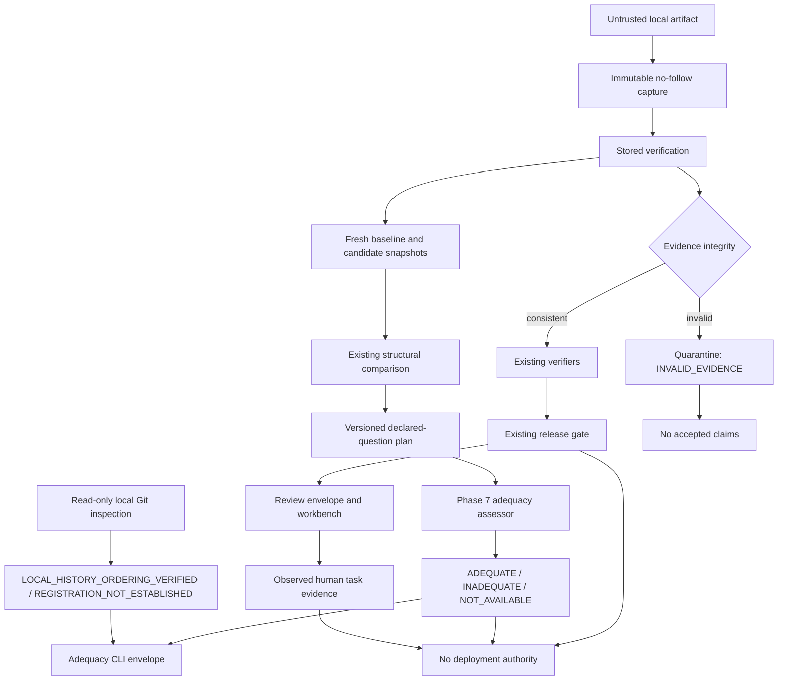

# Hermes Phase 7 — Evaluation Adequacy and Human Validation Design

## 0. Status and approval boundary

**Status:** `OWNER APPROVED — TEST-FIRST IMPLEMENTATION AUTHORIZED`

**Decision:** `GO TO TEST-FIRST IMPLEMENTATION`
**Implementation authorization:** `GRANTED BY BO-HUEI LIN ON 2026-08-16`

This is the owner-approved revision after Claude's design review. It authorizes only the bounded,
test-first implementation scope and exact change controls defined in this document. It does not
authorize work outside that scope, release-gate semantic changes, deployment activity, or favorable
human-study claims. It does not report a human study.

Human comprehension, manual visual quality, and accessibility remain `NOT YET OBSERVED` until the
separate protocols in this design are actually executed.

The required workflow is:

```text
Codex writes this proposed design
→ Claude independently inspects the repository and critiques it
→ Bo-Huei returns Claude's report to Codex
→ Codex verifies every finding and records ACCEPT / MODIFY / REJECT
→ Bo-Huei approves the revised design
→ Codex writes a test-first implementation plan
→ Codex implements only the approved scope
→ Codex writes a Phase 7 implementation handoff and next-design packet
→ Claude reviews the completed implementation
```

Claude's findings and Codex's evidence-backed dispositions are recorded in
`PHASE7_CLAUDE_FEEDBACK_DISPOSITION.md`. This revision incorporates every accepted correction.

Implementation may begin only from this approved design checkpoint in the isolated Phase 7
worktree/branch, under the test-first plan and allowlist in this document.

## 1. Executive summary

Hermes already has a credible evidence spine: deterministic simulation runs, typed evidence,
hash-chained traces, stored recomputation, a non-compensatory gate, immutable review capture,
fail-closed comparison, and a local read-only reviewer workbench.

Phase 7 should not add a broad feature surface or expand release authority. It should repair the two
weakest links identified by fresh-eye review:

1. **Declared-question adequacy.** The retained lead and cut-in pairs are structurally compatible
   and their numeric deltas are real, but neither records the claimed time-to-collision (TTC)
   intervention. Hermes lacks a typed answer to two separate questions: “Did this pair encounter
   the declared input condition?” and “Did it record a materially different action attributable to
   the declared intervention?”
2. **Human-instrument readiness.** The Phase 6 study plan is honest but cannot complete its own
   promotion gate. It lacks one required fixture, assigns an action task to an unsuitable schema,
   omits authoritative status, has no dedicated `CONDITIONAL` journey, and has no predeclared
   unassisted/time bound.

The proposed Phase 7 has two separate workstreams:

- **7A — Declared-question adequacy:** a framework-independent, stored-evidence-only assessor and
  CLI driven by a versioned evaluation plan. It is a claim precondition, not a release gate,
  verifier, winner score, or deployment decision.
- **7B — Human instrument and observation:** pipeline-generate the missing fixture, repair the
  protocol, pilot it, freeze thresholds, and then run a 6–10-person moderated cohort.

Phase 7A must not change `PASS`, `CONDITIONAL`, or `HOLD`. Phase 7B must not promote
comprehension from automated tests, screenshots, a pilot alone, or author self-review.

## 2. Evidence-status legend

| Label | Meaning |
|---|---|
| `SUPPORTED` | Observed in current source, tests, retained artifacts, or completed records. |
| `PROPOSED` | A Phase 7 design decision that does not exist yet. |
| `NOT YET OBSERVED` | Requires future execution or human evidence. |
| `DEFERRED` | Intentionally outside Phase 7. |

No `PROPOSED` item may later be called implemented without a Phase 7 handoff citing exact code,
tests, artifacts, commands, and repository checkpoint.

## 3. Current repository snapshot

Observed at the start of this design pass on 2026-08-14:

| Item | Observed value |
|---|---|
| Branch | `feat/phase6-reviewer-comprehension` |
| HEAD | `9efb811fde6ce122ec83836f782f3d861f626f37` |
| Worktree before this design file was created | Only user-owned untracked `Hermes_Phase6_Reviewer_Comprehension_Iteration_Master_Prompt.md` |
| Distribution | `hermes-autonomy` 0.1.0 |
| Python | Target 3.11; observed 3.11.15 |
| Test collection | 756 tests |
| Last recorded gates | 756 full, 756 non-MetaDrive, 506 focused; not rerun as full gates for this design edit |
| Doctor in this pass | 17 PASS, one expected dirty-tree WARN, one optional display NOT_AVAILABLE |
| Artifact directories | 43 |
| MetaDrive | 0.4.3 at `85e5dadc6c7436d324348f6e3d8f8e680c06b4db`; checkout clean |

The ten representative review bundles remain:

```text
handoff-phase5-demo
handoff-p1-conditional
handoff-p1-collision
phase1-tampered
handoff-p2-metadrive
handoff-p4-fault
handoff-p3-lead-baseline
handoff-p3-lead-shielded
handoff-p3-cutin-baseline
handoff-p3-cutin-shielded
```

The canonical bundle remains exactly ten files:

```text
manifest.json
execution-context.json
scenario.resolved.yaml
gate-config.resolved.yaml
events.jsonl
metrics.json
findings.json
verdict.json
trace.sha256
bundle.sha256
```

Phase 7 does not add an eleventh bundle file.

### 3.1 Existing source seams inspected

These anchors are bound to the starting HEAD and are evidence for the proposed placement:

| Existing seam | Current source | Phase 7 consequence |
|---|---|---|
| Immutable verified snapshot | `src/hermes/evidence/verification.py:91-104` | Adequacy consumes parsed scenario, execution context, events, metrics, findings, and verdict from verified captured bytes only |
| Review capture handoff | `src/hermes/review/facade.py:123-220` | `_review_result` captures once per side; pair comparison reuses those snapshots without reopening paths |
| Comparison compatibility | `src/hermes/comparison/compare.py:58-183` | Adequacy must reuse, not reimplement, the existing fail-closed identity checks |
| Challenge models | `src/hermes/domain/models.py:226-345` | Lead/cut-in mechanics and `behavior_realism_claim: false` are structurally typed; there is no adequacy field today |
| Policy-input TTC and shield order | `src/hermes/shields/deterministic.py:31-115` | TTC uses input distance/relative speed; TTC reason precedes speed-cap reason; exact configured threshold is captured in execution context |
| Closed verifier set | `src/hermes/verifiers/__init__.py:20-40` | No challenge-engagement or TTC finding exists; Phase 7 must not add one silently |
| Current human plan | `docs/PHASE6_USABILITY_TEST_PLAN.md` | Task 4 is blocked, Task 5 names unsuitable schema-1 evidence, and no dedicated CONDITIONAL task exists |
| Current observation record | `docs/PHASE6_HUMAN_OBSERVATION_TEMPLATE.md` | Authoritative status is absent and no participant result has been recorded |
| Current visual/accessibility protocol | `docs/PHASE6_VISUAL_REVIEW_CHECKLIST.md` | Automated/DOM evidence exists, but manual visual, accessibility, and human comprehension remain open |

The independent review verified these seams; implementation must still bind tests to current symbols
rather than treating line numbers in this design as permanent authority.

## 4. Product and decision frame

### 4.1 Primary identity

Hermes is a **simulation-only safety-evidence evaluation prototype and executive product-leadership
demonstration**. Its reusable primitives include evidence generation, deterministic fault and
intervention attribution, verifier/gate separation, immutable review, comparison, and explicit
trust boundaries.

It is not a production AV safety case, on-road validation system, autonomous-driving stack,
certification product, launch authority, or physical-vehicle controller.

### 4.2 Primary persona

**Primary persona:** a safety/evaluation reviewer who did not author the run.

Simulation engineers, onboard/autonomy engineers, product/release leaders, and
developer-infrastructure owners remain supporting personas.

### 4.3 Blocked decision

> Does this internally verified simulation evidence support advancing the candidate to the next
> bounded simulation-evaluation stage, and is the declared comparison question actually exercised?

This is not approval, authorization, certification, or deployment permission.

### 4.4 North Star

> Correct unassisted bounded-advancement reasoning by a non-author reviewer, within a
> time bound frozen before main-cohort results, with zero critical trust misconceptions.

The exact task/time definition is `PROPOSED` until pilot evidence is used to freeze it. It is not
a composite safety score and does not measure real-world AV safety.

### 4.5 Accountable owner

Bo-Huei Lin is the Hermes product owner and final owner of scope, residual-risk acceptance, and
status promotion. Before a real study, the moderator, evidence custodian, and accessibility
observer must be named separately. The implementer cannot self-promote a human gate.

## 5. Why Phase 7 is needed

### 5.1 Supported foundation

Current Hermes supports:

- closed-loop, simulation-only execution with deterministic seeds and bounded horizons;
- fake and pinned headless MetaDrive adapters;
- deterministic observation/control fault injection with typed attribution;
- candidate, permitted where supported, and executed-action evidence;
- versioned verifier profiles and a closed finding set;
- a non-compensatory release gate;
- atomic no-overwrite ten-file publication;
- SHA-256 trace/bundle integrity with explicit authenticity limitations;
- descriptor-relative, no-follow, mutation-sensitive stored verification;
- compatible-pair comparison without a winner;
- invalid-evidence quarantine;
- a local-only, read-only workbench; and
- separate gate, integrity, origin, authorization, permission, scope, and authoritative status.

### 5.2 Current repository-wide engagement gap

Fresh retained-artifact inspection produced:

| Signal | Baseline | Candidate |
|---|---:|---:|
| Gate verdict | `CONDITIONAL` | `CONDITIONAL` |
| Event count | 197 | 271 |
| Minimum policy-input TTC | 11.585881563948043 s at sequence 34 | 13.338911253788899 s at sequence 44 |
| Candidate TTC threshold | — | 2.0 s |
| `TTC_BELOW_THRESHOLD` events | 0 | 0 |
| `SPEED_CAP` events | 0 | 36, first at sequence 25 |
| Challenge trigger | sequence 30 | sequence 30 |
| Challenge phases | 31 pre-trigger, 15 braking, 151 recovery | 31 pre-trigger, 15 braking, 225 recovery |

The pair supports:

> The stored candidate trace has a higher minimum TTC and worse route/comfort measurements than
> the compatible baseline trace.

It does not support:

> The TTC-triggered shield mechanism engaged in the lead-brake challenge and caused the change.

The pair therefore remains a valid negative control but enters a showcase moratorium for
TTC-mechanism or safety-effect claims.

The retained cut-in pair has the same, stronger interpretation trap:

| Signal | Cut-in baseline | Cut-in candidate |
|---|---:|---:|
| Gate verdict | `HOLD` | `HOLD` |
| Minimum policy-input TTC | 1.8155836417275437 s | 8.49579415469856 s |
| Input TTC ≤ 2.0 s | sequences 35 and 36 | none |
| `TTC_BELOW_THRESHOLD` | none | none |
| Recorded pre/at-trigger confound | none | `SPEED_CAP` at sequences 20, 26, and 32 |
| Challenge trigger | sequence 30 | sequence 30 |
| First policy-input `CUT_IN` phase | sequence 31 | sequence 31 |

The candidate's higher stored minimum TTC is a factual descriptive delta. It is not evidence that
the TTC intervention engaged or caused the delta: the candidate never enters the target band and
records speed-cap intervention before and shortly after the trigger. Task 7 retains this pair only
as a deliberate non-causal mixed-delta interpretation test.

Repository-wide inspection of all 43 retained artifact directories found recorded intervention
reasons only for `SPEED_CAP` (178 events) and `STALE_OBSERVATION` (4 events), with no
`TTC_BELOW_THRESHOLD` event. No retained `findings.json` contains a `NOT_AVAILABLE` finding.
These are current-fixture facts, not general statements about Hermes capability.

Both retained lead and cut-in pairs are therefore negative controls for TTC engagement. Neither may
support a claim that the challenge or TTC shield caused its metric deltas.

### 5.3 Human-instrument gaps

| Gap | Consequence | Phase 7 repair |
|---|---|---|
| No valid three-state availability fixture | Task 4 cannot run; promotion is blocked | Pipeline-generate required-unavailable, optional-unavailable, and not-applicable together |
| Schema-1 action mismatch | Named task cannot show distinct permitted action | Bind Task 5 only to schema-2 `handoff-p4-fault` |
| Authoritative status omitted | Required authority boundary is not scored | Add `Authoritative status: NOT_DEFINED` throughout |
| No `CONDITIONAL` journey | A risky-to-interpret state is untested | Use `handoff-p1-conditional` |
| No unassisted/time bound | Success is not operationally bounded | Pilot first, then freeze thresholds before the main cohort |

## 6. Definitions and non-claims

### 6.1 Evaluation adequacy

Phase 7 evaluation adequacy means only:

> Whether one internally verified, structurally compatible baseline/candidate pair contains the
> evidence required to answer one locally declared simulation question under one versioned
> protocol and pair plan.

It does not mean safety-case adequacy, scenario completeness, statistical sufficiency, simulator
fidelity, predictive validity, real-world safety, certification, policy promotion, authorization,
or deployment permission.

### 6.2 Human validation

Phase 7 human validation means only:

> Observed task performance by a declared non-author cohort using a frozen protocol and exact
> fixtures, reported with numerator, denominator, conditions, assistance, time, and limitations.

It does not establish population-level comprehension, causal decision improvement, accessibility
conformance, or underlying AV safety.

### 6.3 Canonical authority language

```text
Gate verdict: PASS | CONDITIONAL | HOLD | INVALID_EVIDENCE
Evidence integrity: UNVERIFIED | INTERNALLY_CONSISTENT | INVALID_EVIDENCE
Origin: NOT_AUTHENTICATED
Authorization: NOT_EVALUATED
Deployment permission: NONE
Scope: SIMULATION_ONLY
Authoritative status: NOT_DEFINED
```

Serialized fields such as `authenticity` do not change because the preferred display label is
`Origin`.

## 7. Separate decision planes



| Plane | Authority | Boundary |
|---|---|---|
| Evidence integrity | Stored verifier | Invalidity quarantines downstream claims |
| Release gate | Existing gate/closed verifier profile | Phase 7 cannot change it |
| Structural comparison | Existing comparison core | Incompatible pairs have no deltas |
| Declared-question adequacy | New assessor | Bounds interpretation only |
| Local-history ordering | New command-specific inspector | Independent of criteria adequacy; unauthenticated and no external timestamp |
| Human comprehension | Frozen observed study | Can hold product claims, not alter evidence |
| Manual visual quality | Recorded browser review | Separate from comprehension/accessibility |
| Accessibility | Named browser/assistive technology | No general WCAG claim |
| Authenticity/authorization/permission | Existing trust contract | Remains NOT_AUTHENTICATED / NOT_EVALUATED / NONE |

## 8. Alternatives and decision

### Option A — Add `challenge.engagement` to the release gate

**Rejected for Phase 7.** Engagement is a property of an intended evaluation question and often a
pair, not a general candidate safety criterion. The finding set is closed/versioned. Adding it would
change historical gate meaning and implicitly make TTC a release criterion.

### Option B — Embed adequacy in a new scenario schema/comparison gate

**Deferred.** Digest binding is strong, but a physical scenario can support multiple evaluation
questions. Embedding one interpretation contract couples scenario mechanics to study intent and
requires wider schema/comparison/workbench migration.

### Option C — External versioned plan plus separate assessor and CLI

**Recommended.** The protocol and pair plan are explicit, reviewable, digest-bound records. Local
Git history can mechanically establish their ordering relative to selected results, but cannot
authenticate their author or establish external preregistration. The assessor uses fresh verified
snapshots and produces a separate result. Gate and comparison v1 remain stable. The plan is an
`ASSUMPTION`, not observed evidence or authority. Criteria adequacy and registration status remain
independent.

This is deliberately an **expert vertical slice**. The safety reviewer can inspect its canonical
text/JSON output, but the Phase 7 workbench does not ingest it. Therefore it does not yet enforce
adequacy across every primary-user comparison journey. Phase 7 must say this plainly, add a generic
non-causality limitation to current comparison surfaces, and keep claim-bearing lead evidence out of
the human protocol. A later reviewed UI phase is required for systemic reviewer-surface enforcement.

### Option D — Test-enforced fixture-acceptance oracle only

**Rejected after independent review.** A versioned test helper plus committed acceptance record
could prove that the repaired showcase fixture engages without adding a public plan/API/CLI. This is
less code and may be sufficient if Phase 7 is defined purely as evidence repair. It is not the
recommendation because the result would be hidden from reviewers, difficult to reuse, and easy to
collapse back into narrative documentation rather than a portable typed decision.

### Option E — Documentation-only checklist

**Rejected.** It cannot fail closed, bind exact evidence, preserve event references, or prevent
repeat over-credit.

## 9. Phase 7A architecture

### 9.1 One-way dependency

```text
Explicit plan root + exact plan selection
→ bounded strict plan capture/loader
→ immutable EvaluationAdequacyPlan v1

Explicit artifact root + exact baseline/candidate selections
→ existing one-capture stored verification
→ two VerifiedArtifactSnapshot objects
→ existing comparison compatibility
→ framework-independent adequacy assessor
→ immutable EvaluationAdequacyEnvelope v1
→ canonical JSON or bounded inert CLI text

Explicit repository root
→ bounded command-specific local Git inspector
→ immutable registration-evidence result
→ injected into assessment orchestration (never imported by adequacy/review core)
```

Hard rules:

- existing stored verification remains mandatory and may recompute its current verifier, gate, and
  deterministic shield checks over captured bytes; the new adequacy core may not add, replace, or
  independently execute gate/verifier/shield semantics;
- no simulator, adapter, policy, fault, or runtime execution during assessment;
- no artifact reopen after capture;
- no UI-owned adequacy logic;
- no `subprocess` or concrete Git-inspector import in adequacy models/loader/assessment or review
  code;
- `hermes.adequacy.api` is the single public application-service composition layer: it constructs
  the command-specific inspector and passes only its immutable result to pure assessment;
- the CLI lazy-imports and calls that public API rather than exposing a second composition path;
- no artifact write, repair, normalization, migration, or bundle extension;
- no automatic plan/artifact discovery;
- no newest/default selection;
- no score, rank, winner, “safer,” promotion, or deployment output;
- no cache that bypasses fresh artifact capture; and
- invalidity/incompatibility fail closed before criteria.

### 9.2 Proposed modules

```text
src/hermes/adequacy/models.py
src/hermes/adequacy/loader.py
src/hermes/adequacy/assessment.py
src/hermes/adequacy/api.py
src/hermes/adequacy/__init__.py
src/hermes/provenance/git.py
src/hermes/provenance/__init__.py
src/hermes/review/facade.py
src/hermes/cli.py
src/hermes/cli_errors.py  # only if necessary
```

No adequacy import is permitted in gates, verifiers, adapters, policies, shields, faults,
runner/orchestrator, or workbench v1. `src/hermes/provenance/git.py` is the sole new Git-process
boundary. The existing `src/hermes/workbench/launcher.py` remains a separately allowlisted process
boundary. Phase 7 does not consolidate the existing doctor, runtime, or MetaDrive Git helpers;
their command and timeout policies differ, so such a migration requires a separate parity-reviewed
change.

`hermes.adequacy.__init__` and `hermes.provenance.__init__` contain package documentation only and
perform no eager re-export/import. Callers and CLI import `hermes.adequacy.api` directly. Importing
`adequacy.models`, `adequacy.loader`, or `adequacy.assessment` must succeed while both
`hermes.provenance.git` and `subprocess` are bombed, proving no transitive process-boundary load.

## 10. Registered protocol and pair-plan contracts

### 10.1 Why two records are required

One file cannot truthfully be frozen both before baseline discovery and after selecting a concrete
scenario digest. Phase 7 therefore uses two distinct records:

1. **Study protocol, frozen before discovery.** Declares the claim, criterion semantics, complete
   bounded baseline grid, exact selection/tie-break rule, valid-run/exclusion rules, and candidate
   shield configuration.
2. **Pair plan, frozen after baseline-only discovery but before either primary run.** Binds the
   selected scenario/configuration, references the protocol and completed discovery-ledger digests,
   and records exact expected runtime identities and predeclared primary run IDs.

Without evidence that these records existed in this order, the assessor may still compute the
criteria but must label registration `REGISTRATION_NOT_ESTABLISHED` and interpretation
`DESCRIPTIVE_ONLY`. Criteria may still aggregate to `ADEQUATE`; that status means only that the
captured pair satisfies the declared criteria. It may not call the work preregistered or make a
declared-question claim.

Local Git history can establish only local relative ordering and captured content. It does not
authenticate an author, provide an independent timestamp, or establish external preregistration.
The mechanically accurate positive status is `LOCAL_HISTORY_ORDERING_VERIFIED`, and it is always
paired with `NOT_AUTHENTICATED` plus the fixed limitation: “Rewritable local history; no external
timestamp.”

### 10.2 Placement and capture

```text
evaluation-plans/lead_ttc_engagement.protocol.v1.yaml
evaluation-plans/lead_ttc_engagement.discovery.v1.jsonl
evaluation-plans/lead_ttc_engagement.pair.v1.yaml
```

The CLI requires an explicit plan root plus exact protocol and pair-plan selections. A private
capture object retains source locator, captured bytes, byte digest, semantic digest, and metadata
identity. Public callers cannot supply an already parsed plan and thereby bypass source provenance.

Capture rejects absolute paths, traversal, root-prefixed aliases, nonexact separators, NULs,
symlinks, directory/root swaps, and mutation. It never scans the directory.

### 10.3 Study protocol — frozen before discovery

The strict protocol contains:

- schema/ID/version, simulation-only label, and one supported claim type;
- exact criterion semantics and thresholds;
- complete finite Cartesian grid of allowed baseline scenario values;
- deterministic selection and tie-break rule;
- valid-run guardrails and exclusion rules;
- candidate shield name/version/full config and canonical config digest;
- expected policy, adapter, simulator, gate, and Hermes implementation identities;
- planned seed, cadence, horizon, and challenge kind; and
- registration evidence location.

Illustrative criterion excerpt:

```yaml
schema_version: "1.0"
protocol_id: lead_ttc_engagement
protocol_version: "1.0"
label: illustrative_simulation_only_declared_question
scope: SIMULATION_ONLY
claim_type: LEAD_TTC_INTERVENTION_ENGAGEMENT

criteria:
  required_phase: BRAKING
  minimum_phase_samples_per_arm: 10
  policy_input_ttc_lte_s: 2.0
  candidate_required_override_reason: TTC_BELOW_THRESHOLD
  minimum_target_override_events: 1
  prohibit_non_target_reasons_through_first_target_response: true
  minimum_post_response_decision_steps: 1
  actuation_delay_compensation_s: 0.0
```

The complete grid and tie-break rule must be machine-readable, not prose such as “choose a good
baseline.” The protocol is committed before any discovery run.

### 10.4 Discovery ledger — frozen before primary-pair execution

The append-created JSONL ledger records every allowed baseline attempt in execution order:

```text
protocol byte/semantic digests
registration commit
parameter values
exact command and environment identity
run ID and artifact locator
bundle and trace digests
verification status
criterion observations
valid-run/exclusion result and exact rule
selection/tie-break result
```

After baseline selection, freeze and commit the ledger. Never delete failed attempts. Any retry or
new grid requires a new protocol version.

Grid variants are deterministically materialized from the committed template into a unique
repository-external temporary work area. The protocol freezes the materializer version and full
parameter-to-field mapping. The ledger records each generated scenario's byte digest, exact
parameters, and selection-criterion observations. All discovery variants remain
repository-external. Exactly one scenario chosen by the frozen selection rule may be materialized
at the declared tracked path; its bytes and digest must exactly match the selected ledger entry and
pair-plan digest. That path is one of exactly three allowed additions in the sole-parent pair-plan
freeze commit. No other discovery variant may become tracked source.

### 10.5 Pair plan — frozen before both primary runs

The pair plan references the protocol and discovery-ledger digests and binds:

```yaml
expected_pair:
  baseline_run_id: handoff-p7-lead-baseline
  candidate_run_id: handoff-p7-lead-candidate
  selected_discovery_attempt_id: <exact ledger attempt ID>
  selected_discovery_selection_evidence_sha256: <canonical typed observation digest>
  scenario_digest_sha256: <selected resolved-scenario digest>
  challenge_kind: lead_vehicle_hard_brake
  seed: 7
  control_frequency_hz: 10
  horizon_steps: 300
  hermes_version: "0.1.0"
  implementation_base_commit: <clean protocol-registration commit>
  require_repository_dirty: false
  policy_name: metadrive-idm
  policy_version: "1.0"
  policy_config_digest_sha256: <frozen digest>
  adapter_name: metadrive
  adapter_version: "1.1"
  adapter_config_digest_sha256: <frozen digest>
  simulator_name: metadrive
  simulator_version: "0.4.3"
  simulator_commit: 85e5dadc6c7436d324348f6e3d8f8e680c06b4db
  baseline_shield_name: noop
  baseline_shield_version: "1.0"
  baseline_shield_config_digest_sha256: <frozen digest>
  candidate_shield_name: deterministic
  candidate_shield_version: "1.0"
  candidate_shield_config_digest_sha256: <frozen digest>
```

The pair-plan commit is the exact clean repository commit recorded by **both** primary bundles. The
plan cannot embed its own content-derived commit SHA; the read-only registration inspector resolves
that commit from Git history and proves the captured pair-plan bytes match it.
`implementation_base_commit` is the clean protocol-registration commit after all reviewed Phase 7
code, configs, candidate-shield config, and protocol are frozen. The pair-plan commit must have that
commit as its direct **sole** parent—merge commits are rejected—and its complete tree diff is limited
to exactly the discovery ledger, pair plan, and selected materialized scenario path. It may not alter
policy, shield, verifier, gate, adapter, runtime, adequacy code, config, tests, or protocol. The
primary bundle `repository_commit` identifies this later, narrowly allowed pair-plan commit.

After that commit, generate a fresh primary baseline and a fresh primary candidate using the two
predeclared run IDs. Discovery baselines remain search/disclosure evidence and are never reused as
the comparison baseline. Both primary targets must be absent before execution. Any retry requires a
new protocol/pair-plan version and new run IDs. There is no v1 `candidate-result` input or tracked
output; the eventual handoff records commands, locators, digests, failures, and assessment output.

### 10.6 Validation and categories

Every mismatch has exactly one primary plane and exit path:

| Condition | Primary plane/result | Criteria | Exit |
|---|---|---|---:|
| Invalid root/selection syntax or unsafe containment | Typed request/operational error | Not run | 40 |
| Baseline or candidate byte/schema/hash/recomputation invalid | Existing integrity quarantine, baseline first | None | 30 |
| Both sides valid but existing comparison incompatible | Existing compatibility result | None | 40 |
| Protocol/ledger/pair file has unknown schema/field, duplicate key, implicit date, wrong/non-finite/out-of-range scalar, oversized input, unsupported role, phase/challenge contradiction, or internal cross-record digest/threshold/config contradiction | Invalid plan | Not run | 40 |
| Valid compatible artifact field differs from a valid plan declaration—run ID, scenario/config/threshold, role, component identity, seed/cadence/horizon, declared repository-commit string, clean-execution flag, or fresh-baseline selection observations/digest | Available adequacy criterion `FAIL` | Evaluated | 0 |
| A required supported observation is genuinely absent | Adequacy criterion `NOT_AVAILABLE` | Evaluated; `FAIL` still wins | 0 |
| Git inspection succeeds but cannot establish captured file-at-commit bytes, ancestry/order, sole parent, exact three-path diff, or clean current registration paths | `REGISTRATION_NOT_ESTABLISHED` | Unchanged | 0 |
| Git cannot be safely executed or parsed—unsafe root, missing executable, timeout, streaming cap, malformed output | Typed operational error | Not run | 40 |

Thus a valid plan does not become “invalid” merely because a selected artifact fails to match its
declaration, and failed local-history ordering never becomes missing evaluation evidence. Artifact
`repository_dirty: true` is a plan-identity criterion failure; current registration-path dirtiness
is a registration result. Raw YAML/JSON/Pydantic/process exceptions never escape the public API or
CLI.

Categorize each field at its actual authority:

- captured locator/source bytes and recorded component identities: `OBSERVED`;
- byte/semantic/config/bundle/trace digests and computed TTC: `COMPUTED`;
- normative question, criteria, thresholds, grid, and selection rule: `ASSUMPTION`;
- origin of every local plan/record: `NOT_AUTHENTICATED`.

## 11. Adequacy semantics

### 11.1 Status

Integrity and compatibility remain independent envelope fields. The optional adequacy assessment
itself has only:

```text
ADEQUATE
INADEQUATE
NOT_AVAILABLE
```

- `ADEQUATE`: all required criteria pass using available verified evidence.
- `INADEQUATE`: available evidence definitively fails at least one criterion.
- `NOT_AVAILABLE`: valid/compatible pair lacks a required supported signal; never zero/failure/pass.

For invalid evidence, the envelope carries baseline-first integrity diagnostics and
`adequacy_assessment: null`. For incompatible evidence, it carries compatibility reasons and
`adequacy_assessment: null`. Both use `NO_INTERPRETATION` and expose no criteria. They are not new
adequacy statuses.

Interpretation is independently typed:

```text
DECLARED_QUESTION_ONLY
DESCRIPTIVE_ONLY
NO_INTERPRETATION
```

`ADEQUATE` is a criteria result only. It never by itself means preregistered, authenticated,
claim-eligible, safe, approved, or deployable. Interpretation becomes `DECLARED_QUESTION_ONLY`
only when all criteria pass **and** local-history ordering is independently verified. Without that
ordering, the same `ADEQUATE` result remains `DESCRIPTIVE_ONLY`.

Registration is independently typed:

```text
LOCAL_HISTORY_ORDERING_VERIFIED
REGISTRATION_NOT_ESTABLISHED
```

Aggregation is deterministic and uses criterion precedence `FAIL > NOT_AVAILABLE > PASS`:

| Input/result state | Adequacy | Interpretation |
|---|---|---|
| Invalid or incompatible | `null` | `NO_INTERPRETATION` |
| Any available criterion `FAIL` | `INADEQUATE` | `DESCRIPTIVE_ONLY` |
| No `FAIL`, at least one criterion `NOT_AVAILABLE` | `NOT_AVAILABLE` | `DESCRIPTIVE_ONLY` |
| All criteria `PASS` and `LOCAL_HISTORY_ORDERING_VERIFIED` | `ADEQUATE` | `DECLARED_QUESTION_ONLY` |
| All criteria `PASS` and `REGISTRATION_NOT_ESTABLISHED` | `ADEQUATE` | `DESCRIPTIVE_ONLY` |

Local-history ordering is necessary for the bounded declared-question interpretation, but it is
neither authenticity nor external preregistration. Every positive ordering record carries origin
`NOT_AUTHENTICATED` and the fixed limitation “Rewritable local history; no external timestamp.”

### 11.2 V1 criteria

V1 separates **target-condition exposure** from **recorded material intervention**.

Define condition-entry sequence `c` as the first candidate event whose policy-input challenge phase
is `BRAKING`, whose named front inputs are available and closing, and whose recomputed policy-input
TTC is less than or equal to the captured candidate threshold. Because the challenge trigger is
sequence 30 and phase is computed from the event's policy input, sequence 30 remains `PRE_TRIGGER`;
the first possible policy-input `BRAKING` event is sequence 31.

Define material action difference component-wise after deterministic IEEE-754 binary32
normalization of candidate and executed steering, throttle, and brake. Non-finite values are already
invalid. Numerically equal binary32 values, including differences visible only in a wider Python
float representation, are not a material intervention.

Define treatment-divergence sequence `d` as the first candidate event at or after `c` that both
records `TTC_BELOW_THRESHOLD` and has a material action difference. V1 supports current schema-1
challenge evidence and does not require a separately stored permitted action.

The result also carries one typed observation disposition:

```text
CONDITION_NOT_OBSERVED
CONDITION_MET_NO_RECORDED_INTERVENTION
TARGET_REASON_WITHOUT_MATERIAL_ACTION
TARGET_INTERVENTION_RECORDED
TARGET_INTERVENTION_CONFOUNDED
EVIDENCE_NOT_AVAILABLE
```

Define three deterministic scan endpoints so absent `c`/`d` never creates an implicit empty range:

- common-prefix endpoint `p = d - 1` when `d` exists; otherwise
  `p = min(B, C) - 1`, the complete shared index range;
- confound endpoint `e = d` when `d` exists; otherwise `e = C - 1`, the complete candidate trace;
- pre-condition endpoint `q = c - 1` when `c` exists; otherwise `q = C - 1`.

Empty ranges exist only when the computed endpoint is `-1`, and are explicitly recorded as zero
visited events. Common-prefix and non-target-confound criteria are always evaluated over `p` and
`e`; they do not become unavailable merely because `c` or `d` is absent.

If `c` is absent because available inputs never enter the band, condition exposure is `FAIL`. If a
required input is absent, condition exposure is `NOT_AVAILABLE`. If `c` exists but `d` does not,
condition exposure remains `PASS`, recorded target intervention is `FAIL`, and the disposition
distinguishes silence from a recorded reason without material action. Criteria that logically need
`d`—at-divergence arm alignment and post-response horizon—are `NOT_AVAILABLE`. The target-
intervention criterion itself is an available `FAIL`, and any non-target predicate/reason over `e`
is independently `FAIL`; aggregate precedence therefore remains deterministic. This avoids
pretending the target condition was absent merely because the current shield suppresses reasons
when its computed action equals the candidate action.

If `c` is absent but a target reason/material divergence appears anywhere through `q`, the
condition criterion still reports why the declared `BRAKING`-phase condition was not observed and
the clean-intervention criterion fails with `TARGET_INTERVENTION_CONFOUNDED`; it is never credited as
declared engagement.

If the first target intervention co-occurs with a non-target predicate or reason, `d` remains
defined, the clean-intervention criterion is `FAIL`, the disposition is
`TARGET_INTERVENTION_CONFOUNDED`, and remaining sequence-dependent criteria are still evaluated.
Co-occurrence can never satisfy the clean primary-pair contract.

The lead-TTC plan is adequate only if:

1. both sides independently verify;
2. existing comparison says structurally compatible;
3. captured protocol, discovery ledger, pair plan, declared repository-commit strings, policy,
   adapter, simulator, scenario, challenge, seed, cadence, horizon, gate, and shield identities
   match; local-history existence/ordering is never an adequacy criterion;
4. baseline is the exact no-op shield role;
5. candidate is the exact deterministic-shield role/config digest;
6. `BRAKING` appears for the minimum samples on both arms;
7. from sequence zero through `p`, both arms match exactly on sequence, challenge phase,
   candidate policy action, input front distance, input relative speed, and computed input TTC; V1
   is same-platform/same-commit and defines no floating tolerance;
8. at sequence `c`, both arms remain exactly matched on phase, policy action, and named front
   signals; both recomputed input TTC values are ≤ the captured candidate shield threshold;
9. from sequence zero through `q`, candidate records no target reason or material target action
   divergence; at `d`, both arms remain exact on challenge phase, policy action, named front inputs,
   and recomputed TTC, baseline uses no-op execution, and candidate records
   `TTC_BELOW_THRESHOLD` with a material binary32-normalized action difference;
10. candidate records at least the declared number of target intervention events, each with input
    TTC ≤ the captured threshold and a material binary32-normalized action difference;
11. from sequence zero through and including `e`, every non-target predicate recomputed from stored
    policy-input observations plus the captured scenario/shield config is false **and** no
    corresponding non-target reason is recorded. The exact predicates are speed above
    `speed_cap_mps`, observation age above `max_observation_age_s`, absolute lateral offset at or
    beyond `boundary_tolerance_m - boundary_margin_m`, `emergency_stop_active`, and the configured
    actuation-delay TTC band. V1 freezes `actuation_delay_compensation_s: 0.0`; config review alone
    is never evidence that the other predicates were nonbinding; and
12. enough decision opportunities remain after first target response.

Boundary-dependent criterion status is frozen as follows:

| Criterion | `PASS` | `FAIL` | `NOT_AVAILABLE` |
|---|---|---|---|
| Target-condition exposure | `c` exists | Inputs available but no `c` | Required named input absent |
| Common-prefix equality | Exact through `p` | Any mismatch through `p` | Never; typed `None` participates in equality and signal availability is scored separately |
| Pre-condition cleanliness | No target reason/material divergence through `q` | Any such evidence through `q` | Never |
| Material target intervention | `d` exists | No `d`, including silent same-action or reason-only evidence | Never |
| At-condition arm alignment | Exact counterpart exists at `c` | Baseline counterpart missing/mismatched at defined `c` | `c` absent |
| At-divergence arm alignment | Exact at `d` | Mismatch at defined `d` | `d` absent |
| Minimum target-event count | Material target count meets bound | Count below bound, including zero | Never |
| Non-target predicates/reasons clear | All false/absent through `e` | Any predicate true or reason recorded | Only if a required predicate input is absent; current v1 supported inputs are otherwise required by valid event schema |
| Post-response horizon | Bound met after `d` | Defined `d` but too few opportunities | `d` absent |

Identity/role/phase/reproduction criteria are always available after valid compatible capture and
therefore return only `PASS` or `FAIL`. Integrity, compatibility, intrinsic plan validity, and Git
operational success are prereq planes under §10.6, not criterion rows.

Existing structural compatibility does not require equal event counts. If the candidate defines
`c` or `d` after the baseline has terminated, the corresponding arm-alignment criterion is an
available `FAIL`, producing completed `INADEQUATE` assessment semantics and exit 0—not
`NOT_AVAILABLE`, unsupported shape, or operational exit 40. Early candidate/baseline termination is
also evaluated normally by phase, condition, count, alignment, and response-horizon criteria.

The **new adequacy-core** event algorithm is one monotonically increasing indexed pass over the two
ordered timelines. It visits each baseline event at most once and each candidate event at most
once, counts phase/target observations as it advances, performs exact lockstep comparisons over the
required prefix, and never restarts or sorts. The adequacy-core visit counter is at most `B + C`.
Each criterion retains only a frozen maximum number of representative source references plus exact
total counts, never an aggregate reference per event.

This is deliberately **not** an end-to-end complexity claim. Current stored trace verification has
legacy prefix reconstruction behavior that can be quadratic, and Phase 7 does not silently rewrite
that verified boundary. End-to-end latency/RSS is measured at the existing 10,000-event resource
ceiling; linearizing stored verification requires a separate design, behavior-parity tests, and
allowlist approval.

If an input front signal is absent, the relevant criterion is `NOT_AVAILABLE`. If the signal is
present but relative speed is nonclosing, that is available evidence of failed engagement and the
criterion is `FAIL`, contributing to `INADEQUATE`.

Compute TTC from the same policy-input fields consumed by the shield:

```text
front_distance_m / -front_relative_speed_mps
```

Do not silently substitute a differently timed aggregate metric. Preserve exact values, unit,
operator, sequence, and source reference.

### 11.3 Allowed and prohibited interpretation

Allowed:

> This pair satisfied the declared lead-TTC criteria in this bounded simulation. Local Git history
> verifies ordering of the plan and selected evidence, but that history is rewritable, has no
> external timestamp, and is not independently authenticated.

> This pair did not exercise it because the baseline never entered the TTC band and the candidate
> intervened for speed-cap reasons before the challenge.

Prohibited:

- the shield is safer;
- the challenge is realistic;
- the candidate is ready to launch;
- the comparison proves causal effectiveness;
- a higher or lower metric was caused by the challenge or shield without separate causal evidence;
- a configured mechanism was exercised when no material target intervention was recorded;
- the plan is an AV safety case.

### 11.4 Existing descriptive comparison

Phase 7 does not retroactively rewrite `ComparisonEnvelope 1.0`. An inadequate pair may still be
inspected for factual deltas, but:

- the adequacy envelope says `DESCRIPTIVE_ONLY`;
- demos/docs cannot attribute a delta to the declared mechanism;
- the current lead pair leaves the human answer key and TTC-effect showcase;
- the cut-in pair remains in Task 7 only as a non-causal mixed-delta interpretation test; it is
  forbidden as evidence that TTC intervention engaged or caused the higher stored minimum TTC;
- every existing comparison text/workbench surface gains a fixed, non-artifact limitation:
  “Stored deltas are descriptive; comparison alone does not establish challenge engagement or
  causal treatment effect”; this is renderer-owned fixed copy and does not mutate or version
  `ComparisonEnvelope 1.0` canonical JSON;
- the workbench places that limitation **before** any directional synthesis and renames
  “Advancement interpretation” to “Descriptive comparison interpretation”; and
- any later UI must show adequacy before mechanism-effect language.

Independent review accepted this separation only with the fixed-copy ordering, renamed heading, and
retained-pair moratorium above. Systemic adequacy display remains a later reviewed UI phase.

## 12. Result, API, and CLI

### 12.1 Criterion record

Each immutable criterion includes:

```text
criterion_id
status: PASS | FAIL | NOT_AVAILABLE
definition: ASSUMPTION
  rule
  threshold machine/canonical/display value and unit
observation: COMPUTED
  observed machine/canonical/display value and unit
  status and rationale
evidence: OBSERVED
  baseline/candidate event sequences
  source references
  unavailable reason when present
```

No weighted score or partial-credit total exists.

### 12.2 EvaluationAdequacyEnvelope 1.0

The envelope contains:

- Hermes/review schema;
- observed protocol/pair-plan selections and captured source-byte identities;
- computed source-byte, semantic, discovery-ledger, configuration, and registration digests;
- assumption-classified claim, criteria, thresholds, grid, and selection rule;
- registration status, local-history commit references, and the fixed rewritable-history/no-external-
  timestamp limitation;
- exact baseline/candidate locator, run ID, bundle/trace digests;
- unchanged side gate, integrity, and trust states;
- compatibility;
- optional adequacy assessment plus independent integrity, compatibility, and interpretation;
- typed target-condition/intervention observation disposition;
- ordered exact criteria/references;
- limitations;
- `NOT_AUTHENTICATED`, `NOT_EVALUATED`, `NONE`, `SIMULATION_ONLY`, `NOT_DEFINED`; and
- deterministic canonical JSON without timestamps, absolute paths, durations, session IDs, or
  filesystem metadata.

Invalid/incompatible output contains safe identity/diagnostics,
`adequacy_assessment: null`, and no accepted criteria. Because these states return before plan-file
capture, they contain only the safely projected requested plan selections; captured plan identities,
digests, and registration fields are `null` with an explicit `PLAN_NOT_EVALUATED` reason.

### 12.3 Public API

The explicit import path is `from hermes.adequacy.api import assess_review_pair_adequacy`;
`hermes.adequacy.__init__` does not eagerly re-export it.

```python
assess_review_pair_adequacy(
    repository_root: Path,
    artifact_root: Path,
    baseline_relative_path: str,
    candidate_relative_path: str,
    plan_root: Path,
    protocol_relative_path: str,
    discovery_ledger_relative_path: str,
    pair_plan_relative_path: str,
) -> EvaluationAdequacyEnvelope
```

The public application service owns bounded plan capture and coordinates the existing review facade
so each artifact side is captured once and the current snapshots are reused, in the frozen order
below. Once plan capture occurs, it passes a private immutable captured-plan identity to the pure
assessor. Public callers cannot supply parsed plans, captures, snapshots, registration results, or
inspector implementations. Do not publicly expose those internals or duplicate path validation.

`hermes.adequacy.api` constructs the concrete command-specific inspector from
`hermes.provenance.git` and passes only its immutable result to the non-public assessment helper.
Pure models/loader/assessment and all review modules import neither `subprocess` nor the concrete
inspector. Unit tests may inject a fake immutable registration result only into the non-public pure
helper; an architecture/API test proves caller-supplied evidence cannot obtain
`LOCAL_HISTORY_ORDERING_VERIFIED`. The CLI lazy-imports this public API. A successful production
inspection can establish local-history ordering, not origin authenticity.

The application service freezes failure precedence and work order:

1. lexically validate all explicit roots and exact relative selections without discovering files;
2. capture/verify baseline once, then candidate once; return baseline-first invalid evidence
   immediately with exit 30 semantics and no plan/Git operation;
3. run existing structural compatibility; return incompatible immediately with no plan/Git
   operation;
4. capture and strictly validate protocol, discovery ledger, and pair plan in that declared order;
5. resolve the trusted Git executable exactly once immediately before the first Git operation, then
   run the bounded registration inspection once; and
6. assess criteria from the already captured snapshots/plans and immutable registration result.

Combined-failure tests prove Git absence/timeout cannot mask invalid-evidence quarantine or
incompatibility, plan failure cannot trigger Git, and no branch rereads an artifact or plan.

Registration ordering may be established only by read-only fixed-argument local Git history readback
under the explicitly supplied canonical `repository_root`. It must prove each captured file matches
its recorded commit and that the commits precede the relevant runs. Specifically, every discovery
bundle must record the exact clean protocol-registration HEAD, while **both fresh primary bundles**
must record the same exact clean discovery-ledger/pair-plan registration HEAD.
The discovery ledger and pair plan may be assembled in an ignored repository-external work area and
moved into the tracked plan root only for their freeze commit, so evidence generation runs from a
clean tree.

The concrete provenance boundary uses one trusted executable resolved exactly once immediately
before its first operation, after invalid/incompatible/invalid-plan gating;
argument arrays only; canonical repository containment; fixed
`rev-parse`, `show`, `rev-list --parents -n 1`,
`diff-tree --no-commit-id -r --name-status -z`, `merge-base --is-ancestor`, and
`status --porcelain=v1 -z --untracked-files=all` operations; replace refs,
terminal prompting, optional locks, and remote/file protocols disabled; no hooks, shell, network, or
Git writes; a proposed five-second timeout and 1 MiB stdout/stderr ceiling per operation; and typed
error normalization. NUL-delimited tree/status output is parsed as bytes with command-specific
record arity. Rename, copy, unknown status, malformed record, newline/tab/leading-dash path
confusion, and unexpected path/change type fail closed. The runner reads bounded chunks, terminates
and then kills on timeout or byte-cap breach, and never uses an unbounded
`subprocess.run(capture_output=True)` buffer. It compares exact file-at-commit bytes and never treats
commit timestamps as ordering authority. Wrong repository identity, missing declared commit/path,
divergent history, merge/multiple-parent pair plan, unexpected tree-diff path/change type,
protocol-after-discovery, or dirty current registration paths yield
`REGISTRATION_NOT_ESTABLISHED`. Artifact execution dirtiness, primary run-ID mismatch, and primary
declared-commit mismatch are adequacy-identity criterion failures under §10.6, not registration
results. An unsafe repository selection, unavailable executable, timeout, oversized output, or
malformed Git response is a typed operational failure. Neither registration failure nor operational
failure can produce `LOCAL_HISTORY_ORDERING_VERIFIED` or `DECLARED_QUESTION_ONLY`.

### 12.4 CLI

```bash
hermes assess-adequacy \
  handoff-p7-lead-baseline \
  handoff-p7-lead-candidate \
  --repository-root . \
  --artifact-root artifacts \
  --plan-root evaluation-plans \
  --protocol lead_ttc_engagement.protocol.v1.yaml \
  --discovery-ledger lead_ttc_engagement.discovery.v1.jsonl \
  --pair-plan lead_ttc_engagement.pair.v1.yaml \
  --format json
```

The command is lazy-imported, simulator-free, local, and read-only. JSON is canonical/full. Text
uses existing Unicode Cc/Cf neutralization and the 1,024-input-scalar bound with explicit metadata.

| Result | Exit |
|---|---:|
| Valid `ADEQUATE`, `INADEQUATE`, or `NOT_AVAILABLE` assessment | 0 |
| Invalid stored artifact | 30 |
| Incompatible evidence, invalid plan, unsupported shape, operational error | 40 |

Exit 0 means completed assessment, not passed gate or deployment permission.

No workbench adequacy surface is included in Phase 7A.

## 13. Lead retuning and anti-cherry-picking

### 13.1 Objective

Produce one uniquely named normal-pipeline lead pair that exercises the frozen v1 question. Preserve
the current pair unchanged as the negative control.

### 13.2 Protocol

1. Commit the study protocol—including criteria, complete bounded grid, deterministic selection/
   tie-break rule, exclusions, disclosure format, and candidate configuration—before any discovery
   run. This clean protocol-registration commit is the frozen implementation base. Record its
   byte/semantic digests and local registration commit.
2. Search only the no-op baseline across bounded existing scenario knobs: initial gap, actor speed,
   trigger, brake duration, recovery throttle.
3. Do not optimize on candidate verdict, TTC delta, comfort, route, or desired narrative.
4. Freeze candidate shield config before its primary run. Set
   `actuation_delay_compensation_s: 0.0`. Every other non-target predicate—not only speed cap—must
   recompute false from stored policy-input observations through the first target intervention, and
   no non-target reason may be recorded. Configuration alone is never proof that a predicate was
   nonbinding.
5. Prefer governed recovery (for example zero resume throttle) over current full-throttle recovery,
   without making a realism claim.
6. Select baseline using only registered engagement and valid-run rules; record every grid attempt in
   the discovery ledger. For each attempt, persist the exact canonical selection observations and a
   deterministic selection-evidence digest over their ordered typed fields.
7. Freeze and commit the completed discovery ledger and pair plan, including both unique primary run
   IDs, plus the selected scenario before either primary execution. This commit has the protocol
   registration commit as its direct sole parent and changes only those three allowed paths.
8. From that same clean pair-plan commit, run a fresh primary baseline and then the primary candidate.
   Before considering the candidate, require the fresh primary baseline's canonical selection
   observations and selection-evidence digest to exactly reproduce the selected discovery ledger
   entry. Retain/report either failure; do not tune silently. Discovery baselines are never primary
   comparison evidence, and discovery-versus-primary is a reproduction check rather than a normal
   compatible-pair comparison because repository commits differ.
9. A material retry requires a new protocol/pair-plan version and unique run IDs.
10. Preserve every attempted config, command, outcome, digest, and exclusion rationale in the
    versioned records outside bundles.
11. No automatic optimizer, reward search, or LLM parameter tuning.

Expected roles:

| Evidence | Role |
|---|---|
| Current lead pair | Negative control: `INADEQUATE` |
| New frozen baseline | Enters TTC band with response horizon |
| New frozen candidate | Records target response without pre-challenge speed-cap confound |
| Comparison | May be mixed, unchanged, or unfavorable; outcome is not an adequacy criterion |

Proposed unique names:

```text
handoff-p7-lead-baseline
handoff-p7-lead-candidate
```

### 13.3 Real MetaDrive acceptance

At least one explicit local acceptance uses pinned real MetaDrive, not a fake environment. CI
remains simulator-free. Record version/commit, environment, command, inputs, run IDs, bundle/trace
digests, wall time, peak memory, fresh verification, and byte-immutability.

The implementation must add a real-only, explicitly selected test node such as
`tests/integration/test_phase7_artifacts.py::test_phase7_real_metadrive_primary_pair` marked
`metadrive`. The local acceptance command is frozen in the handoff, for example:

```bash
conda run -n hermes-dev python -m pytest -q -m metadrive \
  tests/integration/test_phase7_artifacts.py::test_phase7_real_metadrive_primary_pair
```

Normal CI and fake integration tests cannot satisfy this gate, and the node must refuse to run if
the pinned source checkout/version is unavailable or mismatched rather than silently substituting a
fake adapter.

No result generalizes to another platform or real road behavior.

## 14. Phase 7B human instrument

### 14.1 Proposed canonical files

```text
docs/PHASE7_HUMAN_VALIDATION_PLAN.md
docs/PHASE7_HUMAN_OBSERVATION_TEMPLATE.md
docs/PHASE7_COHORT_SYNTHESIS_TEMPLATE.md
docs/PHASE7_MANUAL_VISUAL_RECORD.md
docs/PHASE7_ACCESSIBILITY_RECORD.md
docs/PHASE7_HUMAN_VALIDATION_HANDOFF.md
config/phase7-fixture-registry.yaml
```

The registry binds locator, manifest run ID, bundle/trace digest, schema/profile, expected
gate/integrity, task mapping, and generation command. Validate it freshly before every session.

### 14.2 Ten tasks

| Task | Evidence | Decision |
|---|---|---|
| 1 Nominal PASS | `handoff-phase5-demo` | PASS plus all authority limits |
| 2 Hard HOLD | `handoff-p1-collision` | Collision is non-compensatory; inspect event |
| 3 Invalid | `phase1-tampered` | Stored PASS is quarantined |
| 4 Availability | New one-event `handoff-p7-evidence-availability` | Classify required unavailable / optional unavailable / not applicable; no timeline scrubbing or comparison inference |
| 5 Accountability | `handoff-p4-fault` only | Candidate / permitted / executed / shield / fault distinction |
| 6 CONDITIONAL | `handoff-p1-conditional` | Human review required; no permission |
| 7 Non-causal mixed comparison | Cut-in baseline → shielded | Report exact descriptive deltas, unchanged `HOLD`, pre-trigger `SPEED_CAP`, and zero target reason; reject causal/mechanism/winner claims |
| 8 Provenance | `handoff-p2-metadrive` | Recorded identity/hash is not authenticated origin |
| 9 Incompatible | Lead baseline → cut-in shielded | No deltas/rank/advancement |
| 10 Accessibility | Representative valid flow | Named keyboard/screen-reader observation only |

The old lead pair is removed from the participant answer key until a reviewed adequacy surface exists.
The revised cut-in task remains deliberately difficult, so Tasks 1–9 keep the same denominator. Its
answer key must accept the factual higher candidate minimum TTC while explicitly rejecting “the TTC
shield caused it” and “the TTC mechanism was exercised.” If Task 7 cannot be administered with this
distinction, pilot readiness is blocked rather than silently reducing or renumbering the critical
task denominator.

### 14.3 Seven required dimensions

Every relevant answer/record/synthesis scores:

```text
Gate verdict
Evidence integrity
Origin
Authorization
Deployment permission
Scope
Authoritative status
```

Current valid-evidence fixed boundaries:

```text
Origin: NOT_AUTHENTICATED
Authorization: NOT_EVALUATED
Deployment permission: NONE
Scope: SIMULATION_ONLY
Authoritative status: NOT_DEFINED
```

## 15. Pipeline-generated availability fixture

### 15.1 Proposed scenario

Create `scenarios/fake_evidence_availability.yaml` through explicit normal inputs. Never hand-edit a
bundle. Under the current legacy profile, `comfort.jerk` is the only optional item that can become
unavailable, and it does so only with fewer than two events. Therefore `horizon_steps: 1` is a
**forced fixture condition**, not a preferred scenario length.

Key semantics:

```yaml
schema_version: "1.0"
adapter: fake
control:
  horizon_steps: 1
hazards:
  unavailable_progress: true
```

Copy all other fields explicitly from nominal fake configuration. Use baseline policy, no-op shield,
seed 7, and Phase 1 gate.

### 15.2 Expected result — PROPOSED

| Finding | Requiredness | Availability | Consequence |
|---|---|---|---|
| `trace.integrity` | REQUIRED | AVAILABLE | No adverse effect |
| `collision.zero` | REQUIRED | AVAILABLE | No adverse effect |
| `boundary.within_tolerance` | REQUIRED | AVAILABLE | No adverse effect |
| `progress.required` | REQUIRED | NOT_AVAILABLE | Configured `HOLD` |
| `comfort.acceleration` | OPTIONAL | AVAILABLE | No adverse effect |
| `comfort.jerk` | OPTIONAL | NOT_AVAILABLE | Soft unavailable, behind HOLD |
| `fault.coverage.required` | NOT_APPLICABLE | NOT_APPLICABLE | No effect |

Expected summary:

```text
required_and_available: 3
required_but_unavailable: 1
optional_and_available: 1
optional_and_unavailable: 1
not_applicable: 1
gate: HOLD
integrity: INTERNALLY_CONSISTENT
```

Source and retained-artifact review verified that this exact 3/1/1/1/1 shape is feasible only under
the forced one-event condition. Implementation must capture it test-first through the normal
pipeline before calling the fixture available.

### 15.3 Acceptance

- normal fake execution path;
- unique run ID/directory;
- canonical ten files;
- fresh internal-consistency verification;
- exact status, requiredness, availability reason, and consequence for all seven findings;
- exact metrics including unavailable jerk, sufficiency summary, `HOLD`, integrity, and the single
  event's route-progress timeline value rendered as typed `NOT_AVAILABLE`;
- CLI/workbench parity across those exact records, not merely matching counts;
- source bytes unchanged during review;
- labeled presentation/instrument fixture, not behavior realism evidence;
- Task 4 remains a single-artifact label/consequence task: it does not require timeline scrubbing and
  does not claim comparison availability-delta coverage;
- the expected answer distinguishes progress unavailable because the configured hazard suppresses
  that signal from jerk unavailable because one sample cannot define jerk; and
- exact digest frozen in registry; and
- task dry-run before recruitment.

## 16. Human-study protocol

### 16.1 Sequence

1. Repair instrument and freeze fixtures.
2. Implementer dry run for executability only; not human evidence.
3. Owner expert, manual visual, and scoped accessibility prerequisites.
4. 2–3-person non-author pilot.
5. Repair ambiguity/workflow defects.
6. Exclude pilot results if prompt, key, fixture, UI, or threshold changes materially.
7. Freeze protocol, prompts, digests, exclusions, assistance, time, analysis, stop rules.
8. 6–10-person moderated cohort spanning product, safety, simulation, engineering.
9. De-identified task-level synthesis.
10. Explicit `OBSERVED`, `NOT YET OBSERVED`, or `HOLD AND REDESIGN` decision.

Before the pilot, freeze its task order, maximum session duration, break rule, and the point at which
moderators may correct a misconception. Before main-cohort recruitment, freeze a deterministic
counterbalancing matrix for Tasks 1–9, participant-to-order assignment, fatigue limit, correction
timing, and carryover handling. A participant never repeats a scored task after learning its answer;
any necessary rerun is recorded outside the primary denominator under the frozen deviation rule.

### 16.2 Assistance levels

```text
UNASSISTED
NEUTRAL_PROMPT
INSTRUCTIONAL_ASSISTANCE
NOT_COMPLETED
NOT_RUN
```

Any prompt removes the attempt from the unassisted numerator. Record exact moderator words/time.

### 16.3 Measures

Tasks 1–9 are the critical comprehension tasks and enter the North Star. Task 10 is a separate
accessibility observation and never enters the comprehension numerator or denominator.

North Star numerator:

> Eligible critical-task attempts completed correctly, unassisted, within the frozen bound.

Denominator:

> All eligible presentations of Tasks 1–9 in the frozen main cohort, excluding only protocol-defined
> participant withdrawals.

A fixture, verification, workbench, or other technical invalidation is not silently excluded. It is
reported as `NOT_RUN_TECHNICAL`, fails the 100% executable-instrument gate, and must be corrected and
rerun under the unchanged frozen protocol before the cohort can close. This prevents technical
failure from improving the comprehension rate.

Pilot hypotheses, not final gates:

- at least 80% correct unassisted critical attempts;
- median ≤120 seconds for single-artifact decisions;
- median ≤240 seconds for accountability/comparison;
- zero critical trust misconceptions;
- 100% executable critical-fixture coverage;
- no composite score hiding task/role patterns.

Freeze final thresholds before main-cohort results exist. System latency is not reviewer thinking time.

### 16.4 Immediate stops

Stop, preserve quote/state, and hold promotion if a participant:

- treats PASS/CONDITIONAL as safe, authenticated, authoritative, approved, or deployable;
- uses quarantined evidence;
- treats a hard failure as compensable;
- reads unavailable as zero/false/blank/infinity/pass;
- collapses candidate/permitted/executed actions;
- attributes a control fault to the shield;
- declares winner/safer/advancement from mixed comparison;
- attributes a mixed-pair metric delta to the challenge or shield, treats a recorded target
  intervention as proving causal effect, or asserts TTC-mechanism engagement from displayed
  comparison evidence alone;
- infers deltas from incompatibility; or
- treats provenance/hash as origin signature.

Also stop for fixture digest mismatch, failed verification, mutation, contradictory key, moderator
teaching, or essential inaccessible workflow.

### 16.5 Promotion

Comprehension remains `NOT YET OBSERVED` after tests, dry runs, screenshots/DOM, expert critique, a
pilot, or incomplete cohort.

Keep two post-cohort states separate:

- `HUMAN_EVIDENCE_OBSERVED`: the frozen cohort ran and its actual outcomes are recorded, whether
  favorable or unfavorable.
- `COMPREHENSION_GATE_MET`: all frozen unassisted/time thresholds, zero-critical-
  misconception rule, and 100% executable critical-task coverage passed.

If evidence is observed but the gate is not met, the disposition is `HOLD AND REDESIGN`, not
`NOT YET OBSERVED` and not success. Only a frozen main cohort can support bounded language:

> In protocol vX, N of M eligible non-author participants completed these tasks under these
> conditions, with A unassisted attempts and B critical misconceptions.

Never state “reviewers understand Hermes” without qualifiers.

## 17. Manual visual, accessibility, and privacy

Maintain independent statuses:

```text
Automated correctness
Manual visual quality
Accessibility
Expert critique
Pilot human comprehension
Main-cohort human comprehension
```

Before pilot, render exact Phase 7 fixture states on a working screenshot backend. Accessibility
observations must name browser/assistive technology. Mouse success cannot promote keyboard or
screen-reader status. No WCAG claim follows.

Treat the 108-column density concern as a pilot question rather than redesigning blindly. Fix known
truth defects—label/state mismatches, hidden required failures, stale navigation—before pilot.
Material post-pilot UI changes require protocol versioning.

Privacy:

- participant IDs only; no committed names/emails/employers;
- ask participants not to share employer-confidential information;
- explicit consent for recording;
- encrypted raw data outside Git and `artifacts/`;
- recommended deletion 30 days after accepted synthesis;
- commit only blank templates and de-identified aggregate results;
- verbatim quotes separated from observer inference;
- record withdrawals/deviations;
- name evidence custodian and deletion owner.

## 18. Operational prerequisites

### 18.1 Isolated Phase 7 worktree

Implementation begins only after design approval in a dedicated Phase 7 Git worktree/branch created
from the approved design commit. The current root worktree and the user-owned untracked Phase 6
master prompt remain untouched. Registration commits, clean-status assertions, generated discovery
work area, and primary runs occur only in that isolated worktree. Ignored primary artifacts remain
local to it; their commands, identities, and digests are copied into the handoff without staging the
bundles.

### 18.2 Fresh participant process

Start a fresh loopback workbench for every participant. This bounds session leakage/cache growth and
makes command/repository state reproducible.

### 18.3 Facade LRU decision

Current unbounded `_cache`/`_active` maps are an accepted P2, but a ten-task repeated study is a
bounded, explicit local workflow rather than an artifact-only trigger. The approved Phase 7 decision
is to **defer LRU modification until after the pilot measurement**. Every participant starts a fresh
process, and the exact Tasks 1–10 reference at most ten unique selections; invalid evidence is not a
reusable cache entry.

Record RSS plus `_cache`/`_active` high-water marks across the exact dry-run and pilot sequence.
Promote a deterministic synchronized LRU (candidate cap 16) into a separately reviewed change only
if measured growth breaches the frozen local budget or perturbs task timing. If promoted, preserve:

- every interaction freshly captures/compares identity;
- invalid evidence is never cached;
- eviction cannot reuse stale snapshots;
- evicted revisit recaptures/reprojects;
- unchanged canonical bytes remain equal;
- mutation/root/cross-root tests remain safe; and
- cap is operational state, not evidence.

### 18.4 Performance

Measure smallest/median/largest cold/warm review, comparison, adequacy, RSS over ten tasks, cache
counts, and mutation recapture. Freeze a local study-machine budget after measurement. Do not
estimate or count system delay as user time.

## 19. Security/resource boundaries

Preserve:

- simulation/closed lab only;
- no vehicle/CAN/automotive Ethernet/actuator/remote control;
- loopback only;
- no telemetry/cloud/database/account/upload/remote ingestion;
- no raw HTML/executable evidence content;
- no simulator/policy execution from review/adequacy;
- untrusted plan/artifact paths;
- existing 16 MiB/file, 64 MiB total, 10,000 events, 1 MiB/event-line limits;
- small bounded plan and strict scalars;
- one monotonic **adequacy-core** pass with at most `B + C` adequacy event visits, no adequacy event
  cross product/restart/hidden sort, and no unbounded aggregate-reference construction; no
  end-to-end linearity claim is made for existing stored verification;
- a deterministic test-only visit counter bounded by a frozen affine function of `B + C`, plus
  bounded summary/source-reference cardinality; wall-clock timing alone cannot prove complexity;
- normalized parse errors;
- canonical JSON and bounded inert text; and
- no signing/authenticity implication.

## 20. Test-first implementation sequence — only after approval

1. **Contract freeze:** accept Claude feedback, freeze requirements/traceability, owner approval.
2. **Plan models/loader:** RED strict parsing, capture, path, mutation, canonical digest.
3. **Adequacy core:** RED current lead negative control, then exact `O(B + C)` criteria.
4. **Facade/CLI:** one capture per side, typed outcomes, canonical/safe output, import bombs.
5. **Lead repair:** freeze grid, baseline-only discovery, commit ledger/pair plan, then generate both
   fresh primary arms at the same clean commit with the predeclared run IDs.
6. **Human fixture/protocol:** generate availability fixture, close all five defects, registry tests.
7. **Operational dry run:** latency/RSS/cache high-water measurements, manual/accessibility
   prerequisites; defer LRU unless its measured promotion trigger fires.
8. **Independent adversarial review:** no recruiting with open P0/P1.
9. **Pilot/freeze:** 2–3 non-authors, version changes, freeze main protocol.
10. **Main cohort/handoff:** 6–10 sessions, bounded synthesis, next Claude packet.

## 21. Required automated matrix

### Adequacy/plan

- strict frozen models, unknown fields, deterministic JSON;
- plan byte/semantic digests and bounds;
- traversal/symlink/root swap/mutation/duplicate YAML/implicit date/huge scalar;
- exact local Git ordering and file-at-commit bytes; wrong repository, missing Git, divergent
  history, replace refs, merge parent, unexpected code/config/tree change, protocol-after-discovery,
  dirty execution, primary-run-ID/commit mismatch, timeout/oversized output, and
  shell/hook/write/network attempts all fail closed;
- discovery attempts record the protocol-registration commit; both primary bundles record the same
  pair-plan-registration commit and remain comparison-compatible;
- criteria aggregation and registration are independent: all criteria `PASS` always aggregate to
  `ADEQUATE`; `REGISTRATION_NOT_ESTABLISHED` constrains interpretation to `DESCRIPTIVE_ONLY`;
- invariant tests cover the adequacy × registration × interpretation cross-product and prove
  `ADEQUATE` alone is never preregistration or claim eligibility;
- mutation matrix covers every §10.6 class exactly once: invalid artifact 30, incompatible/invalid
  plan/operational 40, artifact-versus-plan criterion failure 0, missing signal 0, and historical
  ordering failure as registration-not-established with criteria unchanged;
- current lead `INADEQUATE` for non-entry and speed-cap confound;
- retained cut-in is descriptive only: baseline enters the band, candidate does not, target reason
  is absent, and pre-trigger speed-cap predicates/reasons are visible;
- missing front signals are `NOT_AVAILABLE`; present nonclosing signals are available `FAIL` and
  contribute to `INADEQUATE`;
- policy-input TTC, sequence-30 `PRE_TRIGGER` / sequence-31 `BRAKING` convention, phase samples,
  response window;
- correct arm roles/configs;
- condition exposure and recorded material target intervention are separate criteria with exact
  typed observation dispositions;
- binary32-only candidate/executed differences are not material action changes;
- target reason coincides with threshold and a binary32-normalized material action change;
- absent target response, silent same-action condition handling, reason-without-material-change,
  and target/non-target co-occurrence have deterministic typed outcomes;
- all non-target predicates are recomputed from stored inputs/config through `e`, all recorded
  non-target reasons are checked, and delay compensation is frozen to zero;
- early baseline/candidate termination, including missing baseline counterparts at defined `c`/`d`,
  has exact criterion failures and completed exit-0 assessment behavior;
- common-prefix and pre-challenge non-target failures;
- selected discovery ledger observations/digest exactly match the fresh primary baseline;
- adequate does not require favorable TTC/verdict/collision outcome;
- invalid baseline/candidate/both baseline-first, no criteria;
- incompatible, unknown shape, exceptions fail closed;
- combined-failure precedence: invalid evidence and incompatibility perform zero Git operations;
  their uncaptured plan fields are null/`PLAN_NOT_EVALUATED`; invalid plan performs zero Git
  operations; Git operational failure occurs only after captured sides are valid/compatible and
  plans are valid;
- one-pass adequacy-core `O(B + C)` visit-count bound, bounded reference output, and exact results at
  10,000 events per supported side limit; end-to-end latency/RSS is measured separately without a
  false linearity assertion.

### Authority/regression

- historical gate findings/verdicts unchanged;
- no adequacy import in authority/runtime/workbench modules;
- no `subprocess` or concrete provenance-inspector import in adequacy
  models/loader/assessment or review; only `adequacy.api` may compose the concrete provenance
  service, whose argv/env/cwd/timeout/output caps and no-shell behavior are tested in
  `test_provenance_git.py`;
- package initializers are side-effect-free; pure-submodule import bombs block both `subprocess` and
  `hermes.provenance.git` and still pass;
- the public API exposes no inspector/result injection and cannot be made
  `LOCAL_HISTORY_ORDERING_VERIFIED` by caller-supplied evidence;
- NUL-delimited Git tree/status parsing rejects newline, tab, leading-dash, rename/copy, unknown
  status, malformed-arity, timeout, and streaming byte-cap probes;
- lazy CLI import bombs runtime/adapters/policies/MetaDrive/workbench while allowing the existing
  doctor and workbench-launcher process boundaries;
- existing review/comparison bytes stable where schema unchanged;
- no winner/safety/approval/deployment copy;
- no artifact writes;
- fresh capture/TOCTOU/reference resolution;
- full suite, Ruff, doctor, diff, third-party cleanliness.

### Human instrument

- fixture generated normally and freshly verified;
- exact sufficiency/reasons/consequences/HOLD/immutability;
- PASS/CONDITIONAL/HOLD/INVALID all executable;
- Task 5 requires schema 2 and distinct actions;
- all seven authority fields on every relevant decision surface, expected answer, per-task record,
  session summary, and cohort synthesis; do not triplicate them inside every detail table;
- lead pair forbidden as TTC-mechanism participant evidence; cut-in Task 7 explicitly rejects
  causal/mechanism attribution while retaining factual descriptive deltas;
- observation template blank, no expected answers;
- registry fresh-verifies fixtures;
- no string test can promote human/manual/accessibility status.

### CLI/result behavior

- every completed valid assessment exits 0, including `ADEQUATE`, `INADEQUATE`, and
  `NOT_AVAILABLE`, with either registration status;
- exit 30 remains invalid stored evidence; exit 40 covers incompatible evidence, invalid plan,
  unsupported shape, or operational failure;
- exit status never means passed release gate, registration, safety, or deployment permission;
- JSON remains one exact canonical document; bounded text preserves typed status and limitations.

### LRU only if post-measurement promotion is approved

- 17 selections keep maps ≤16;
- deterministic oldest eviction;
- invalid not reusable;
- evicted revisit fresh;
- mutation/root/cross-root/concurrency safe;
- canonical envelope unchanged.

## 22. Artifact and evidence-generation protocol

1. Resolve exact unique target/run ID.
2. Assert target absent.
3. Hash every retained control bundle.
4. Record branch, HEAD, status, Python, config digests, MetaDrive identity.
5. For the primary pair, prove both predeclared targets absent and HEAD equals the clean pair-plan
   registration commit before running either arm.
6. Run only approved command; generate the fresh primary baseline and candidate at that same HEAD.
7. Before candidate interpretation, prove the fresh primary baseline reproduces the selected
   discovery entry's canonical selection observations and selection-evidence digest.
8. Freshly verify new bundle and assert both manifests record that identical HEAD.
9. Re-hash controls.
10. Never repair/annotate/regenerate in place.
11. Preserve all discovery attempts; no pleasing-result selection.
12. Stage only exact approved paths after review.

## 23. Acceptance gates

### 23.1 Adequacy GO

- current lead returns `INADEQUATE` for declared TTC question;
- retained cut-in remains explicitly non-causal/descriptive and cannot satisfy target-intervention
  adequacy;
- exact values/sequences for every criterion;
- new local-history-ordered pair has predeclared run IDs, one shared pair-plan commit, structural
  compatibility, and a truthful result without speed-cap confound;
- target-condition exposure and recorded material intervention are independently represented;
- fresh primary baseline exactly reproduces the selected discovery observations/digest;
- no favorable outcome required;
- gate/comparison semantics unchanged;
- invalid/incompatible/missing fail closed;
- deterministic CLI/API; no MetaDrive, adapter, policy, fault, or runtime import/execution on the
  assessment path beyond the existing stored-verification dependencies;
- separate real MetaDrive generation record;
- artifact immutability and full/adversarial gates pass.

### 23.2 READY_FOR_PILOT

- five instrument defects closed;
- all tasks execute against fresh registry-bound fixtures;
- manual visual prerequisites recorded;
- scoped accessibility prerequisites pass or have owned risk;
- latency excluded from task timing;
- no open P0/P1 instrument/authority issue;
- implementer dry run complete;
- comprehension still `NOT YET OBSERVED`.

### 23.3 READY_FOR_MAIN_COHORT

- pilot complete;
- material changes versioned and pilot excluded;
- thresholds/protocol/fixtures/analysis/stop rules frozen;
- no open P0/P1 instrument issue.

### 23.4 Human completion

- 6–10 non-author cohort complete;
- task-level numerator/denominator and slices;
- `HUMAN_EVIDENCE_OBSERVED` recorded regardless of outcome;
- all frozen unassisted/time thresholds and 100% executable critical-task coverage evaluated;
- zero critical misconception and all thresholds met, or explicit `HOLD AND REDESIGN`;
- deviations/missing/assistance visible;
- privacy/deletion completed;
- only bounded claims promoted.

### 23.5 Rollback / automatic HOLD triggers

Stop the affected wave and revert only its approved changes if any of these occur:

- a historical artifact's recomputed gate/finding meaning changes;
- review or comparison v1 canonical bytes change without an explicitly approved schema version;
- invalid/quarantined evidence yields criteria or accepted claims;
- assessment requires a second artifact read or bypasses fresh capture;
- adequacy models/loader/assessment or review imports `subprocess` or the concrete Git inspector;
  `adequacy.api` accepts caller-supplied registration evidence; or any undeclared Git command
  crosses the command-specific provenance boundary. The existing workbench launcher remains a
  separate intentional process boundary;
- a plan can be parsed without its captured locator/byte identity;
- a generated run overwrites or mutates a retained bundle;
- adequacy code imports or launches MetaDrive/runtime/policy/adapter/fault code outside existing
  stored verification;
- the current lead negative control can return `ADEQUATE`;
- a workbench truth fix hides a hard failure or weakens the persistent authority boundary;
- the human protocol can promote after an unexecuted critical task, technical invalidation, changed
  pilot instrument, or unmet frozen threshold; or
- any output implies safety, certification, approval, authorization, or deployment permission.

Rollback never deletes evidence. Preserve the failing result, exact command, repository state, and
diagnostic ledger; use a new version for the next attempt.

## 24. Risks and mitigations

| Risk | Mitigation |
|---|---|
| “Adequate” sounds safe/complete | Always say “for declared question”; preserve trust dimensions |
| Tuning after candidate result | Baseline-only discovery; commit plan; run both fresh primary arms once; disclose all attempts |
| Config-only speed check misses confound | Require event evidence |
| Recorded reasons hide a same-action condition | Separate condition exposure from material intervention; binary32-normalize actions |
| A different non-target predicate preempts TTC | Recompute every shield predicate from stored inputs/config; require no non-target reason; freeze delay to zero |
| TTC computation differs from shield | Use policy input and captured config |
| External plan/local Git is rewritable/self-controlled | Capture bytes/digests/order; label local ordering precisely; keep NOT_AUTHENTICATED and fixed limitation |
| Logic drifts into gate/UI | Dependency tests; core/facade/CLI only |
| New pair becomes pleasing story | Preserve negative control; no outcome criterion |
| Human fixture is fabricated | Normal pipeline and registry |
| Pilot counted after change | Automatic exclusion/versioning |
| Small cohort overgeneralized | Exact numerator/denominator/conditions |
| Accessibility inferred | Separate status, named setup, no WCAG |
| Cache grows | Fresh participant process; measure high-water/RSS; post-pilot LRU trigger |
| Existing verification scales worse than new adequacy core | Scope visit bound to adequacy only; measure end-to-end at cap; separate parity-safe optimization design |
| UI redesigned blindly | Fix truth defects; study density first |
| MetaDrive mistaken for reality | `behavior_realism_claim: false` and explicit limits |

## 25. Non-goals and future phases

Not Phase 7:

- TTC/adequacy in release gate or canonical finding set;
- generalized plan language, taxonomy, statistical coverage, ODD claims;
- winner/safety score/rank;
- signing/authenticity/key governance;
- approval/deployment workflows;
- cloud/multi-user/database/account/upload;
- automatic optimizer;
- perception/sensor simulation, traffic realism, on-road correlation;
- statistical road-safety validation or cross-platform determinism;
- workbench adequacy UI;
- general WCAG conformance;
- RL, CARLA, ROS, Autoware, hardware, CAN, physical control;
- unrelated debt without separate approval.

Future candidates: workbench adequacy, multi-seed portfolio, TTC gate-policy decision, authenticity,
generalized evaluation plans/calibration, formal accessibility/broader human research.

## 26. Tentative implementation allowlist

Independent review narrowed this allowlist. No directory-wide staging.

### Code/tests

```text
src/hermes/adequacy/__init__.py
src/hermes/adequacy/models.py
src/hermes/adequacy/loader.py
src/hermes/adequacy/assessment.py
src/hermes/adequacy/api.py
src/hermes/provenance/__init__.py
src/hermes/provenance/git.py
src/hermes/review/facade.py  # only private one-capture orchestration/injected protocol
src/hermes/cli.py
src/hermes/cli_errors.py  # only if required
src/hermes/workbench/app.py  # fixed limitation/order/heading only; no adequacy state/computation
tests/unit/test_adequacy_models.py
tests/unit/test_adequacy_loader.py
tests/unit/test_adequacy_assessment.py
tests/unit/test_adequacy_api.py
tests/unit/test_provenance_git.py
tests/unit/test_review_adequacy.py
tests/cli/test_adequacy_cli.py
tests/cli/test_review_cli.py  # fixed comparison limitation/order; canonical JSON unchanged
tests/unit/test_workbench_projection.py
tests/integration/test_workbench_smoke.py
tests/unit/test_architecture_boundaries.py
```

### Plans/scenarios/config/evidence

```text
evaluation-plans/lead_ttc_engagement.protocol.v1.yaml
evaluation-plans/lead_ttc_engagement.discovery.v1.jsonl
evaluation-plans/lead_ttc_engagement.pair.v1.yaml
scenarios/metadrive_lead_vehicle_hard_brake_adequacy_v1.yaml
config/shield.phase7.lead_ttc.yaml
scenarios/fake_evidence_availability.yaml
config/phase7-fixture-registry.yaml
tests/integration/test_phase7_artifacts.py
tests/integration/test_phase7_fake_availability.py
```

The three `artifacts/handoff-p7-*` directories are ignored local runtime outputs and are never
staged. Their exact inventories/digests/commands appear in the registry and handoff. This preserves
the repository rule against staging generated artifacts.

### Documents

```text
docs/PHASE7_HUMAN_VALIDATION_PLAN.md
docs/PHASE7_HUMAN_OBSERVATION_TEMPLATE.md
docs/PHASE7_COHORT_SYNTHESIS_TEMPLATE.md
docs/PHASE7_MANUAL_VISUAL_RECORD.md
docs/PHASE7_ACCESSIBILITY_RECORD.md
docs/PHASE7_HUMAN_VALIDATION_HANDOFF.md
docs/PHASE7_REQUIREMENTS_TRACEABILITY.md
docs/PHASE6_USABILITY_TEST_PLAN.md       # mark superseded; link to Phase 7
docs/PHASE6_DEMO_RUNBOOK.md              # non-causality wording/supersession only
docs/decision-log.md
tests/unit/test_phase7_docs.py
PHASE7_IMPLEMENTATION_HANDOFF.md
CODEX_HANDOFF.md
```

`README.md`, `PROJECT_BRIEF.md`, `BUILD_PLAN.md`, `VALIDATION_MATRIX.md`,
`CURRENT_STATE_HANDOFF.md`, and historical Phase 6 records are **not** generically preauthorized.
Add one to the final allowlist only if implementation creates a specifically identified stale
contract/status statement; record that reason before editing and preserve historical evidence. A
separate legacy Git-helper consolidation is also outside this allowlist.

No `third_party/metadrive` edits.

## 27. Owner decisions embodied in this revision

Approval of this document approves these bounded choices:

1. Use the external versioned protocol/discovery-ledger/pair-plan model; do not add adequacy to the
   scenario schema, release gate, or finding set.
2. Keep factual directional deltas, but precede them with fixed non-causality copy and use the
   heading “Descriptive comparison interpretation.”
3. Separate target-condition exposure, recorded target reason, and binary32-normalized material
   action intervention; do not claim causal effect.
4. Keep exact common-prefix equality for same-platform/same-commit v1; broader portability is
   deferred.
5. Implement lead-only v1 adequacy. Retained cut-in remains a negative control and deliberate
   non-causal human task, not a generalized cut-in adequacy type.
6. Defer LRU until measured pilot evidence triggers a separate change; start a fresh process per
   participant and record RSS/cache high-water marks.
7. Keep generated bundles ignored/local, with committed plans, registry, commands, and digests.
   Portable deterministic fixture packaging remains future scope.
8. Treat the one-event availability fixture as a narrow classification/consequence instrument;
   do not infer timeline-scrubbing or comparison-availability validation.
9. Treat local Git only as `LOCAL_HISTORY_ORDERING_VERIFIED`, always `NOT_AUTHENTICATED`, with the
   fixed rewritable-history/no-external-timestamp limitation.
10. Keep Tasks 1–9 in the denominator by retaining revised Task 7; any inability to administer its
    non-causal distinction blocks pilot readiness rather than silently changing the denominator.

Pilot thresholds, final cohort composition, and zero-tolerance manual/accessibility prerequisites
remain `PROPOSED`. They are frozen only after the technical dry run and non-author pilot, before
main-cohort results exist; they do not authorize favorable reinterpretation of pilot outcomes.

## 28. Independent design review completed

Claude completed a read-only repository review and returned `CONDITIONAL GO` for design revision,
not implementation. The report identified two P0 consequences, five P1 correctness/architecture
issues, three P2 assurance issues, and three P3 precision issues. Codex independently reproduced or
source-verified the material claims before editing this design.

The binding disposition record is `PHASE7_CLAUDE_FEEDBACK_DISPOSITION.md`. In summary, this revision:

- applies the engagement moratorium to retained lead and cut-in pairs;
- retains cut-in Task 7 only as a deliberate non-causal interpretation test;
- separates target-condition exposure from recorded material intervention;
- prevents binary32-only action differences and every non-target shield predicate from being
  over-credited;
- separates criteria adequacy from local-history registration;
- moves concrete Git process execution to a command-specific provenance boundary;
- requires fresh primary-baseline reproduction of the selected discovery observations;
- narrows the availability fixture to its forced one-event label/consequence purpose;
- defers LRU until measured evidence triggers a separate change; and
- replaces an informal linearity claim with a testable adequacy-core `O(B + C)` visit/output bound.

Bo-Huei approved this revision on 2026-08-16. The next gate is an isolated-worktree, test-first
implementation plan; code still may not precede its failing tests.

## 29. Codex feedback disposition

Codex created the required ledger before revising this document:

| Record | Path | State |
|---|---|---|
| Claude review dispositions and repository evidence | `PHASE7_CLAUDE_FEEDBACK_DISPOSITION.md` | Complete; owner-approved implementation scope recorded |

The allowed dispositions were:

- `ACCEPT` — reproduced and solution sound;
- `ACCEPT WITH MODIFICATION` — issue valid, safer/smaller solution chosen;
- `REJECT` — evidence disproves it;
- `DEFER` — valid but outside Phase 7; owner/future gate named;
- `NEEDS OWNER DECISION` — competing product choices.

No suggestion was adopted merely because Claude proposed it; each accepted issue was reproduced or
verified against source/artifacts, and modifications are explicit in the ledger.

## 30. Required post-implementation handoff

Create `PHASE7_IMPLEMENTATION_HANDOFF.md` with:

- start/end snapshot;
- Claude finding dispositions;
- exact allowlist/commits;
- final plan/envelope/API/CLI contracts;
- RED/GREEN evidence;
- old negative-control and new-pair adequacy results;
- all retuning attempts/rationale;
- new inventories/run IDs/digests;
- before/after source hashes;
- real MetaDrive acceptance;
- human fixture/registry;
- automated/manual/accessibility/expert/pilot/cohort status;
- performance/cache measurement;
- full tests, Ruff, doctor, diff, Git state;
- limitations/nonclaims; and
- next design packet/prompt.

No handoff may claim human validation before the frozen main cohort completes.

## 31. Recommendation and next three actions

**Decision:** this revised design is approved for test-first implementation. The architecture is a
separate declared-question criteria layer, independent local-history ordering evidence, a
command-specific Git provenance boundary, and a repaired human instrument. Do not alter release
gate, historical bundles, comparison/review canonical schemas, or workbench authority.

**Top risks:** authority inflation, result shopping, defective human instrument, weakened capture,
and overgeneralizing a small cohort. The design mitigates them through separate decision planes,
explicit local-ordering limitations, complete discovery disclosure, pipeline fixtures, one-capture
reuse, and bounded reporting.

**Next three actions:**

1. Approval was received on 2026-08-16; Codex creates an isolated Phase 7 worktree/branch and writes
   a task-level,
   RED→GREEN implementation plan with exact allowlists and review checkpoints.
2. Codex implements only that approved plan, validates it, writes
   `PHASE7_IMPLEMENTATION_HANDOFF.md`, and prepares the next Claude read-only review packet.
3. No pilot/main cohort status is promoted until the separately frozen human protocol actually runs.
