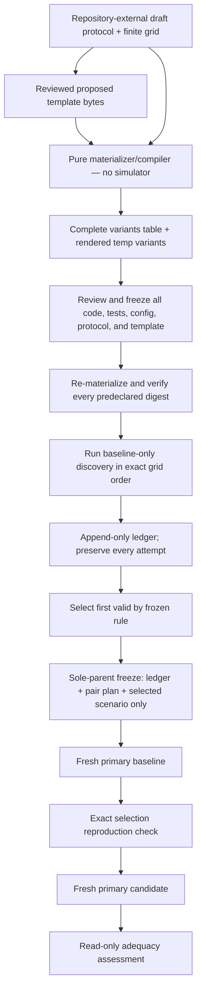

# Hermes Phase 7 Contract Amendment — Interface-Valid Human Scoring and Deterministic Discovery

## 0. Status and approval boundary

**Status:** PROPOSED — CLAUDE REVIEW AND EXPLICIT USER APPROVAL REQUIRED.

**Date:** 2026-08-16.

**Repository checkpoint inspected:**

- branch: `codex/phase7-evaluation-adequacy-human-validation`;
- HEAD: `0caed90150a5b403227c97bf21c7c809181ee3cf`;
- tracked worktree and index: clean when this amendment was started;
- retained Phase 7 availability fixture: ignored and registry-bound, not staged;
- no Task 8 discovery run, primary-pair run, server, browser, or new MetaDrive execution occurred.

This document is a narrow amendment to
`PHASE7_EVALUATION_ADEQUACY_AND_HUMAN_VALIDATION_DESIGN.md` and
`PHASE7_CLAUDE_FEEDBACK_DISPOSITION.md`. It does not authorize implementation by itself.

Until Claude reviews this document and Bo-Huei explicitly approves the revised contract:

- technical requirement `P7-HV-07` is `BLOCKED` and Task 7 must not be administered or counted;
- the `READY_FOR_PILOT` and `READY_FOR_MAIN_COHORT` criteria are not met;
- the Task 7 edits at `0caed901...` are a tested proposal, not an approved protocol revision;
- Task 8 scenario materialization, discovery, ledger creation, pair-plan creation, and simulator
  execution remain prohibited; and
- no existing Phase 7 adequacy, gate, review, comparison, or artifact result may be reinterpreted.

## 1. Executive summary

Two implementation preflights found genuine contradictions in the approved Phase 7 design.

1. **Task 7 asks participants to report facts the approved schema-1 review interface does not
   expose.** The stored artifact can support a moderator audit of challenge phase and the numeric
   shield threshold, but the public `ReviewEnvelope`/workbench intentionally projects the relevant
   schema-1 observation tracks as unavailable and does not expose shield configuration content.
   Scoring those hidden facts violates the neutral instruction to use only what the interface
   shows.
2. **Task 8 cannot truthfully freeze one adapter-config digest across a multi-variant MetaDrive
   discovery grid.** MetaDrive's evidence configuration includes the scenario challenge payload,
   so each grid variant has a different recorded adapter-config digest. The current materializer
   contract also binds only a version and field mappings; it does not bind exact template bytes,
   template semantics, or the complete predeclared rendered-variant identities.

The recommended amendment is:

- version Task 7's scored key around **facade-visible evidence only**, while retaining hidden
  phase/threshold/recomputed-TTC facts as clearly labeled moderator-only audit context;
- version the Phase 7 human protocol and Task 7 answer key rather than silently modifying v1;
- add a versioned materializer-template identity and complete frozen `variants` table;
- bind adapter-config digest per variant, then require the selected ledger entry, pair plan, and
  both primary artifacts to agree on that exact selected digest; and
- generate all planned bytes and digests without launching MetaDrive, then freeze them before the
  first discovery run.

The product principle is unchanged:

> The model proposes, the environment executes, the verifier evaluates, the gate decides, and the
> trace supports a reproducible internally consistent Hermes decision.

This amendment improves verifier and instrument integrity. It does not expand Hermes beyond local,
simulation-only evaluation and does not establish real-world safety, authenticity, authorization,
certification, or deployment permission.

## 2. Decision frame

### 2.1 User and blocked decision

The immediate users are:

- a non-author participant using the local read-only review workbench;
- a moderator scoring only evidence the participant could inspect;
- an evaluation engineer freezing a finite MetaDrive discovery question before execution; and
- a reviewer deciding whether the resulting local evidence is adequate for that declared question.

The blocked decisions are:

1. Can Task 7 be scored deterministically without asking a participant to infer hidden evidence?
2. Can Task 8 freeze a complete, non-cherry-picked grid while preserving exact recorded component
   identities for every variant?

### 2.2 Current status

| Area | Current state | Decision |
|---|---|---|
| Task 7 public values, pointers, eligibility, and status tests | Automated tests green | Not sufficient; `P7-HV-07` remains `BLOCKED` while governing design disagrees |
| Task 7 human observation | Not run | `NOT YET OBSERVED` |
| Task 7 pilot readiness | Criteria not met | Do not recruit or administer |
| Task 8 discovery contract | Preflight contradiction | `HOLD` |
| Task 8 MetaDrive discovery | Not run | Prohibited pending approval |
| Existing retained bundles | Preserved | No mutation or reinterpretation |

## 3. Evidence behind the amendment

### 3.1 Task 7 interface evidence boundary

The approved Task 7 pair is:

```text
handoff-p3-cutin-baseline -> handoff-p3-cutin-shielded
```

Both artifacts use evidence schema `1.0`. The immutable stored artifacts contain challenge-phase
and policy-input facts, but the approved participant interface does not expose all of them:

- `ObservationValue` can represent `challenge_phase`, but schema-1 timeline projection makes the
  raw/delivered/result observation tracks `NOT_AVAILABLE` with zero points;
- the candidate threshold `2.0 s` is stored at
  `execution-context.json /shield/config/ttc_threshold_s`, but shield configuration content is not
  projected into the participant-facing review envelope/workbench; and
- proving target-band entry requires recomputing policy-input TTC from stored front distance and
  relative speed, which is not an approved participant operation for this schema-1 task.

Facade-visible Task 7 facts are sufficient for a narrower, honest question:

- comparison `COMPATIBLE`;
- baseline and candidate both `HOLD` and `INTERNALLY_CONSISTENT`;
- minimum TTC `1.8155836417275437 -> 8.49579415469856 s`;
- route completion `84.88178621406203 -> 84.39151677812995 %`;
- maximum absolute acceleration
  `12.683377265917573 -> 13.003747463227677 m/s^2`;
- maximum absolute jerk `128.41591835005693 -> 157.565283775339 m/s^3`;
- candidate `SPEED_CAP` at sequences `20`, `26`, and `32`;
- candidate override histogram `{"SPEED_CAP": 3}`; and
- no recorded `TTC_BELOW_THRESHOLD` override reason.

Those facts support the bounded conclusion:

> The stored review evidence does not demonstrate TTC-target intervention, mechanism engagement,
> causal treatment effect, an aggregate winner, a safer system, or advancement readiness.

The absence of a recorded `TTC_BELOW_THRESHOLD` reason does not prove that the target predicate was
false. It proves only what the typed review surface records. This distinction is part of the scored
non-causal conclusion.

They do not support asking the participant to report hidden `PRE_TRIGGER`/`CUT_IN` labels, the
numeric threshold, or target-band non-entry.

### 3.2 Task 8 adapter-config identity contradiction

`StudyProtocol.expected_components.adapter.config_digest_sha256` currently requires one fixed
digest, and the loader requires the pair plan to equal it. That cannot describe the approved finite
MetaDrive grid truthfully because MetaDrive's trace-bound `evidence_config` includes:

- resolved MetaDrive environment configuration;
- simulator version and source commit;
- challenge-manager identity; and
- the scenario's complete challenge payload.

Changing grid parameters therefore changes the recorded adapter-config digest. Read-only preflight
materialization already demonstrated distinct digests for different allowed gap/recovery/duration
values. Treating one digest as global would force one of three unacceptable outcomes:

- a singleton grid masquerading as discovery;
- deliberate component-identity failures for valid variants; or
- a digest that excludes stored scenario-dependent configuration and no longer matches the bundle.

### 3.3 Task 8 materializer identity gap

`MaterializerSpecification` currently freezes only:

```text
version
parameter-to-scenario-field mappings
```

It does not freeze:

- the source template path or bytes;
- a semantic digest of the template;
- the deterministic renderer identity;
- constant/non-grid scenario fields;
- the exact byte and semantic digest for every Cartesian-grid output; or
- the expected adapter-config digest for every rendered variant.

Consequently, two implementations can claim the same mappings while generating different scenario
bytes, constant fields, or adapter identities. The selected scenario is checked later, but the
complete pre-discovery search space is not cryptographically frozen.

## 4. Amendment A — Task 7 human-scoring contract

### 4.1 Options

| Option | Description | Benefit | Cost/risk | Decision |
|---|---|---|---|---|
| A1 | Expand review schema/workbench to expose phase, shield config, and policy-input TTC derivation | Preserves the original key | New review/UI contract, schema-1 special handling, larger trust surface | Reject for this wave |
| A2 | Version the key around facade-visible evidence; keep hidden facts moderator-only | Honest, minimal, testable, no UI expansion | Changes the approved task contract | **Recommend** |
| A3 | Preserve v1 exactly and keep Task 7 non-executable | No contract change | Blocks pilot indefinitely and yields no usable Task 7 | Fallback only |

### 4.2 Required versioning

If A2 is approved, freeze these identifiers together:

```text
Human protocol version: P7-HV-1.1
Task 7 prompt version: P7-T07-v2
Task 7 answer-key version: P7-T07-A2
Registry Task 7 version: 1.1
```

The participant prompt may retain its plain-language wording, but its version changes because the
required evidence and scoring semantics materially change. No v1 Task 7 observation may be mixed
with v2 results. No human observation exists today, so there is no result migration.

### 4.3 Exact scored checklist

Task 7 v2 is correct only when the participant, using the approved review interface:

1. reports comparison `COMPATIBLE`;
2. reports baseline `HOLD` / `INTERNALLY_CONSISTENT` and candidate `HOLD` /
   `INTERNALLY_CONSISTENT`;
3. reports unchanged verdict `HOLD -> HOLD`;
4. reports minimum TTC `1.8155836417275437 -> 8.49579415469856 s` as `IMPROVED`;
5. reports route completion `84.88178621406203 -> 84.39151677812995 %` as `REGRESSED`;
6. reports maximum absolute acceleration
   `12.683377265917573 -> 13.003747463227677 m/s^2` as `REGRESSED`;
7. reports maximum absolute jerk `128.41591835005693 -> 157.565283775339 m/s^3` as
   `REGRESSED`;
8. reports `SPEED_CAP` at candidate sequences `20`, `26`, and `32`;
9. reports candidate override count `3`, histogram `{"SPEED_CAP": 3}`, and zero recorded
   `TTC_BELOW_THRESHOLD` reasons;
10. concludes that the stored review evidence does **not demonstrate** TTC-target intervention or
   mechanism engagement, and that absence of a recorded target reason does not prove the hidden
   predicate was false; and
11. rejects causal effect, aggregate winner, safer-system, recommendation, or advancement claims;
    and
12. reports the seven exact authority values: Gate verdict `HOLD`, Evidence integrity
    `INTERNALLY_CONSISTENT`, Origin `NOT_AUTHENTICATED`, Authorization `NOT_EVALUATED`, Deployment
    permission `NONE`, Scope `SIMULATION_ONLY`, and Authoritative status `NOT_DEFINED`. Gate verdict
    and Evidence integrity are required separately for both baseline and candidate.

The scored task must not require the participant to name why phase/threshold/target-band evidence
is absent. The interface does not expose those field identities. A correct answer may simply state
the bounded no-demonstration conclusion.

### 4.4 Moderator-only, non-scored audit context

The following retained-artifact facts remain useful for technical audit but are not participant
answers and never enter the North Star numerator:

#### Moderator-only retained-artifact audit — NON-SCORED / NOT EXPOSED BY APPROVED PARTICIPANT INTERFACE

| Fact | Exact stored/recomputed value | Exact bound source and scan rule |
|---|---|---|
| Candidate challenge phase | sequence 20 `PRE_TRIGGER`; 26 `PRE_TRIGGER`; 30 `PRE_TRIGGER`; 31 `CUT_IN`; 32 `CUT_IN` | Five separate candidate `events.jsonl` records selected by `sequence`; pointer `/observation_summary/challenge_phase` in each record |
| Candidate threshold | `2.0 s` | candidate `execution-context.json`, pointer `/shield/config/ttc_threshold_s` |
| Baseline policy-input TTC | Complete scan of sequences 0–299 finds finite closing samples at 35–39. Sequence 35: `7.601826890027262 / 3.9533629417406444 = 1.9228760430177498 s`; sequence 36: `7.2062191778049 / 3.969092369078694 = 1.8155836417275437 s`; these are the only values `<= 2.0 s`. | Every baseline `events.jsonl` record, pointers `/observation_summary/front_distance_m` and `/observation_summary/front_relative_speed_mps`; include only non-null distance and strictly negative relative speed, then compute `distance / -relative_speed` |
| Candidate policy-input TTC | Complete scan of sequences 0–299 finds only two finite closing samples. Sequence 35: `10.792115790907568 / 0.9828672409066663 = 10.980237555737595 s`; sequence 36: `10.688161895909293 / 1.2580533027625505 = 8.49579415469856 s`; neither is `<= 2.0 s`. | Every candidate `events.jsonl` record, using the same two exact pointers and strictly-negative-relative-speed rule |

The heading above is the one allowed literal; it is not an example or an interchangeable label.
This section may appear only in the moderator key after the participant's attempt closes.

These facts cannot justify marking an unobservable participant claim correct.

The existing Claude disposition's generic statement that sequence `31` first becomes `BRAKING`
does not apply to these cut-in artifacts. For the Task 7 pair, sequence `30` is `PRE_TRIGGER` and
sequence `31` is the first `CUT_IN` record. The sequence-31 `BRAKING` convention remains valid only
for the lead-vehicle selection-evidence domain.

### 4.5 Required participant-visible source references

The scored key binds only these participant-visible typed paths:

- `ComparisonEnvelope.compatibility.status`;
- `ComparisonEnvelope.baseline.gate_verdict`, `.baseline.integrity`,
  `.candidate.gate_verdict`, and `.candidate.integrity`;
- `ComparisonEnvelope.improvements[dimension_id="minimum_ttc_s"]`;
- `ComparisonEnvelope.regressions[dimension_id="route_completion_pct"]`,
  `[dimension_id="max_abs_acceleration_mps2"]`, and
  `[dimension_id="max_abs_jerk_mps3"]`; each delta carries exact BASELINE/CANDIDATE `METRIC`
  side references to its matching `metrics.json` pointer;
- candidate `ReviewEnvelope.timeline.tracks[track_id="override_reasons"].points[sequence=20]`,
  `[sequence=26]`, and `[sequence=32]`, with three separate `EVENT` source references to
  `events.jsonl /override_reasons` at the matching sequence;
- candidate `ReviewEnvelope.metrics[metric_id="shield_override_count"]` and
  `[metric_id="shield_override_reasons"]`; the latter's `EVENT` references cover
  `/override_reasons` for the complete retained sequence grid; and
- each side's `ReviewEnvelope.gate.verdict`, `.verification.integrity`, and five ordered
  `ReviewEnvelope.trust.records` for Origin, Authorization, Deployment permission, Scope, and
  Authoritative status.

No participant-visible source list may include `execution-context.json /shield/config`,
`/observation_summary/challenge_phase`, or policy-input TTC recomputation for this schema-1 task.

### 4.6 Status, readiness, and owner rules

- `P7-HV-07` is a technical requirement with the closed values `BLOCKED | IMPLEMENTED`. It is
  `BLOCKED` now. It becomes `IMPLEMENTED` only after explicit approval, all tracked amendments,
  fresh automated gates, and two independent immutable-package `GO` reviews; tests alone cannot
  promote it.
- `Automated correctness` remains the separate value `TEST-DERIVED` after its named tests pass.
- Only the named manual-visual, accessibility, expert, pilot, or main-cohort protocol may change
  its own evidence status; no protocol can promote a different evidence plane.
- `Manual visual quality`, `Accessibility`, `Expert critique`, `Pilot human comprehension`, and
  `Main-cohort human comprehension` remain exactly `NOT YET OBSERVED`.
- `HUMAN_EVIDENCE_OBSERVED` and `COMPREHENSION_GATE_MET` remain exactly `NOT PROMOTED`.
- The `READY_FOR_PILOT` and `READY_FOR_MAIN_COHORT` criteria remain **not met** until every named
  prerequisite is complete. This amendment does not create a readiness enum or boolean field.
  Explicit acceptance of the currently `UNASSIGNED` evidence-custodian and deletion-owner roles
  remains mandatory.

Every status-bearing field must be parsed exactly once and compared with its allowed enum. Tests
must operate on raw exact lines/rows, must not normalize accepted values by case-folding or
whitespace collapsing, and must not rely on a list of prohibited phrases. While prerequisites are
open:

- cohort decision/disposition fields remain blank;
- `HUMAN_EVIDENCE_OBSERVED` and `COMPREHENSION_GATE_MET` remain `NOT PROMOTED`;
- no document may contain a second conflicting status value; and
- `COMPLETE`, `READY`, `OBSERVED`, `PASS`, or `GATE MET` cannot appear as an owning status merely
  because another paragraph still says `NOT YET OBSERVED`.

Mutation tests cover removal, duplication, unknown value, wrong case, added whitespace, and every
canonical promotion form. Blank cohort-result fields remain distinct from the current authoritative
handoff state.

### 4.7 Required governing-document updates after approval

Section 9 is the sole modification allowlist. Within that exact scope, the implementation must:

- label the raw cut-in facts in design §5.2 as moderator-only retained-artifact audit context;
- replace design §14.2's Task 7 row and prose with the interface-valid v2 contract;
- replace design §21's claim that hidden target-band/phase facts are participant-visible;
- keep the denominator and immediate-stop rules while binding them to v2;
- correct feedback disposition §2 so sequence-31 `BRAKING` is explicitly lead-only and Task 7
  cut-in sequence 31 is `CUT_IN`;
- supersede the disposition's P0-1 Task 7 requirement with the facade-visible checklist; and
- add negative cross-document tests proving hidden moderator facts cannot appear in scored
  participant sections.

The ignored historical Task 9 brief, reports, and review packages remain byte-for-byte historical
inputs. A new ignored amendment execution report/review package records their supersession after
implementation; the tracked decision log records the same relationship.

## 5. Amendment B — Task 8 discovery/materializer contract

### 5.1 Options

| Option | Description | Benefit | Cost/risk | Decision |
|---|---|---|---|---|
| B1 | Keep one global adapter-config digest | Smallest diff | False for a multi-variant challenge grid | Reject |
| B2 | Record adapter digest only after each run | Truthful ledger | Search space not fully predeclared; weaker anti-cherry-pick | Reject |
| B3 | Predeclare exact variant bytes, semantics, and adapter digest for every grid point | Truthful and audit-ready | Versioned model/loader/materializer work | **Recommend** |
| B4 | Hash only a scenario-independent adapter subset | Stable | No longer equals trace-bound manifest identity | Reject |

### 5.2 Version boundary

No real Phase 7 adequacy protocol, discovery ledger, or pair plan has been published. Therefore the
recommended correction versions the **plan-record schema family** before first use:

```text
StudyProtocol record schema: 2.0
MaterializerSpecification record schema: 2.0
DiscoveryLedgerEntry record schema: 2.0
PairPlan record schema: 2.0
Study/criteria major version and .v1 filenames: unchanged
EvaluationAdequacyEnvelope schema: 1.0, unchanged
Public assess-adequacy API: unchanged eight-argument signature
```

The study question/criteria remain v1; `2.0` identifies the corrected storage and identity shape,
not a different scientific question. Public Phase 7 plan capture accepts only the schema-2 record
family after this amendment. Plan-record schema `1.0` remains only as an explicit rejection input;
it is never silently upgraded, accepted for discovery/assessment, or retained as a second active
model path. Pure-assessment characterization fixtures migrate to schema 2.0 while preserving their
criterion semantics and bytes at the assessment-result boundary.

### 5.3 Frozen template identity

`MaterializerSpecification 2.0` adds:

```yaml
version: "2.0"
algorithm: STRICT_EXISTING_SCALAR_REPLACEMENT_V1
output_serialization: HERMES_RESOLVED_SCENARIO_YAML_UTF8_LF_V1
protocol_serialization: HERMES_EVALUATION_PROTOCOL_YAML_UTF8_LF_V1
adapter_config_projection: METADRIVE_ADAPTER_EVIDENCE_CONFIG_V1_1
template:
  repository_relative_path: evaluation-plans/templates/lead_ttc_engagement.template.yaml
  byte_digest_sha256: <sha256 exact UTF-8 bytes>
  scenario_digest_sha256: <sha256 canonical parsed ScenarioDefinition>
mappings: <exact ordered existing parameter/field mappings>
variants: <complete ordered Cartesian grid table>
```

The template path is a lexical repository-relative path derived only from the captured protocol;
the caller cannot supply it separately. The protocol-registration commit contains both the reviewed
protocol and reviewed template. The registration inspector proves the declared template blob at
that commit and includes the path in its clean-status check. The pair-plan commit still has the
protocol-registration commit as its sole parent and still adds only the ledger, pair plan, and
selected scenario. No unselected variant becomes tracked source.

The public assessment service still captures exactly three caller-selected plan records in its
existing order:

```text
protocol -> discovery ledger -> pair plan
```

It does not introduce a fourth public selection or reopen the current filesystem template. Template
verification is a command-specific local-Git registration operation after invalid, incompatible,
and invalid-plan gating.

The template is a fully valid supported `ScenarioDefinition`, not text containing placeholder
tokens. Materialization parses it into a typed object, changes only the five closed mappings below,
revalidates the complete scenario, then serializes deterministically. String substitution is
forbidden.

The template itself must have scenario schema `2.0`, adapter `metadrive`, challenge kind
`lead_vehicle_hard_brake`, and no observation/control fault profile. Its seed-independent control
frequency and horizon must equal `StudyProtocol.planned_execution`. The protocol's frozen seed,
expected MetaDrive version/commit, and each materialized scenario are the complete inputs to the
adapter-config preview; no ambient environment value may affect the result.

`HERMES_RESOLVED_SCENARIO_YAML_UTF8_LF_V1` means the existing public
`hermes.scenarios.loader.resolved_scenario_yaml()` result encoded as UTF-8. That serializer uses
the schema-aware resolved payload, `yaml.safe_dump(..., allow_unicode=True, sort_keys=True)`, LF
line endings, and one final newline. The materializer must call that serializer rather than create
a second YAML format.

`HERMES_EVALUATION_PROTOCOL_YAML_UTF8_LF_V1` is also exact. Starting from the validated final
`StudyProtocol 2.0` model:

1. call `model_dump(mode="json")`;
2. normalize and serialize it with `canonical_adequacy_json_bytes`, then decode that JSON once to
   an ordinary tree so there are no shared object identities or YAML aliases;
3. call
   `yaml.safe_dump(payload, allow_unicode=True, sort_keys=True, default_flow_style=False,
   indent=2, width=4096, line_break="\n", explicit_start=False, explicit_end=False)`;
4. require exactly LF line endings and one final newline; and
5. encode once as UTF-8 without BOM.

The protocol byte digest is SHA-256 over those exact bytes. Its semantic digest is exactly
`SHA-256(canonical_adequacy_json_bytes(final_protocol))`. The same plan-YAML serializer is used
later for `PairPlan 2.0`; discovery ledger serialization remains one canonical JSON object per line
with one LF and no CR/BOM.

The grid and mappings are one exact ordered five-element tuple. A subset, superset, alias, duplicate,
or reordering is invalid:

| Order | Grid parameter | Exact scenario field | Strict type and closed domain |
|---:|---|---|---|
| 1 | `initial_gap_m` | `challenge.initial_gap_m` | finite `float`, bool/int rejected, `0.0 < value <= 200.0` |
| 2 | `actor_speed_mps` | `challenge.actor_speed_mps` | finite `float`, bool/int rejected, `0.0 <= value <= 50.0` |
| 3 | `trigger_step` | `challenge.trigger_step` | strict `int`, bool rejected, `0 <= value` |
| 4 | `brake_duration_steps` | `challenge.brake_duration_steps` | strict `int`, bool rejected, `1 <= value <= 10_000` |
| 5 | `recovery_throttle` | `challenge.resume_throttle_command` | finite `float`, bool/int rejected, `0.0 <= value <= 1.0` |

Every declared dimension value must satisfy its row before Cartesian expansion. Every resulting row
must also satisfy
`trigger_step + brake_duration_steps <= StudyProtocol.planned_execution.horizon_steps`.
These checks are model-boundary rules and are repeated during loader cross-record validation so a
fully rebound invalid plan cannot bypass them. Boundary tests cover each inclusive edge, each
out-of-range neighbor, nonfinite floats, integer-as-float, float-as-integer, bool, and a fully
recomputed protocol/ledger/pair mutation.

If reviewers prefer an embedded template instead, they must explicitly choose that alternative and
freeze the embedded byte/string format. A path-only or digest-only reference is insufficient.

### 5.4 Complete predeclared variant table

Each `MaterializedVariantBinding` is frozen before the first discovery run:

```yaml
grid_index: 0
variant_id: grid-0000
parameters: <exact ordered GridAssignment tuple>
scenario_byte_digest_sha256: <SHA-256 of exact rendered bytes>
scenario_digest_sha256: <scenario_digest of canonical parsed scenario>
adapter_config_digest_sha256: <SHA-256 of canonical trace-bound adapter evidence config>
```

The digest algorithms are exact:

```text
scenario_byte_digest_sha256 = SHA-256(UTF-8 resolved-scenario YAML bytes)
scenario_digest_sha256 = hermes.scenarios.loader.scenario_digest(parsed scenario)
adapter_config_digest_sha256 = SHA-256(canonical_json_bytes(preview adapter config))
```

Required invariants:

- the table length exactly equals the bounded Cartesian product and never exceeds `256`; the
  loader's existing absolute parser defense of `1,024` records remains unchanged, but a valid
  Task 8 schema-2 plan cannot exceed the tighter representable limit;
- `grid_index == row index`, `variant_id == grid-{index:04d}`, and parameters follow exact grid
  order;
- parameter tuples exactly match the existing grid dimensions and materializer mappings;
- renderer output reparses as the supported scenario schema;
- every rendered byte/semantic/adapter digest matches its predeclared value;
- byte, semantic, adapter, and variant-ID identities are each unique across the table; plan-record
  schema `2.0` rejects duplicates unconditionally;
- a materialization or pre-discovery rematerialization mismatch is a typed materialization-command
  failure at exit `40`, emits no adequacy envelope, and occurs before simulator execution;
- the public loader validates only the static schema, complete table, and captured cross-record
  bindings; it does not reopen the template or claim to re-prove template-to-table derivation; and
- the materializer writes only to a newly created explicit repository-external output directory and
  never overwrites, repairs, normalizes, or deletes a variant. Each output name is derived exactly
  as `grid-{grid_index:04d}.yaml`; it is not caller-supplied.

### 5.5 Per-variant adapter identity

The generic component contract becomes explicit about digest ownership through
`config_digest_scope`:

```text
POLICY: FIXED digest in protocol
ADAPTER: MATERIALIZED_VARIANT digest, no global config digest
SIMULATOR: NOT_APPLICABLE config digest, fixed source commit
GATE: FIXED digest in protocol
```

Add the exact `config_digest_scope` discriminator with these cross-product validators:

```text
FIXED -> component is POLICY or GATE; config_digest_sha256 is present; source_commit is null
MATERIALIZED_VARIANT -> component is ADAPTER; global digest is null; source_commit is null
NOT_APPLICABLE -> component is SIMULATOR; global digest is null; source_commit is present
```

`DiscoveryLedgerEntry 2.0` adds `materialized_variant_id` and
`adapter_config_digest_sha256`. The completed ledger has exactly one entry for each protocol
variant in table order: `attempt_index == grid_index`, the variant ID and ordered parameters equal
that row, and the adapter digest equals both that row and the verified bundle's observed adapter
identity. The ledger's scenario byte and semantic digests must equal the same protocol variant.

`ExpectedPair` adds `selected_materialized_variant_id` and
`scenario_byte_digest_sha256`; its existing scenario semantic and adapter digests remain required.
The selected **scenario-byte** identity must equal all of:

- the selected planned variant;
- the selected discovery-ledger entry;
- the pair plan's selected scenario identity;
- the exact selected tracked scenario blob in the sole-parent pair-plan commit.

The selected semantic `scenario_digest_sha256` and per-variant
`adapter_config_digest_sha256` must separately equal the selected planned variant, selected ledger
entry, pair plan, fresh primary baseline, and fresh primary candidate. The current primary mapping
does not expose the scenario-file byte digest and must not invent one. Existing stored verification
independently proves that each primary `scenario.resolved.yaml` is canonical for its parsed
scenario; that verification is not relabeled as a direct plan-to-primary byte comparison.

An internal mismatch among protocol, variant table, ledger, pair plan, and selected scenario is
`INVALID_PLAN` before Git. Failure precedence for primary evidence is exact:

- if only one side's scenario or adapter identity changes, the two artifacts become structurally
  unequal and the existing comparison returns `INCOMPATIBLE`, exit `40`, before plan capture or Git;
- if both artifacts remain mutually compatible but share an available semantic scenario or
  adapter identity that differs from the valid plan, the owning adequacy criterion is `FAIL`, exit
  `0`; and
- fields outside the existing comparison compatibility relation retain their current criterion
  `PASS`/`FAIL`/`NOT_AVAILABLE` behavior.

Missing required supported primary evidence is `NOT_AVAILABLE`. No mismatch is silently
normalized. Tests bind both precedence branches and prove the earlier terminal result performs no
plan or Git operation.

The separately tracked candidate shield file is also identity-bound before simulation.
`config/shield.phase7.lead_ttc.yaml` must parse through the existing strict shield loader to a
runtime `ShieldConfig` whose complete JSON projection is exactly equal to
`StudyProtocol.candidate_shield.configuration`; its canonical SHA-256 must equal both the protocol
and pair-plan candidate-shield config digests. Any mismatch blocks registration/discovery rather
than becoming a primary result. The exact primary commands, run from the canonical repository root
at the clean pair-plan commit, are:

```bash
conda run -n hermes-dev hermes run \
  --simulator metadrive \
  --scenario scenarios/metadrive_lead_vehicle_hard_brake_adequacy_v1.yaml \
  --policy metadrive-idm --seed 7 --run-id handoff-p7-lead-baseline \
  --gate-config config/gates.phase2.yaml --headless --shield noop

conda run -n hermes-dev hermes run \
  --simulator metadrive \
  --scenario scenarios/metadrive_lead_vehicle_hard_brake_adequacy_v1.yaml \
  --policy metadrive-idm --seed 7 --run-id handoff-p7-lead-candidate \
  --gate-config config/gates.phase2.yaml --headless --shield deterministic \
  --shield-config config/shield.phase7.lead_ttc.yaml
```

The baseline completes and is freshly verified/reproduced before the candidate command is allowed.
No favorable verdict or metric is required; the exact observed exits and artifacts are preserved.

### 5.6 Pure adapter-config preview

Predeclaring adapter digests must not launch MetaDrive. Add one import-safe pure builder at a narrow
module such as `src/hermes/adapters/metadrive_config.py`, used by both planning and runtime:

```python
preview_metadrive_adapter_evidence_config(
    scenario,
    seed,
    simulator_version,
    simulator_commit,
) -> dict[str, JsonValue]
```

Properties:

- no environment construction, simulator import, filesystem discovery, network, or subprocess;
- includes the same resolved environment config, signal-availability records, challenge-manager
  identity, challenge payload, and front-signal mapping used by runtime evidence;
- after runtime dependency provenance is resolved but before environment construction,
  `MetaDriveAdapter.reset` calls the same builder exactly once and immediately canonicalizes the
  complete preview into a retained immutable byte snapshot;
- the environment receives an independent mutable deep clone of the retained preview's
  `metadrive_config`; challenge runs receive a second independent mutable deep clone of that same
  preview's `challenge` member. Runtime never calls `scenario.challenge.model_dump()` or rebuilds
  either value through another path;
- `evidence_config` returns a fresh deep copy decoded from the retained snapshot, never the object
  given to the environment; and
- exact canonical digest parity is tested between preview and dependency-injected runtime reset,
  then once with pinned real MetaDrive in the separately approved real-only acceptance.

Mutation tests use an environment factory that mutates both supplied objects and a caller that
mutates the returned evidence mapping. Neither may change the retained bytes/digest, which must
remain exactly equal to the pre-runtime preview digest.

Adequacy models/loader must not import the adapter or this builder. A separately approved Task 8
integration harness or pure materialization module produces planned values; adequacy only captures
and validates immutable records.

### 5.7 Materialization flow



The compiler may output a proposed finalized protocol into a new external directory. It may not
edit a tracked protocol in place. The template is also repository-external until the reviewed
template and finalized protocol are copied to their declared tracked paths and committed together
as the protocol-registration commit. The tree at that commit must also contain every reviewed Task
8 implementation/test change and the candidate shield configuration; earlier reviewed checkpoint
commits may be ancestors, but no later code/config/test change may intervene before discovery. This
separate explicit freeze occurs before discovery.

The compiler consumes a repository-external authoring draft plus the reviewed template and emits a
strict final `StudyProtocol` record with `schema_version: "2.0"`, `protocol_version: "1.0"`, and
the complete table. The authoring draft is not a valid adequacy plan, is never registered as
evidence, and cannot be supplied to `assess-adequacy`.

The authoring draft has one private, strict `StudyProtocolAuthoringDraft 1.0` shape owned only by
`hermes.evaluation_plans.materializer`:

```yaml
authoring_schema_version: "1.0"
protocol_payload:
  # Exactly these final StudyProtocol fields, no extras:
  # protocol_id, protocol_version, label, scope, claim_type, criteria,
  # selection_evidence, baseline_grid, selection_rule, valid_run_rules,
  # exclusion_rules, candidate_shield, expected_components, planned_execution, registration
materializer_input:
  algorithm: STRICT_EXISTING_SCALAR_REPLACEMENT_V1
  output_serialization: HERMES_RESOLVED_SCENARIO_YAML_UTF8_LF_V1
  adapter_config_projection: METADRIVE_ADAPTER_EVIDENCE_CONFIG_V1_1
  template_repository_relative_path: evaluation-plans/templates/lead_ttc_engagement.template.yaml
  mappings: <the exact ordered five mappings in section 5.3>
```

The draft cannot contain final template digests, a variants table, generated identities, a caller-
selected variant, discovery observations, or candidate results. The compiler captures both input
files once with bounded no-follow reads, validates the draft and template, expands the complete
grid, computes every final binding, constructs the strict final protocol model, and serializes it.

Both YAML inputs use the same closed YAML/JSON-value subset and normalization boundary as the
public plan loader. They reject UTF-8 BOM, tags, aliases, anchors, merge keys, duplicate or
non-string mapping keys, implicit non-JSON scalars, nonfinite numbers, malformed UTF-8, CR line
endings, and unknown fields. Parsed structure is bounded to depth `32`, `100,000` nodes, `4,096`
Unicode scalars per string, integer absolute value `<= 2^63 - 1`, and finite float absolute value
`<= 1e12`. `UnicodeError`, `TypeError`, `ValueError`, `OverflowError`, `RecursionError`, YAML
errors, validation errors, and filesystem errors are normalized to the command's detached typed
error boundary; no raw exception, path content, parser diagnostic, cause, or context escapes.
Tests isolate every malformed form and every exact numeric/structure boundary plus `+1`, so one
earlier rejection cannot mask the intended guard.

The exact command surface is:

```bash
hermes materialize-evaluation-plan \
  --repository-root /absolute/Hermes \
  --authoring-draft /absolute/repository-external/lead_ttc_engagement.authoring.yaml \
  --template /absolute/repository-external/lead_ttc_engagement.template.yaml \
  --output-root /absolute/repository-external/new-phase7-plan-v1 \
  --format json
```

All four paths must use absolute, lexically canonical spelling. The repository root must be the
existing canonical Hermes repository directory. Both input files and the output root must be
outside that root. Both input files must already exist as bounded regular files; the output path
and an output-path symlink must not exist, and its canonical parent must be an existing directory.
The command does not infer a repository, template, grid, output name, or version. It creates
exactly:

```text
new-phase7-plan-v1/
  lead_ttc_engagement.protocol.v1.yaml
  variants/grid-0000.yaml
  ... one grid-{index:04d}.yaml per declared row ...
```

Materialization and downstream loader bounds are jointly frozen:

- `1 MiB` per input file and `2 MiB` combined captured authoring input;
- `4,096` Unicode scalars per parsed string;
- at most `256` Task 8 variants, while the loader's independent absolute parser defense remains
  `1,024` records;
- `1 MiB` per rendered scenario and `64 MiB` combined rendered scenario bytes;
- final protocol bytes `<= 1 MiB`, and successful validation through the same pure
  `validate_study_protocol_bytes` seam used by the public loader, before the output root is created;
- every schema-2 discovery-ledger canonical JSONL record `<= 3 KiB` including its final LF, so the
  complete 256-row ledger is at most `768 KiB`; and
- final ledger and pair-plan files each `<= 1 MiB`, preserving the existing `1 MiB` per-file and
  `3 MiB` three-file aggregate capture limits without enlarging them.

Checkpoint D constructs the exact deterministic discovery command/ID/path/environment skeleton for
every declared row using fixed-width placeholder hashes/commits and the frozen rationale literals,
then canonicalizes it through the real schema-2 ledger model. Any line over `3 KiB`, aggregate over
`1 MiB`, or three-plan projection over `3 MiB` blocks registration. Actual append enforces the same
limits before each run and write; it may not discover an oversize condition only after executing a
simulator attempt.

Tests cover each exact size/count limit and `+1`, root/ancestor replacement, intermediate/leaf
symlink, FIFO/device/socket, mutation during capture, duplicate output, partial write, and descriptor
cleanup. The implementation may use a smaller in-memory representation but may not relax these
public limits.

Success is exit `0` and one canonical JSON summary containing the output-root locator, protocol
byte and semantic digests, and variant count. Invalid input, any derivation mismatch, unsafe path,
resource-bound failure, or partial write is one canonical bounded CLI error document and exit
`40`; it emits no adequacy envelope and never launches a simulator. The implementation computes
and validates all outputs within the documented aggregate resource cap before creating the output
root. If a filesystem failure occurs after creation, the incomplete root and exact diagnostics are
preserved for investigation and are never accepted, retried, repaired, normalized, overwritten, or
silently deleted.

### 5.8 Template provenance and public result

Recommended boundary:

- do not add a fourth caller-supplied plan selection;
- do not change the public eight-argument adequacy API;
- keep `EvaluationAdequacyEnvelope 1.0`, its field order, canonicalization algorithm, public
  signature, and unaffected early-terminal output bytes unchanged; schema-2 evaluated fixtures are
  deliberately rebaselined because their captured plan-source identities change;
- let the captured protocol's semantic digest bind the exact template identity and complete
  variant table; and
- make `RegistrationGitInspector` derive the template path from that captured protocol, prove exact
  template bytes at the protocol-registration commit, and include that path in clean-status checks.

The pair-plan diff remains exactly three additions. Missing/wrong historical template bytes or a
dirty current template yield `REGISTRATION_NOT_ESTABLISHED`; malformed protocol/variant/ledger/pair
relationships remain `INVALID_PLAN` before Git. A positive registration status therefore covers
the template blob and ordering without adding its identity to the portable envelope.

The portable assessment does not reopen the template, rerun the compiler, or claim that Git
attests to correct materialization. The public loader performs static schema/table/cross-record
validation only. The no-follow authoring compiler must parse the proposed
template, verify its declared semantic digest, and recompute every variant-table row before the
protocol-registration commit; it repeats that check from fresh external output before discovery.
The completed ledger then has one bound attempt per row. Git establishes only that the exact
self-controlled protocol/template bytes preceded that ledger/pair commit. Origin remains
`NOT_AUTHENTICATED`, local history remains rewritable, and compiler correctness remains supported
by reviewed code/tests rather than an independent signature or timestamp.

## 6. Failure precedence and trust boundaries

The existing order remains normative:

1. pure lexical screen of all public arguments;
2. baseline capture/verification;
3. candidate capture/verification;
4. compatibility decision;
5. protocol, ledger, and pair-plan capture/validation;
6. supported evidence-shape mapping;
7. bounded local Git inspection, including the protocol-derived template blob; and
8. pure adequacy assessment.

`assess-adequacy` never invokes the materializer. Within assessment, invalid-evidence quarantine or
incompatibility therefore always precedes plan, template-history, and Git results; no Git or
simulator operation occurs for an earlier terminal result. A one-sided scenario/adapter change is
`INCOMPATIBLE` before plan/Git. A mutually compatible pair whose shared available identity differs
from the valid plan reaches the owning criterion as `FAIL` at exit `0`.

The separate authoring command has no artifact selections and emits no adequacy envelope. Its typed
exit-`40` failure blocks protocol registration and discovery. It cannot reinterpret or mask a
review, comparison, or adequacy result because it is never composed into those public paths.

Hard boundaries remain:

- no cloud, network, remote repository, auto-discovery, or public bind;
- no physical vehicle, CAN bus, actuator, or road deployment;
- no LLM or optimizer in the control or parameter-selection loop;
- no candidate-result-driven search;
- no deletion of failed discovery attempts;
- no automatic retry or overwrite;
- no authenticity, authorization, certification, safety, or deployment claim; and
- no simulation until the protocol, template, and complete variant table are reviewed and committed
  cleanly.

## 7. Test-first implementation sequence after approval

### Checkpoint A — reconcile Task 7 authority

1. Write RED document-contract tests for design/plan/disposition/registry version alignment.
2. Write RED tests proving only facade-visible facts enter the scored key.
3. Write RED exact-field status/cohort blankness tests.
4. Update the approved authorities and bump versions together.
5. Run Task 9 focused, full non-MetaDrive, Ruff, and Git hygiene gates.
6. Freeze an immutable review package and obtain two independent GO reviews.

No participant study runs at this checkpoint.

### Checkpoint B — freeze Task 8 plan-record schema 2.0 models, loader, and provenance

1. Write RED model tests for template identity, variants, digest-scope discriminators,
   per-entry adapter digests, and every invalid cross-product.
2. Write RED loader tests that preserve the exact three-selection capture order, reject schema
   `1.0`, validate the complete grid and selected-variant bindings, and never open the template.
3. Write RED provenance tests for the protocol-derived template path, historical blob digest,
   clean-status inclusion, unchanged three-addition pair diff, command/output bounds, and failure
   precedence.
4. Implement only the minimum versioned models/loader/provenance changes; preserve the public API
   signature, envelope schema/field order/canonicalizer, and unaffected early-terminal bytes.
   Rebaseline schema-2 evaluated fixture bytes only for their changed captured plan identities.
5. Run focused architecture/import bombs and full non-MetaDrive gates.
6. Freeze and independently review the checkpoint.

### Checkpoint C — pure compiler and adapter preview

1. Write RED pure-function tests before implementation.
2. Prove every grid variant has deterministic byte, semantic, and adapter-config identities.
3. Prove preview/runtime digest parity with dependency injection.
4. Prove no simulator import/environment construction in normal compiler tests.
5. Add exactly `hermes materialize-evaluation-plan` with the arguments, output tree, canonical JSON
   success, typed exit-`40` error, and repository-external no-overwrite semantics in §5.7.
6. Freeze and independently review the checkpoint.

### Checkpoint D — freeze all reviewed implementation and protocol inputs before discovery

1. Generate the proposed protocol/template/variant table without simulator execution.
2. Review exact grid size, values, renderer, constants, and digests.
3. Run all non-simulator gates.
4. Create the clean protocol-registration commit whose tree contains all reviewed Task 8
   implementation, tests, configuration, candidate-shield configuration, final protocol, and
   template. This includes `config/shield.phase7.lead_ttc.yaml` and
   `tests/integration/test_phase7_artifacts.py`; it is not a protocol/template-only tree. Earlier
   reviewed Checkpoint B/C commits may be ancestors, but discovery begins from this exact commit and
   no later tracked implementation/config/test change is allowed.
5. Record exact commit and byte/semantic digests.

### Checkpoint E — discovery and primary pair

Only after Checkpoints A–D and explicit approval:

1. re-materialize into a fresh external directory and verify all predeclared digests;
2. run each baseline discovery attempt once in exact grid order;
3. preserve every artifact and append-only ledger record;
4. stop on any command/exit/digest/integrity discrepancy;
5. freeze the ledger, pair plan, and selected scenario in the sole-parent three-path commit;
6. run the fresh primary baseline, prove selected-evidence reproduction, then run the candidate;
7. run public review, comparison, and adequacy assessment without mutation; and
8. report favorable, unfavorable, missing, or failed outcomes without tuning the narrative.

### Rollback and failure preservation

- **Before protocol registration:** no simulation is permitted. A rejected proposal may discard
  only its repository-external generated output after recording the exact command, failure, and
  review disposition; tracked history and retained artifacts are untouched.
- **After registration but before discovery:** any material change or failed re-materialization is
  `HOLD`. Preserve the registration commit and create a separately reviewed new protocol version;
  never amend or overwrite the registered version.
- **During discovery:** preserve every attempt, artifact, exact command, repository state, and
  diagnostic. Never delete, overwrite, retry, repair, or replace an attempt. Any discrepancy stops
  the wave and requires a reviewed new protocol version.
- **After the pair-plan freeze or any primary failure:** preserve the commit and all artifacts.
  Resume only through a reviewed new protocol/pair-plan version and new run IDs; never amend
  history, reuse a failed run ID, or silently substitute evidence.

## 8. Required RED/GREEN matrix

### Task 7

- protocol, prompt, answer-key, and registry versions agree exactly;
- design, disposition, plan, traceability, and handoff define the same scored key;
- scored sources exist in public review envelopes and the approved workbench path;
- hidden phase/threshold/recomputation facts occur only in moderator-only non-scored sections, not
  in any participant-facing prompt, scored checklist, numerator rule, or participant source list;
- schema-1 observation tracks remain honestly `NOT_AVAILABLE`;
- no participant checklist item asks why an unexposed field is unavailable;
- all seven authority dimensions remain exact;
- status fields are unique, enum-validated, and fail closed across every status-bearing document;
- cohort result/disposition fields are blank before an observed study; and
- no human result, visual result, accessibility result, readiness, or gate is fabricated.

### Task 8 models and loader

- exact version literals and legacy rejection;
- template path, bytes, semantic digest, renderer, and mapping validation;
- exact ordered five-dimension tuple and mappings, strict float/int/bool separation, every inclusive
  boundary and adjacent rejection, and `trigger_step + brake_duration_steps <= horizon_steps`;
- complete ordered Cartesian-product table, Task 8's `256`-variant ceiling, and unchanged `1,024`
  absolute parser-defense ceiling;
- duplicate/missing/reordered/extra variant rejection;
- parameter, scenario byte, scenario semantic, and adapter digest mutation rejection;
- component digest-binding cross-products;
- ledger/planned-variant/pair-plan/selected-scenario agreement;
- primary baseline/candidate semantic scenario and adapter digest agreement, while scenario-byte
  equality is limited to protocol/ledger/pair-plan/selected tracked Git blob;
- one-sided scenario/adapter mismatch -> `INCOMPATIBLE` exit `40` with no plan/Git, versus a
  mutually compatible shared plan mismatch -> criterion `FAIL` exit `0`;
- invalid/incompatible precedence before plan/template/Git;
- the public loader's existing descriptor cleanup and mutation/root/symlink/FIFO/resource controls
  across exactly three caller-selected plan records;
- bounded Git blob/status inspection for the protocol-derived template path; and
- unchanged public API signature, `EvaluationAdequacyEnvelope 1.0` schema/field order/canonicalizer,
  and unaffected early-terminal bytes; explicitly rebaselined schema-2 evaluated fixtures.

### Pure materializer and runtime parity

- template constant-field preservation;
- exact scalar formatting, UTF-8, LF, final newline, and key-order rules;
- same input -> same bytes/digests;
- one changed parameter -> only declared mapped fields change;
- pure adapter preview -> runtime evidence-config digest parity;
- no MetaDrive import/launch in normal unit tests;
- no overwrite, traversal, symlink, root replacement, or partial-output acceptance; and
- exact authoring-draft schema, command arguments, output tree, canonical JSON success, and typed
  exit-`40` failure with no envelope; and
- clean failure preserves diagnostics and allows only a reviewed new protocol version.

## 9. Exact narrow allowlist after approval

This is the sole allowlist for the amendment. It is a review target until Bo-Huei explicitly
approves it; approval authorizes only the listed checkpoint and never authorizes a simulator run by
implication.

### 9.1 Task 7 reconciliation — tracked modifications

- `PHASE7_TASK7_AND_TASK8_CONTRACT_AMENDMENT.md` — approval/status and final readback only
- `PHASE7_EVALUATION_ADEQUACY_AND_HUMAN_VALIDATION_DESIGN.md`
- `PHASE7_CLAUDE_FEEDBACK_DISPOSITION.md`
- `docs/PHASE7_HUMAN_VALIDATION_PLAN.md`
- `docs/PHASE7_HUMAN_VALIDATION_HANDOFF.md`
- `docs/PHASE7_REQUIREMENTS_TRACEABILITY.md`
- `docs/decision-log.md`
- `config/phase7-fixture-registry.yaml`
- `tests/unit/test_phase7_docs.py`
- `tests/integration/test_phase7_fake_availability.py`

### 9.2 Task 7 reconciliation — one tracked addition and read-only inputs

Create exactly:

- `docs/superpowers/plans/2026-08-16-phase7-task7-human-scoring-amendment.md`

The following are read-only test inputs and are not modified:

- `docs/PHASE7_HUMAN_OBSERVATION_TEMPLATE.md`
- `docs/PHASE7_COHORT_SYNTHESIS_TEMPLATE.md`
- `docs/PHASE7_MANUAL_VISUAL_RECORD.md`
- `docs/PHASE7_ACCESSIBILITY_RECORD.md`

The existing ignored Task 9 brief, reports, and immutable review packages remain byte-for-byte
historical. Create new ignored execution evidence only at:

- `.superpowers/sdd/2026-08-16-phase7-evaluation-adequacy-human-validation/task-7-contract-amendment-report.md`
- `.superpowers/sdd/2026-08-16-phase7-evaluation-adequacy-human-validation/task-7-contract-amendment-review-package.md`

Only Task 7's registry version changes to `1.1`. Tasks 1–6 and 8–10 stay at `1.0`; fixture
locators, run IDs, commands, digests, operation order, exits, and North Star membership do not
change. The tracked decision log records that the new plan/package supersedes only the Task 7
scoring portion of the historical Task 9 material.

### 9.3 Task 8 models, provenance, materializer, adapter, and command

Modify exactly:

- `src/hermes/adequacy/models.py`
- `src/hermes/adequacy/loader.py`
- `src/hermes/provenance/git.py`
- `src/hermes/adapters/metadrive.py`
- `src/hermes/cli.py`

Create exactly:

- `src/hermes/adapters/metadrive_config.py`
- `src/hermes/evaluation_plans/__init__.py` — side-effect-free; no eager imports
- `src/hermes/evaluation_plans/materializer.py`

`src/hermes/adequacy/api.py` is a regression-test subject only and receives no production edit.

### 9.4 Task 8 tests

Modify exactly:

- `tests/unit/test_adequacy_models.py`
- `tests/unit/test_adequacy_loader.py`
- `tests/unit/test_provenance_git.py`
- `tests/unit/test_metadrive_adapter.py`
- `tests/unit/test_architecture_boundaries.py`
- `tests/unit/test_adequacy_api.py` — regression tests only

Create exactly:

- `tests/unit/test_metadrive_adapter_config.py`
- `tests/unit/test_evaluation_plan_materializer.py`
- `tests/cli/test_adequacy_materializer_cli.py`
- `tests/integration/test_phase7_artifacts.py`

### 9.5 Task 8 tracked plans/configuration and exact commit topology

Create by the clean protocol-registration commit. Its tree must also contain every reviewed Task 8
code/test change above and no uncommitted tracked change:

- `evaluation-plans/lead_ttc_engagement.protocol.v1.yaml`
- `evaluation-plans/templates/lead_ttc_engagement.template.yaml`
- `config/shield.phase7.lead_ttc.yaml`

The later sole-parent pair-plan freeze commit creates exactly three paths and no others:

- `evaluation-plans/lead_ttc_engagement.discovery.v1.jsonl`
- `evaluation-plans/lead_ttc_engagement.pair.v1.yaml`
- `scenarios/metadrive_lead_vehicle_hard_brake_adequacy_v1.yaml`

### 9.6 Task 8 plans and completion records

Create exactly:

- `docs/superpowers/plans/2026-08-16-phase7-task8-deterministic-discovery.md`
- `PHASE7_IMPLEMENTATION_HANDOFF.md` only in the final documentation checkpoint

Modify exactly for supersession, traceability, or final evidence:

- `PHASE7_TASK7_AND_TASK8_CONTRACT_AMENDMENT.md`
- `PHASE7_EVALUATION_ADEQUACY_AND_HUMAN_VALIDATION_DESIGN.md`
- `PHASE7_CLAUDE_FEEDBACK_DISPOSITION.md`
- `docs/superpowers/plans/2026-08-16-phase7-evaluation-adequacy-human-validation.md` — Task 8
  supersession pointer only; do not rewrite completed execution history
- `docs/PHASE7_REQUIREMENTS_TRACEABILITY.md`
- `docs/PHASE7_HUMAN_VALIDATION_HANDOFF.md`
- `docs/decision-log.md`
- `CODEX_HANDOFF.md` only in the final documentation checkpoint

No verifier, gate, shield semantics, comparison arithmetic, adequacy assessment implementation,
review/workbench production code, runtime control loop, artifact publisher, existing retained
artifact, or third-party simulator source is preauthorized. No path absent from §§9.1–9.6 may be
modified without a new reviewed amendment and explicit approval.

## 10. Acceptance and automatic HOLD triggers

### GO to implement the amendment

All must be true:

- Claude reports no open P0/P1 and every P2 has an explicit disposition;
- Bo-Huei explicitly approves the revised amendment;
- Task 7 versioning and scored/non-scored boundary are exact;
- Task 8 variant/digest/template design is uniquely implementable;
- no simulator execution is required to freeze planned variant identities;
- failure precedence and trust boundaries remain unchanged; and
- the implementation plan has an exact allowlist, TDD sequence, rollback, and independent review.

### Automatic HOLD

Stop if any of these occurs:

- Task 7 still scores a fact absent from the approved participant interface;
- moderator-only facts leak into participant prompts or numerator scoring;
- one global adapter-config digest is reused across distinct scenario variants;
- adapter digests cannot be computed without launching a simulator before protocol freeze;
- rendered variants are generated after discovery begins or are not exhaustively predeclared;
- unselected variants enter tracked source;
- selected scenario bytes differ from the planned variant/ledger/pair-plan identity;
- invalid or incompatible evidence is masked by plan/template/Git failure;
- failed attempts are deleted, overwritten, or silently retried;
- any result is described as authenticated, safe, approved, certified, or deployable; or
- implementation requires physical hardware, remote services, or an LLM control loop.

## 11. Risks and mitigations

| Risk | Severity | Mitigation |
|---|---|---|
| Version drift across Task 7 documents | P1 | One version matrix plus exact cross-file test |
| Moderator context becomes an answer hint | P1 | Separate non-scored section; never expose before attempt closure |
| Variant table is large or hand-edited | P1 | Pure compiler, bounded grid, generated proposal, reviewed immutable bytes |
| Preview config diverges from runtime | P1 | One shared builder plus dependency-injected and real-only parity tests |
| Template authoring or Git inspection expands the trust surface | P1 | No-follow bounded authoring capture plus command-specific bounded Git blob/status operations; public loader remains three-source |
| Envelope compatibility drifts | P2 | Keep schema/field order/canonicalizer and eight-argument API; preserve unaffected early-terminal bytes and deliberately rebaseline schema-2 evaluated fixtures |
| Local Git is mistaken for authenticity | P1 | Preserve `NOT_AUTHENTICATED` and rewritable-history limitation |
| A favorable candidate drives tuning | P1 | Baseline-only frozen selection; candidate outcome excluded from selection |

## 12. Questions Claude must answer

Please review this as a skeptical architecture, verifier-integrity, security, and human-study design
review. Answer each question explicitly.

1. Is Task 7 v2's scored checklist fully answerable from the approved schema-1 public interface?
2. Is the moderator-only/non-scored separation strong enough to prevent answer leakage or numerator
   contamination?
3. Should the protocol/task/answer-key/registry versions be exactly those proposed, or should the
   whole registry schema also bump?
4. Should the materializer template be a separately tracked, Git-inspected file or embedded in the
   protocol?
5. Is the proposed complete `variants` table sufficient to freeze constants and prevent
   cherry-picking?
6. Are the exact five parameter types, domains, mapping order, and horizon cross-rule complete and
   uniquely implementable at both model and loader boundaries?
7. Is per-variant adapter digest the correct identity, and are the planned/ledger/pair/primary
   cross-record invariants complete?
8. Can the pure adapter-config builder truthfully match runtime without importing or launching
   MetaDrive?
9. Is keeping `EvaluationAdequacyEnvelope 1.0` and the eight-argument API unchanged correct when
   the captured protocol semantically binds the template/table and bounded Git proves the template
   blob separately?
10. Does the three-selection capture plus protocol-derived Git-template inspection preserve failure
   precedence and bounded process/file handling?
11. Is the one-sided incompatibility versus mutually compatible plan-mismatch criterion split exact?
12. Is it acceptable that the no-follow authoring compiler proves template-to-table derivation
    before discovery while the later portable assessment validates table/ledger/primary bindings
    and Git ordering but does not rerun that compiler?
13. Are the private draft schema, exact command/output contract, allowed files, commit topology,
    rollback gates, and adversarial cases complete?

Report findings as P0/P1/P2/P3 with exact evidence and smallest safe correction. End with one of:

```text
GO
CONDITIONAL GO
HOLD
```

Do not edit files, run MetaDrive, generate artifacts, stage, commit, push, or start a server/browser.

## 13. Exact prompt for Claude

Point a fresh Claude conversation at this exact Hermes worktree root, not the separate main checkout:

```text
/Users/bohueilin/.codex/worktrees/Hermes/phase7-evaluation-adequacy-human-validation
```

Then send:

```text
READ-ONLY DESIGN REVIEW — DO NOT IMPLEMENT.

Read completely:
1. AGENTS.md
2. PHASE7_TASK7_AND_TASK8_CONTRACT_AMENDMENT.md
3. PHASE7_EVALUATION_ADEQUACY_AND_HUMAN_VALIDATION_DESIGN.md
4. PHASE7_CLAUDE_FEEDBACK_DISPOSITION.md

Then inspect only the current code/tests/documents needed to verify the amendment's claims.

Review the proposed Task 7 interface-visible scoring boundary and the Task 8 deterministic
materializer/per-variant adapter-identity contract with a fresh, skeptical eye. Verify exact
model/loader/provenance/runtime seams, failure precedence, schema/version decisions, public result
compatibility, human-study scoring integrity, anti-cherry-picking, and the test/allowlist plan.

Do not edit files. Do not run MetaDrive or any simulator. Do not generate or mutate artifacts. Do
not stage, commit, push, start a server/browser, or perform remote actions.

Return:
- verified strengths;
- P0/P1/P2/P3 findings with exact file/line or contract evidence;
- disposition for every proposed option and unresolved question;
- the smallest safe wording/model/test correction for each accepted finding;
- GO, CONDITIONAL GO, or HOLD.
```

## 14. Recommendation and next three actions

**Recommendation:** approve the direction only after Claude confirms the versioned Task 7 boundary
and uniquely implementable Task 8 template/variant identity contract. Do not run discovery yet.

1. Claude performs the read-only review above.
2. Bo-Huei returns Claude's complete output to Codex and explicitly approves the reconciled
   amendment.
3. Codex implements Checkpoint A, freezes an independent GO review, then proceeds to Task 8 model
   work; MetaDrive discovery remains last and separately gated.
