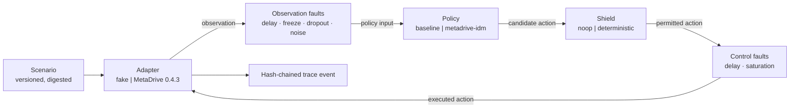
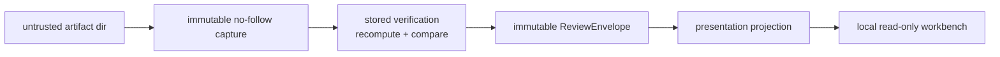
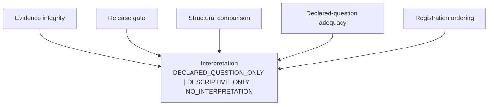

# Hermes — Project Handoff

> **This file is the canonical entry point.** If you are a new conversation, a new model, or a
> new collaborator, read this file completely before reading anything else or touching any
> code. Everything else in this repository is downstream of it.
>
> **Last updated:** 2026-08-17 · **By:** Opus 5 (builder) · **At commit:** `a0c0e64`
> · **Covers through:** Phase 7A complete

---

## 0. How to use this document, and the habit it establishes

This repository has more than twenty root-level Markdown files and eight phases of history. A
cold reader cannot reconstruct intent from the code, and reconstructing it from the phase
documents takes hours. This file exists so that **any** conversation can become productive in
about ten minutes.

### The update habit — please follow it

**Every substantive session updates this file before it ends.** Not the phase documents — those
are frozen records. This one.

What "substantive" means: you changed behaviour, added or removed a contract, generated or
invalidated evidence, made a decision that constrains future work, or discovered something that
changes what the next person should believe.

What to update, in order of importance:

1. **§4 Current state** — commit, tests, gates, what is and is not done.
2. **§7 Phase history** — append what happened; never rewrite a prior phase's record.
3. **§9 Next-phase considerations** — remove what you did, add what you learned.
4. **§10 Known debt and open decisions** — this is where honesty compounds.
5. The header block at the top: date, who, commit, coverage.

**Rules for updating.**

- **Append, don't overwrite, for history.** Phase records are evidence. If a prior phase's claim
  turned out to be wrong, add a correction *next to it* with the date — do not silently edit it.
  The Phase 7 record contains three failed protocol versions on purpose.
- **State the source of every number.** If you cannot say where a figure came from, don't put it
  in. `docs/` and `evaluation-plans/DISCOVERY_RESULTS.md` are the evidence of record.
- **Preserve the non-claims in §3 verbatim.** They are load-bearing. Softening them is the most
  damaging edit anyone could make to this project.
- **If you disagree with a decision here, say so in §10** rather than quietly acting otherwise.

---

## 1. Roles — who does what

This project deliberately separates design authority from implementation authority. That
separation is the reason several serious errors were caught rather than shipped.

| Role | Who | Authority | Explicitly not their call |
|---|---|---|---|
| **Owner** | Bo-Huei Lin | Scope, residual-risk acceptance, status promotion, publication | — |
| **Design & consulting** | **Fable 5** or **Codex Sol 5.6** | Architecture proposals, contract design, adversarial review, critique of the builder's work | Cannot approve their own design; cannot promote status |
| **Implementation** | **Opus 5** | Building, testing, evidence generation, gates | Cannot approve its own design; cannot self-certify a human or safety claim |

**Why the split matters, with receipts.** In Phase 7 the design was written by one model,
independently reviewed by another, and implemented by a third. The review caught a P0 in the
human-study answer key that the design had missed. The implementation then caught a
contradiction the design had asserted as fact. And the implemented assessor caught an error made
by its own builder (§7.8). None of those would have surfaced in a single-agent loop.

**If you are a design/consulting model reading this:** your job is to be genuinely adversarial.
Do not ratify. The most valuable thing you produced historically was a finding the builder did
not want to hear.

**If you are an implementation model reading this:** do not implement a suggestion merely
because a reviewer proposed it. The project convention is an explicit disposition ledger —
`ACCEPT` / `ACCEPT WITH MODIFICATION` / `REJECT` / `DEFER` / `NEEDS OWNER DECISION` — with
repository evidence for each. See `PHASE7_CLAUDE_FEEDBACK_DISPOSITION.md` for the format.

---

## 2. What Hermes is

Hermes is a **simulation-only autonomous-driving safety-evidence evaluation prototype**, built
to study one question seriously:

> How does an organization know that its evaluation evidence actually supports the decision it
> is being used to make?

It is a working system, not a slide deck: 1245 passing tests, a pinned physics simulator, a
hash-chained evidence format, a non-compensatory release gate, an immutable review path, a
read-only reviewer workbench, and a preregistered-experiment layer.

It is also, deliberately, a **product-leadership demonstration**. The interesting decisions in
Hermes are product decisions — what to refuse to build, what to make impossible, what to force a
human to look at — not implementation ones.

### The thesis, in one line

> **Autonomy policy proposes → environment executes → verifiers evaluate → gate decides → trace proves.**

### What "trace proves" means, precisely

This narrowness is the whole point. Say it in these exact words:

> The stored trace supports a reproducible and internally consistent Hermes decision under the
> installed verifier and gate implementation.

It does **not** prove independent authenticity, that runtime facts were not fabricated by the
producer, real-world vehicle safety, certification or compliance, authorization to promote
software, or permission to deploy to hardware.

---

## 3. Non-negotiable boundaries — do not soften these

**Scope.** Simulation and closed-lab learning only. Hermes must never connect to a road vehicle,
CAN bus, automotive Ethernet, public-road actuator, remote-control channel, or production
safety-critical system.

**Claims.** Never claim SAE automation level, road readiness, production safety, certification,
compliance, regulatory approval, or deployment permission. All thresholds are illustrative and
versioned. Every challenge scenario carries `behavior_realism_claim: false`.

**LLM boundary.** A language model may generate scenarios, tests, explanations, and
documentation. It must **never** enter a real-time control loop or a parameter-selection loop
that could shop for a favourable result.

**The seven trust dimensions, never collapsed into one green light:**

```text
Gate verdict:          PASS | CONDITIONAL | HOLD | INVALID_EVIDENCE
Evidence integrity:    UNVERIFIED | INTERNALLY_CONSISTENT | INVALID_EVIDENCE
Origin:                NOT_AUTHENTICATED
Authorization:         NOT_EVALUATED
Deployment permission: NONE
Scope:                 SIMULATION_ONLY
Authoritative status:  NOT_DEFINED
```

**Human status.** Human comprehension, manual visual quality, and accessibility are
**NOT YET OBSERVED**. No participant study has been run. No test, screenshot, dry run, or expert
opinion may promote them.

---

## 4. Current state

| Item | Value |
|---|---|
| Public repository | `github.com/bohueilin/Hermes` |
| Working branch | `codex/phase7-evaluation-adequacy-human-validation` |
| HEAD | `a0c0e64` |
| Default branch | **not yet set** — see §9 |
| Tests | **1245 passing** (6 are `-m metadrive`, real-simulator only) |
| Ruff | clean |
| `hermes doctor` | 17 PASS · 1 WARN (conda env) · 1 NOT_AVAILABLE (display) |
| Python / env | 3.11, conda env `hermes-dev` |
| Simulator | MetaDrive 0.4.3 pinned at `85e5dadc6c7436d324348f6e3d8f8e680c06b4db`, clean |
| Artifact directories | 131, all gitignored local outputs; none ever committed |
| Phases 0–6 | complete |
| Phase 7A (adequacy) | **complete** |
| Phase 7B (human study) | instrument built, **blocked pending owner approval**; `P7-HV-07` is `BLOCKED` |

---

## 5. Core principles — the design DNA

If you internalize nothing else, internalize this section. Every non-obvious decision in the
codebase follows from one of these.

**1. Name the blocked decision, narrowly.** Hermes answers exactly one question: *does this
internally verified simulation evidence support advancing this candidate to the next bounded
simulation-evaluation stage?* Not "is it safe." A system that answers "is it safe" can never be
wrong in a checkable way.

**2. Missing evidence is a first-class outcome.** Findings are three-valued: `PASS`, `FAIL`,
`NOT_AVAILABLE` — the last with a reason and a stated gate consequence. Unavailable evidence is
never rendered as zero, false, blank, or success. This is the most load-bearing decision in the
product.

**3. Non-compensatory gating. No composite score.** A perfect comfort result can never offset a
collision. A composite is the artifact that lets a bad result average itself into an acceptable
one. The comparison view likewise refuses to name a winner.

**4. Separate the planes.** Integrity, gate verdict, structural comparability, declared-question
adequacy, registration ordering, and interpretation are independent dimensions. Compressing any
two of them is the characteristic failure this project exists to prevent.

**5. One-way dependency, enforced by tests.** Untrusted artifact → immutable no-follow capture →
stored verification → immutable envelope → projection → read-only UI. The UI may not implement
gate or verifier logic, may not reopen artifacts, and may not import simulators, policies,
adapters, or runtime. AST tests and subprocess import-bombs fail the build if it does.

**6. Recompute; never trust stored claims.** Review recomputes from captured bytes. A tampered
bundle claiming `PASS` is quarantined, not displayed.

**7. Fail closed.** Invalid evidence, incompatible pairs, unsupported shapes, and malformed
plans all terminate before producing anything interpretable. Order is fixed: lexical screen →
baseline verification → candidate verification → compatibility → plan capture → Git inspection →
assessment.

**8. Artifacts are untrusted input.** Bounded reads (16 MiB/file, 64 MiB/bundle, 10,000 events,
1 MiB/line), no-follow descriptor-relative capture, path containment, symlink and traversal
rejection, Unicode Cc/Cf neutralization, escaped rendering.

**9. Determinism is a product feature.** Pinned simulator commit, seeded runs, digest-bound
scenarios, byte-stable serialization. A refactor must reproduce the trace digest exactly — and
this has been verified across a real adapter refactor.

**10. Freeze the question before you look.** Preregistration is machinery, not etiquette: the
complete search grid, selection rule, and exclusions are committed before any run exists, every
attempt lands in an append-only ledger, and failures are never deleted.

**11. Keep the failures.** Three protocol versions that found nothing are committed. A version
whose assessment failed is committed. Negative results are the evidence, not the waste.

**12. Comprehension is a gate, not a hope.** The human protocol promotes on *zero critical
misconceptions*, and scoring rules are explicit enough that two moderators reach the same mark.

**13. Say the limits before you are asked.** Every surface, document, and CLI output states what
it does not establish. This is the project's single strongest credibility asset.

---

## 6. Architecture at a glance

### 6.1 The closed loop (evidence generation)



**The distinction that matters most:** `candidate_action` (what the policy proposed),
`permitted_action` (what the shield allowed), `executed_action` (what actually happened) are
three separate recorded facts. Collapsing them destroys post-hoc attribution.

### 6.2 The judgment path (evidence review)



### 6.3 The decision planes



### 6.4 The evidence bundle — exactly ten files

```text
manifest.json   execution-context.json   scenario.resolved.yaml   gate-config.resolved.yaml
events.jsonl    metrics.json             findings.json            verdict.json
trace.sha256    bundle.sha256
```

Atomic, no-overwrite publication. `events.jsonl` is a SHA-256 hash chain.

---

## 7. Phase history — what was built and why

Each phase is a frozen record. Append corrections; do not rewrite.

### 7.1 Phase 0 — Foundation (`c181509`, 2026-08-11)
Repository identity, Python 3.11 packaging as `hermes-autonomy`, CLI skeleton, environment
doctor, unattended build plan. Established the naming surfaces that must not drift.

### 7.2 Phase 1 — Deterministic evidence core (`635c246`)
The heart of the system. Strict frozen Pydantic domain models; the ten-file bundle contract;
hash-chained trace; the closed verifier set (`trace.integrity`, `collision.zero`,
`boundary.within_tolerance`, `progress.required`, `comfort.acceleration`, `comfort.jerk`); the
non-compensatory gate returning `PASS`/`CONDITIONAL`/`HOLD`/`INVALID_EVIDENCE`; a deterministic
`fake` adapter as an architectural test double.

**Why it matters:** three-valued findings and non-compensatory precedence were decided here, and
everything since depends on them.

### 7.3 Phase 2 — MetaDrive adapter (`638a951`)
Real physics via MetaDrive 0.4.3, pinned to an exact source commit, headless, lazily imported.
Recorded simulator identity in every event. Boundary test: evidence, gate, and verifier modules
may not import adapters or the simulator.
*Reference:* `docs/phase2-metadrive-adapter.md`.

### 7.4 Phase 3 — Safety shield and challenge scenarios (`862b98f`)
The `deterministic` shield with a closed reason set (`TTC_BELOW_THRESHOLD`, `SPEED_CAP`,
`STALE_OBSERVATION`, `BOUNDARY_RISK`, `EMERGENCY_STOP`, `ACTUATION_DELAY_COMPENSATION`), plus two
bounded MetaDrive challenges: lead-vehicle hard brake and cut-in near field. Introduced the
candidate/permitted/executed distinction.
*Reference:* `docs/phase3-safety-shield.md`.

**Correction added 2026-08-17:** the showcase pairs produced here were later shown not to
exercise the TTC mechanism they appeared to demonstrate. See §7.8.

### 7.5 Phase 4 — Deterministic faults and CI hardening (`267a88e`)
Scheduled, reproducible observation faults (delay, freeze, dropout, bounded noise) and control
faults (delay, saturation); evidence schema 2.0 with typed fault provenance;
`fault.coverage.required` as a first-class finding.
*Reference:* `docs/phase4-fault-and-ci-hardening.md`.

### 7.6 Phase 5 — Evidence contract closure (`3c32c52`, `9e257a0`)
Atomic no-overwrite publication, digest inventory, repository provenance in the manifest, and the
canonical ten-file contract reconciled across all documents.

### 7.7 Phase 6 — Evidence Review Workbench (`27cc5a0` → `fce442a`, 2026-08-12/13)
The largest phase. A reviewer-oriented, local, read-only workbench answering nine questions
including "what does this result *not* establish?"

Built: the immutable review facade with one-capture-per-side; `ReviewEnvelope 1.0` and
`ComparisonEnvelope 1.0`; evidence-sufficiency modelling (required/optional/not-applicable ×
available/unavailable); fail-closed comparison with no winner score; quarantine of stored
verdicts on verification failure; a local loopback Streamlit workbench; AST and import-bomb
boundary tests. A reviewer-comprehension iteration followed (`e2eab34` → `fce442a`).
*References:* `docs/PHASE6_ARCHITECTURE_AND_TRUST_MODEL.md`,
`docs/PHASE6_REVIEW_ENVELOPE_CONTRACT.md`, `CURRENT_STATE_HANDOFF.md`.

### 7.8 Phase 7A — Evaluation adequacy (`4eb8765` → `a0c0e64`, 2026-08-16/17) **← current**

**The problem.** Fresh-eye review found that the flagship showcase comparison — lead-vehicle
hard brake, baseline vs TTC shield, minimum TTC improving 11.586 s → 13.339 s — was structurally
valid, internally consistent, and **telling a story the raw logs contradicted**. The shield's TTC
rule had fired zero times. A `SPEED_CAP` had fired 36 times, first at sequence 25, and the
challenge did not trigger until step 30. Across all 43 retained artifact directories,
`TTC_BELOW_THRESHOLD` had never fired anywhere. The cut-in pair showed a 4.68× TTC "improvement"
from the identical confound.

**The response — a new plane, not a new metric.** Adding a `challenge.engagement` verifier was
rejected: engagement is a property of an evaluation *question* and usually of a *pair*, and the
finding set is closed and versioned, so adding to it would retroactively change historical
meaning and make TTC an implicit release criterion.

Instead: a declared-question **adequacy** assessor returning `ADEQUATE` / `INADEQUATE` /
`NOT_AVAILABLE`, with independently typed registration and interpretation. It is a *claim
precondition*, not a gate — it cannot change a verdict and grants nothing.

**Preregistration machinery.** A study protocol with the complete finite Cartesian grid,
deterministic selection rule, and exclusions, committed before any run exists; an append-only
discovery ledger; a pair plan that must be a sole-parent child commit touching exactly three
paths; and a hardened read-only Git inspector (`hermes.provenance.git`) verifying that ordering.

**Plan-record schema 2.0.** MetaDrive's trace-bound evidence config embeds the scenario challenge
payload, so every grid point has a *different* adapter-config digest — a single frozen adapter
identity is not merely inconvenient but false. Schema 2.0 predeclares the complete variant table
with each variant's exact bytes, scenario digest, and adapter digest, computed by a pure builder
that never launches the simulator and is shared with runtime.

**The results — five protocol versions, all committed:**

| Version | Threshold | Attempts | Discovery | Assessment |
|---|---:|---:|---|---|
| v1 | 2.0 s | 18 | nothing found | — |
| v2 | 2.0 s | 32 | nothing found | — |
| v3 | 2.0 s | 15 | nothing found | — |
| v4 | 4.0 s | 9 | selected | `INADEQUATE` — builder's own mis-declared policy digest |
| v5 | 4.0 s | 9 | selected | **`ADEQUATE`**, all 17 criteria |

**The headline is the negative result.** Across 65 registered baseline attempts the
`metadrive-idm` policy never let policy-input TTC fall below **~3.11 s**, bracketed on both
sides. A 2.0 s TTC shield is therefore **structurally unreachable** in this scenario family — the
retained pair does not merely happen to lack an intervention. A competent car-following
controller brakes early enough to preserve its own headway.

v5 then asked the same question at 4.0 s, above the measured floor, frozen in advance: exactly
three `TTC_BELOW_THRESHOLD` overrides at sequences 66/70/74, no confounding reason anywhere, arms
bit-identical through sequence 65, and a fresh baseline reproducing the selected discovery
observation exactly. **The first `TTC_BELOW_THRESHOLD` override recorded anywhere in the
repository.** Both arms remain at gate verdict `HOLD` — adequacy is not a gate.

**Also delivered:** a scoring match rule that made the human protocol deterministically scorable;
a frozen-vs-installed simulator preflight protecting the append-only ledger; and a fix for a
pre-existing test-isolation defect where the workbench `AppTest` import bomb leaked its meta-path
blocker into the whole pytest session.

*References:* `PHASE7_IMPLEMENTATION_HANDOFF.md`, `evaluation-plans/DISCOVERY_RESULTS.md`,
`PHASE7_TASK7_AND_TASK8_CONTRACT_AMENDMENT.md`, `PHASE7_CLAUDE_FEEDBACK_DISPOSITION.md`.

### 7.9 Phase 7B — Human instrument (built, **not run**)
Ten-task moderated protocol at version `P7-HV-1.1`; blank observation, synthesis, manual-visual,
and accessibility templates; a digest-bound fixture registry; a pipeline-generated three-state
availability fixture. `P7-HV-07` is `BLOCKED`, `READY_FOR_PILOT` is not met, and comprehension
remains `NOT YET OBSERVED`.
*Reference:* `docs/PHASE7_HUMAN_VALIDATION_PLAN.md`.

---

## 8. Target domains — why this problem, and for whom

Hermes is deliberately aimed at two adjacent AV product domains. Any design proposal should be
able to say which one it serves.

### 8.1 Safety evaluation (the Waymo-shaped problem)

The domain question: *how do you increase the confidence, quality, and speed of decisions for
onboard developers, simulation teams, data scientists, safety reviewers, and launch owners?*

Hermes is a bounded study of what it takes to serve **one** of those decisions honestly. What
transfers to real scale is not the implementation but the habits: name the decision, separate the
planes, make missing evidence first-class, refuse composites, freeze the question before looking,
and keep the failures.

**The honest gap, which must always be stated:** Hermes is single-pair, single-scenario, n=1, and
deterministic. Real safety evaluation is population-level — fleet exposure, rare events,
statistical power, ODD coverage, real-world validity. The exact-equality discipline that makes
Hermes defensible at n=1 is precisely what would need replacing with statistical machinery at
fleet scale. Phase 7A's most relevant contribution is the *adequacy* idea: extending to a new
scope or market is exactly when existing evidence can remain structurally valid while ceasing to
be *about* the thing being decided.

### 8.2 Rider experience (the Uber-shaped problem)

The domain question: *without a driver, what makes a rider trust the vehicle?*

For a century riders read a human — gaze, posture, hesitation, a head turn toward a hazard. In a
robotaxi those channels are gone and the cabin software inherits them. Three Hermes disciplines
transfer directly:

- **Candidate / permitted / executed** is exactly the information needed to answer "why did the
  car just brake?" — full disclosure for a reviewer, one true sentence for a rider.
- **Never render missing evidence as success** becomes: a degraded system must never show a
  serene, confident screen. Honest state is a trust feature.
- **Comprehension as a promotion gate** becomes a shippable launch criterion: no rider finishes a
  first trip without knowing how to pull over or reach a human.

**Positioning note for any model writing external material:** in a rider-experience context,
Hermes is *supporting evidence of autonomy fluency*, never the centrepiece. Leading with
evidence machinery there mis-types the work.

**Career-positioning material is intentionally not in this repository.** It lives in a private
local folder (`~/Documents/Hermes-Interview-Prep/`) and must not be committed here.

---

## 9. Next-phase considerations

None of these are approved. They are the live options, with the case for and against.

### 9.1 Immediate and small

- **Set a default branch on GitHub.** The repo currently has none; the Phase 7 branch is the only
  one. Decide between promoting it to `main` or renaming to a non-Codex-owned name.
- **Optimize the README banner.** `Hermes_Github.png` is 2.5 MB at 2172×724 for a ~1000 px
  render column.
- **Independent adversarial review of Phase 7A.** The amendment's own gate requires this before
  any recruitment, and the builder is the wrong reviewer. *This is the highest-value next action.*

### 9.2 Phase 7B — run the human study
Everything is built and blocked on owner approval. Needs: named moderator, evidence custodian,
and accessibility observer; 2–3-person non-author pilot; threshold freeze; then a 6–10-person
cohort. **Nothing may promote comprehension short of that.**

### 9.3 Phase 8 candidates, roughly in order of value

**A. Adequacy in the reviewer surface.** Phase 7A deliberately shipped adequacy as an expert CLI
vertical slice; the workbench does not ingest it. Until it does, adequacy does not protect the
primary reviewer journey — which is where the original over-credit happened. *Strongest
candidate.*

**B. Multi-seed portfolios.** Adequacy is currently a property of one pair. Making it a property
of a seed distribution is the first real step toward statistical thinking, and would expose
whether the 3.11 s floor is seed-robust.

**C. Authenticity.** Detached Ed25519 over a canonical attestation. Would close the largest
honest gap (`NOT_AUTHENTICATED`). Must keep signature validity strictly separate from integrity,
authorization, and deployment permission. Deliberately deferred so far, and that was right —
it should not be done before the reviewer surface work.

**D. Replace local-Git registration.** `LOCAL_HISTORY_ORDERING_VERIFIED` is self-attestation with
extra steps: rewritable by the same author it defends against. Real preregistration needs
external timestamping. Worth doing only if the adequacy layer is being taken seriously beyond a
prototype.

**E. Directional-language suppression for inadequate pairs.** Currently the workbench renders a
guarded "Minimum TTC improved…" interpretation string above the limitations. The Phase 7 design
asked whether that separation is sufficient or whether directional language should be suppressed
for claim-bearing inadequate pairs. **Unresolved.**

### 9.4 Explicit non-goals
Not: TTC or adequacy in the release gate; a generalized evaluation-plan language; winner or
safety scores; approval or deployment workflows; cloud, multi-user, database, or upload; any
automatic optimizer; perception or sensor simulation; statistical road-safety validation; RL,
CARLA, ROS, Autoware; any physical hardware or control.

---

## 10. Known debt and open decisions

Honest inventory. Add to it; don't quietly clear it.

| Item | Severity | Status |
|---|---|---|
| **Engagement evidence is action-conditioned.** The shield records a reason only when the override *changes* the action, so a shield firing while agreeing with the policy is invisible. Phase 7 works around it by checking the condition from observations separately, but the instrumentation is the wrong shape. | High | Worked around, not fixed |
| **`LOCAL_HISTORY_ORDERING_VERIFIED` is self-attestation.** Rewritable local history, no external timestamp. Honest in naming and limitations; still weak. | High | Accepted, named |
| **Adequacy is not in the reviewer surface.** The expert CLI is protected; the primary journey is not. | High | Deliberate Phase 7A scope limit |
| **Task 4's availability fixture is a one-event trace.** Forced by metric semantics — jerk is unavailable only below two events — not chosen. Cannot exercise timeline or comparison surfaces. | Medium | Documented, scoped |
| **Facade `_cache` / `_active` are unbounded.** Fresh-process-per-participant bounds exposure; LRU deferred to post-pilot pending RSS measurement. | Medium | Deferred with rationale |
| **Four separate Git subprocess helpers** (`doctor`, `orchestrator`, `metadrive` adapter, `provenance`). Only the last is hardened. | Medium | Open |
| **Directional comparison copy for inadequate pairs.** See §9.3E. | Medium | **Needs owner decision** |
| **Absolute local paths in ~10 tracked docs.** Deliberate per `AGENTS.md` §1, but now public. | Low | Accepted |
| **20+ root Markdown files.** This file is the mitigation. | Low | Mitigated |

---

## 11. Repository map — where to look

**Read first:** this file → `AGENTS.md` (rules, precedence, git discipline) → the phase handoff
for whatever you're touching.

```text
src/hermes/
  domain/          strict frozen models — the contracts everything else obeys
  adapters/        fake, metadrive (pinned/lazy), metadrive_challenge, metadrive_config (pure builder)
  policies/        baseline, metadrive_idm
  shields/         noop, deterministic (closed reason set)
  faults/          deterministic observation and control fault injection
  evidence/        canonical JSON, trace hash chain, metrics, artifacts, verification
  verifiers/       closed finding set
  gates/           non-compensatory release gate
  comparison/      fail-closed structural comparison, no winner
  review/          facade, models, projection — the one-way judgment path
  workbench/       local read-only Streamlit UI
  adequacy/        Phase 7 models, loader, assessment, api
  evaluation_plans/ authoring-time materializer and simulator preflight
  provenance/      hardened read-only Git inspector
  runtime/         orchestrator (the closed loop)

evaluation-plans/  frozen protocols, discovery ledgers, pair plans, DISCOVERY_RESULTS.md
scenarios/         versioned scenario definitions
config/            gate profiles, shield configs
artifacts/         generated evidence — gitignored, never committed
third_party/       MetaDrive checkout — not tracked, not a submodule
tests/             1245 tests: unit, cli, integration
docs/              phase records, human-study protocol and templates
```

**Key documents by purpose:** rules → `AGENTS.md` · current technical state →
`PHASE7_IMPLEMENTATION_HANDOFF.md` · Phase 6 state → `CURRENT_STATE_HANDOFF.md` · trust model →
`docs/PHASE6_ARCHITECTURE_AND_TRUST_MODEL.md` · human protocol →
`docs/PHASE7_HUMAN_VALIDATION_PLAN.md` · evidence of record →
`evaluation-plans/DISCOVERY_RESULTS.md` · decisions → `docs/decision-log.md`.

---

## 12. Commands

```bash
conda activate hermes-dev
python -m pip install -e ".[dev,workbench]"
```

```bash
python -m pytest -q                      # full suite — expect 1245 passing
python -m pytest -q -m "not metadrive"   # simulator-free
python -m ruff check .
python -m hermes doctor
git diff --check
```

```bash
python -m hermes run --simulator metadrive \
  --scenario scenarios/metadrive_lead_vehicle_hard_brake_adequacy_v2.yaml \
  --policy metadrive-idm --seed 7 --run-id <unique-id> \
  --gate-config config/gates.phase2.yaml --headless --shield noop
```

```bash
python -m hermes assess-adequacy handoff-p7b-lead-baseline handoff-p7b-lead-candidate \
  --repository-root . --artifact-root artifacts --plan-root evaluation-plans \
  --protocol lead_ttc_engagement.protocol.v5.yaml \
  --discovery-ledger lead_ttc_engagement.discovery.v5.jsonl \
  --pair-plan lead_ttc_engagement.pair.v5.yaml --format json
```

```bash
python -m hermes workbench --artifact-root artifacts   # local loopback only
```

**Git discipline:** work on an approved feature branch; never force, hard reset, or rewrite
history; never stage `artifacts/`, caches, or `third_party/`; commit only after gates pass.

---

## 13. If you are picking this up cold — start here

1. Read §2, §3, §5. Those are the project.
2. Skim §7.8 — the Phase 7 story is the most instructive thing in the repository, because it is
   the project catching its own error.
3. Check §4 against reality: `git log -1`, `pytest -q`, `hermes doctor`. Trust the repository
   over this file, and if they disagree, **fix this file**.
4. Read §10 before proposing anything. Most good ideas are already there with a reason.
5. Pick work from §9. If it isn't there, say why it should be, in §9, before starting.
6. **Update this file before you finish.**
