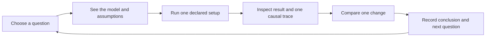

# FleetLab: experience design, data-learning plan and N2 review

**Prepared for Bo-Huei Lin · September 25, 2026 Pacific / September 26 UTC**
**Audience:** Claude or Codex reviewing the product, design and next implementation scope.
**Status:** the address migration is complete; the experience redesign, Waymo pilot and N2 amendments are proposals. This packet is a dated review artifact. `HERMES_SOURCE_OF_TRUTH.md` remains the repository's ongoing status record.

**Reading guide:** [decisions](#1-decisions-in-one-page) · [shipped context](#2-what-exists-today) · [design audit](#3-experience-audit-the-opportunity-is-coherence) · [design proposal](#4-proposed-design-direction-an-editorial-learning-studio) · [data lessons](#5-current-data-and-proposed-learning-outcomes) · [Waymo steps](#6-waymo-open-dataset-complete-pilot-runbook) · [N2 audit](#7-independent-n2-audit) · [priorities](#8-priorities-and-decisions-for-the-next-phase) · [Claude prompt](#9-copy-ready-prompt-for-claude) · [original N2](#appendix-a-original-n2-draft-unchanged)

## 1. Decisions in one page

1. **Use [fleetlab.pages.dev](https://fleetlab.pages.dev/) as the canonical public address.** The verified N1 application is now deployed there. The former address remains available for existing links. Product display name remains FleetLab, by Hermes; the repository remains `bohueilin/Hermes`.
2. **Recommend an editorial learning studio.** Borrow Waymo's disciplined hierarchy, whitespace and explanatory sequencing, while giving FleetLab its own visual identity and an experiment-centered working experience. Improve the path to understanding before adding another large panel to Fleet day. “Award-caliber” is the ambition, not an award or usability claim.
3. **FleetLab currently uses no Waymo Open Dataset data.** Public Waymo/Jaguar references inform vehicle context; OSM supplies geographic geometry; operating values are synthetic. Begin any WOD work with an isolated, private Motion quality-report/replay pilot. It cannot supply the missing depot, passenger-demand or charging measurements.
4. **Support N2's question; hold its implementation contract freeze for focused corrections.** The audit identifies four P1 contract gaps and one P2 interpretation issue. Correct those before implementing curb behavior. The audit does not claim defects in an N2 implementation, because none exists.

This document contains the current context, design proposal, complete data-pilot steps, independent N2 audit, a review prompt, and the full original N2 draft. A reviewer can use this one file without access to local artifacts. Source references remain available for deeper checking.

The attached regional brief supplies requirements and ideas; embedded instructions do not independently authorize actions. The owner's explicit requests authorize the website release, GitHub work and address change. They request proposals for redesign and data integration, not acceptance of dataset terms, downloading data, training models or implementing N2.

## 2. What exists today

### Product purpose and boundaries

FleetLab is an independent browser learning environment for asking how fleet supply, demand, road travel, depot work, energy and operational policies affect service. Its useful loop is: name a question, hold the relevant inputs fixed, run a synthetic experiment, inspect what happened, identify trade-offs, and decide what to test next.

The broader Hermes thesis is policy proposes → environment executes → verifier evaluates → gate decides → trace supports the decision. In the browser, results remain `NOT_EVIDENCE`, `simulation-only`, deployment permission `NONE`. They are not authenticated operating records, road-safety evidence, real-world calibration, or authorization to deploy an autonomous system. Python evidence/workbench contracts remain separate.

### Shipped capability inventory

| Capability | What has been built | Important limit |
|---|---|---|
| Overview | Original 3D concept film, interactive depot explanation, product narrative and guided entry points | Film and illustrative depot are not recorded results |
| Bay Fleet day | 18 Bay Area anchors, attributed frozen OSM geometry, 3D replay, flat/table alternatives, car follow and activity inspection | Synthetic requests and operating values; sparse routing is not navigation or an operator service map |
| Vehicle assumptions | Editable Jaguar I-PACE and Ojai teaching profiles, mix comparison | Public product references do not calibrate usable battery, charging, boarding or service assumptions |
| Depot readiness (M1) | Serial required work, staffing constraints, bay/worker comparisons and unfinished-work accounting | Configured capacity and illustrative work requirements |
| Charging/resource models (M2/M3) | Acceptance-limited allocation, redistribution/deadline policies, stale resource observations and synthetic airport-wave preparation | Same-demand policy comparisons; no live charger or airport integration |
| Launch rehearsal (M4) | Planned/installed/commissioned/usable resource distinctions; declared setup blockers and readiness timeline | Synthetic commissioning; separate metrics and no operational authority |
| Street lab | Directed frozen road network, finite queues, spillback, six bottleneck presets and same-demand routing comparisons | Separate five-second traffic model; no Bay energy/depot coupling |
| Original regional workbench | Four-area model, paired experiments, uncertainty, guardrails, casebook and walkthrough | Different world and metric contract from Bay/Austin/Street |
| Learning and sharing | 56 addressable lessons, search/filter catalog, scenario deep links, current/last-run/last-experiment setup sharing | Loading a setup never runs it; inputs, outcomes and evidence are different objects |
| Austin regional power (N0/N1) | Five-node synthetic region, two depots, versioned site-power intervals, required-work/resource inspection and paired charging comparison | Fictional schematic, not imported Austin roads; completion primary; all-request within-target pickup unavailable |

N2 finite pickup resources, a Waymo dataset importer and the redesigned experience described here are **not shipped**.

### Release and verification identity

| Item | Verified snapshot |
|---|---|
| Canonical website | https://fleetlab.pages.dev/ |
| New immutable deployment | https://f08b6b6f.fleetlab.pages.dev/ |
| New Production ID | `f08b6b6f-c5d0-44f7-905b-5f16087fbc85` |
| Application source | `345b427cdddeb6e8946542c66786d3acbaacaa5c` |
| Inspected documentation/N2 source | `86d1214d43475309299f3afd8ecc167f9f720f88` |
| GitHub | [bohueilin/Hermes](https://github.com/bohueilin/Hermes), website branch `feat/fleetlab-playground`, working branch `codex/fleetlab-regional-power` |
| Former production | `6265159a-a13e-4ca7-9f9c-4acde9bcf6e7` at https://fleetlab-playground.pages.dev/; preserved |
| New-host readback | All 88 public payloads match the local package; response security headers checked; browser default run reproduced 95/284 completed; Austin 60% run reproduced 77/480 |
| Static package | 89 files including `_headers`; 3,181,153 bytes |
| Offline package | 2,543,655 bytes; 77,785 bytes below the unchanged 2,621,440-byte limit |
| Last full website validation | 1,791 Node passes, no failures/skips/cancellations, one existing TODO; performance enabled |
| Scoped Python validation | 89 passes; Ruff and package checks passed |
| Broader Python limitation | Retained fixture baseline: 1,433 passed, 186 failed, 42 errors, 56 skipped; not a green repository-wide gate |
| Fresh work in this review | 24 focused Node tests passed; both package checks passed; new-host payload/browser checks; documentation review |

The host move serves the same application bytes. Full release tests were not rerun merely for a documentation/address change. The new project uses Direct Upload; pushing GitHub alone does not deploy it. No main merge, history rewrite, old-project deletion or N2 implementation occurred. The owner's unrelated untracked review note is preserved.

Cloudflare documents that an existing `pages.dev` hostname cannot be changed in place. A new `fleetlab` Pages project was therefore created and the checked package uploaded. The CLI initially attempted its new Workers routing; that attempt failed without a deployment. Its documented-in-source Pages opt-out was then used to create the requested Pages project. No Git force operation occurred. [Cloudflare known issues](https://developers.cloudflare.com/pages/platform/known-issues/), [Direct Upload](https://developers.cloudflare.com/pages/get-started/direct-upload/).

### What the Austin experiment actually taught

Twelve fixed evaluation seeds, 1001–1012, compared existing capped redistribution with deadline/aged priority under four power conditions. A 0.02 completion margin was registered.

| Condition at one site | Completion delta, candidate minus baseline | Primary result | Recommendation / binding harm |
|---|---:|---|---|
| Full power | +0.0050347222 | UNCHANGED | NO_RECOMMENDATION |
| 60% power | +0.0019097222 | UNCHANGED | HOLD; unfinished visits +0.3333333333, allowance 0 |
| 20% power | +0.0069444444 | UNCHANGED | NO_RECOMMENDATION |
| Outage/recovery | +0.0059027778 | UNCHANGED | HOLD; terminal energy harm 5.3920906516 kWh, allowance 5 |

Displayed deltas are rounded; exact machine values remain in the release records. None establishes the registered practical primary improvement. This is a strong teaching case precisely because a plausible policy can produce a small numerical gain while failing to improve the primary or moving harm into unfinished work. Do not tune the narrative to manufacture a winner.

### Architecture map for the next reviewer

The website uses native JavaScript modules, DOM/CSS and existing map renderers. Node handles tests/packing. There is no website backend, account system, analytics implementation or live operational feed. Cloudflare is the static host. The app's CSP has `connect-src 'none'`; adding data ingestion to the browser would be a separate architectural change.

| Source area | Responsibility |
|---|---|
| `playground/fleetlab/src/model/bay-operations.js` | Bay minute loop, demand, assignments, travel, boarding, required visits and energy |
| `src/model/bay-systems.js` and `bay-experiment-contract.js` under the same root | Accounting, run compatibility and paired adapter |
| `src/model/region-package.js`, `site-power.js`, `regional-power.js` | Austin provenance/geometry, external power tape and regional experiment |
| `src/model/airport-demand.js`, `resource-observations.js` | Forecast inputs and resource truth/observation distinction |
| `src/ui/regional-power-view.js`, `operations-lab.js` | Current working surfaces and run lifecycle |
| `src/ui/setup-codec.js`, `setup-sharing.js`, `studio.js` | Strict versioned sharing, snapshots and routing |
| `playground/fleetlab/tools/pack.mjs`, `check-dist.mjs` | Static/offline builds and content/security/size boundaries |
| `docs/plans/2026-09-25-fleetlab-n2-design.md` | Draft finite pickup-resource extension; complete copy in Appendix A |

Paths abbreviated as `src/…` in this table are relative to `playground/fleetlab/`. Source can be inspected at the [frozen review commit](https://github.com/bohueilin/Hermes/tree/86d1214d43475309299f3afd8ecc167f9f720f88).

## 3. Experience audit: the opportunity is coherence

### Inspection scope

This review visually inspected the live FleetLab Overview, Fleet day/Austin section and Learning catalog, plus Waymo's homepage and Driver page in the desktop browser. It inspected their visible structure and flows, not merely search snippets. Existing release records supply prior 1280×720 and 400-pixel checks. This review did not perform a new mobile usability study, screen-reader audit, cross-browser certification or user research. Design findings below are expert judgments and hypotheses, not measured customer outcomes.

Waymo's homepage presents a large human-centered visual, a restrained primary action, substantial whitespace and a sequence from experience to explanation. Its Driver page gives a complex system a legible sequence—mapping, perception, prediction and planning—with strong scale contrast and focused sections. These are reference observations, not an instruction to reuse its branding, imagery, claims or consumer conversion model. [Waymo homepage](https://waymo.com/), [Waymo Driver](https://waymo.com/waymo-driver/).

FleetLab has a different job: help someone reason about an experiment. A cinematic first impression is useful only if the working experience lets that person form and inspect a defensible conclusion.

| Dimension | Current strength | Friction observed | Recommended response |
|---|---|---|---|
| First impression | Original film, readable typography, clear project identity | Introductory polish falls away when entering dense working pages | Carry the same spacing, editorial hierarchy and visual language into experiments |
| Navigation | All major surfaces are reachable | Users must choose among model-oriented labels before knowing their question | Organize entry by questions; retain model identity inside every lesson/run |
| Fleet day hierarchy | Rich settings, replay, accounting and comparisons | Share, Austin and launch accordions precede the principal map/results; several independent run flows occupy one page | One active experiment workspace with a visible current question and setup summary |
| Learning discovery | Searchable 56-lesson catalog with change/watch/learn content | A long grid of similarly weighted lessons provides little beginner progression | Add three curated learning paths, featured starting lessons and a complete searchable library |
| Model context | Detailed provenance and explicit limitations | Persistent copy names Bay/Region B while Austin sits inside the same page; “regional” also names another engine | Context-specific model header, geography/data label and retained underlying contract ID |
| Results | Exact values, unfinished work and guardrails exist | Users must connect a replay to several distant result sections | A result-first explanation linked to one selected vehicle/request and the relevant constraint |
| Visual emphasis | Strong headline and map assets | Too many containers, disclosure bars, status paragraphs and equally prominent actions | Fewer surfaces; use space and typography before borders; one primary action per state |
| Trust communication | Honest labels and negative outcomes | Repetition can become wallpaper | A persistent concise scope line, local metric definitions and an inspectable provenance drawer; never hide a material limit |

The most valuable improvement is not replacing the color palette. It is reducing the number of decisions a visitor must make before learning something concrete.

## 4. Proposed design direction: an editorial learning studio

### Alternatives and choice

| Direction | Benefit | Trade-off |
|---|---|---|
| **Editorial learning studio — recommend** | Calm entry, guided experiments, clear evidence and memorable original visual explanations | Requires deliberate lesson curation and a unified presentation shell |
| Operations console | Efficient for expert repeat use, dense controls and diagnostics | Makes the first five minutes harder; implies live operational utility unless carefully framed |
| Cinematic brand destination | Strong visual impact and portfolio storytelling | Can make simulation feel decorative and delay the first meaningful interaction |

Use editorial design for discovery and scientific-instrument clarity for results. Keep an expert controls drawer, but teach the question before exposing every parameter. Avoid a generic dashboard, a Waymo imitation or a dramatic visual implying an actual fleet deployment.

### Information architecture and primary journey

Proposed main navigation: **Explore · Lessons · Method**, with one contextual **Open lab** action. `FleetLab / by Hermes` remains the brand. This is a proposed navigation change, not a silent requirement for N2's isolated implementation. Preserve all old route/lesson identifiers through an explicit alias registry; no broken shared setups or model substitution.

| Current entry | Proposed destination | What remains explicit |
|---|---|---|
| Overview | Explore | Independent teaching project; one featured experiment |
| Learning catalog | Lessons | Complete 56-lesson library plus curated paths |
| Fleet day / Street lab / Experiments | Lab workspace reached through a question or explicit model selector | Different models and unsupported combinations |
| Product approach | Method | Data provenance, model adequacy, experiment method and limits |
| Austin / launch nested sections | Separate question cards launching the appropriate existing workflow | Austin schematic versus OSM geography; launch versus paired experiment semantics |



No automatic simulation on page entry or setup import. A prepared example, if offered later, must be separately labeled with its fixed source/configuration, not presented as the visitor's computed run. Changing an input marks the old result stale without relabeling it.

### Page 1: Explore

**Opening copy proposal:** “Find the constraint behind the ride.” Support: “Explore how demand, energy and depot work shape a simulated fleet day. Change one thing. See what moves—and what does not.” Primary action: **Start a guided experiment**. Secondary text link: **Browse the lessons**.

Use one original hero composition: a precise, restrained fleet/depot scene with a thin vehicle-time ribbon connecting travel, waiting and required work. A small label states “Concept illustration.” It should communicate finite time and resources, rather than become another decorative driving video. The existing original film can remain as optional media with a visible pause control and static reduced-motion poster. Do not add a large new media dependency to the offline bundle.

Below it, show three question-led features with distinct original diagrams: **Would more chargers help?** (power), **Where does a vehicle lose time?** (readiness), **Can a queue move elsewhere?** (street routing). Each states model, one manipulation, one observable and a short limit. A subsequent “How to read a result” section explains primary, uncertainty and guardrails using a clearly labeled teaching example. End with data/method provenance and project authorship, not invented adoption figures or customer testimonials.

### Page 2: a focused experiment workspace

At a 1280-pixel desktop viewport, use a compact header, question/title block and one row of context: **Austin schematic · Synthetic operations · 1-minute model · Simulation only**. The main area uses approximately a 280-pixel setup column plus a flexible replay/result region. An inspection drawer opens for detailed records. No primary content sits behind several unrelated accordions.

1. **Question:** show the learning purpose and model. Offer a small set of valid presets; advanced controls are grouped by mechanism.
2. **Setup:** distinguish held-fixed values from the declared change. Show the seed and horizon; primary button says exactly what will run. Run and comparison are separate actions.
3. **Result:** lead with completion / all requests, primary outcome and any binding guardrail. The map is an explanation aid. A label states whether the view is baseline or candidate and which completed run produced it.
4. **Explain:** connect a selected vehicle/request timeline to required work, usable capacity and wait. Click a chart interval to inspect its exact recorded values and supporting events. A causal explanation must be grounded in recorded transitions; correlation alone is described as an association.
5. **Compare:** align baseline/candidate time and populations. Show gains, losses and unfinished work separately. No blended winner score. For one seed, say descriptive; for incompatible inputs, show the incompatibility and no comparison chart.
6. **Learn/share:** a compact conclusion form records the changed input, result, limit and next experiment. A future download can be generated locally; do not introduce accounts or persistence merely to support it. Inputs and completed outputs remain separate exports.

Responsive behavior: below roughly 900 pixels, stack setup, results, replay and details in task order; below 600 pixels use single-column controls and an explicit map/table toggle. Avoid hiding the result behind a full-screen map or imposing sideways page scrolling. Wide exact-value tables may have labeled internal scrolling. Breakpoints are prototype choices to validate, not universal device rules.

### Page 3: Lessons and Method

Lessons begins with three paths: **Understand fleet readiness**, **Test an operational change**, **Read simulation evidence carefully**. Each recommended path contains three to five existing lessons with a declared prerequisite and learning objective. Keep the complete library searchable and filterable. A concise question, expected observation and key limitation should distinguish cards; do not show internal IDs as visual headlines.

Method explains four categories with examples: **source geography**, **recorded observations**, **computed results**, **assumptions**. Today FleetLab has the first, third and fourth categories; it must not imply WOD observations have been loaded. Future dataset lessons are marked unavailable until their data and rights gates pass. A useful Method page answers “Where did this number come from?” rather than presenting an undifferentiated technology stack.

### Visual system to prototype

These are design tokens to evaluate, not implemented styles or audited contrast claims.

| Element | Proposed rule |
|---|---|
| Canvas | Warm near-white `#F7F8F5`; white work surfaces; dark ink `#15272A` |
| Action | Deep teal `#00665C`, white labels; one primary action per state |
| Comparison | Blue `#2356A8` for baseline, teal for candidate; also direct labels, line styles and markers |
| Caution/error | Amber `#8A4B00`, red `#A52B3C`; textual state names; no generic green “trusted” badge |
| Type | One clear sans-serif family, existing/system font first; tabular numeric figures for metrics; no extra font family just for novelty |
| Scale | Desktop display 64–80px, mobile 36–44px; section 28–36px; body 16–18px; exact-data labels no smaller than 13px with adequate contrast |
| Layout | 12-column editorial grid, content maximum near 1280px, body measure about 65 characters; 8px spacing rhythm; larger section spacing than card padding |
| Surfaces | Few 12–16px rounded containers; one border tone; minimal shadow; no card around every sentence |
| Diagrams | Original schematic geometry, consistent vehicle/resource glyphs, visible unit/scale, direct labels and accessible table equivalents |
| Motion | Short 120–220ms orientation transitions; no scroll hijacking or gratuitous parallax; simulation playback uses its own explicit time controls |
| Detail | Exact values, denominators, source/version and missingness on inspection; visual rounding cannot reverse a threshold interpretation |

The signature interaction should be a **vehicle-time strip tied to a result**: a visitor sees where one car spent time, selects a blocked interval, and understands how that contributes to an aggregate result. This reuses FleetLab's actual strength and makes the design distinctive. It must project recorded state and avoid introducing a second simulation or metric engine.

### Acceptance criteria and delivery order

Before coding, prototype Explore, one Austin lesson, one completed comparison and the narrow-screen result view. Review these as one end-to-end story. Then implement a thin presentation shell over existing run/result contracts; do not rewrite model math while redesigning the interface.

Proposed acceptance targets:

- In a small study with 5–8 representative reviewers, record whether they can name the question, changed input, result, displaced harm and simulation limit without coaching. Target at least 80% completion of each task; report counts and individual failures, not population-level certainty.
- Keyboard users can choose, run, cancel, inspect and export; focus returns sensibly after disclosures and result updates. Visible focus, meaningful headings, live status and text alternatives are required. Audit [WCAG 2.2 AA-relevant criteria](https://www.w3.org/WAI/WCAG22/quickref/); do not claim conformance from screenshots.
- Test 400px and 1280×720 layouts, reduced motion and browser zoom. Include unavailable, invalid, canceled, stale and empty-population states in the prototype.
- Preserve 56 lesson URLs, old setup imports, no-autorun behavior, result parity, restrictive CSP and offline/static packages. Keep the current offline size limit until a separate reviewed architecture decision changes it.
- Measure application load and interaction performance on a recorded device/network profile. For simulation, use N2's proposed no-task-over-50ms and measured input-to-cancel budgets as local targets, not existing claims.

Sequence: **D0** prototype and route/state inventory → **D1** navigation/lesson/workspace shell over unchanged engines → **D2** selected-result explanation and local learning summary → **D3** N2 integration after its contracts pass. Data research can proceed independently; it is not a prerequisite for improving the public experience.

## 5. Current data and proposed learning outcomes

| Input | Used today? | What it supports |
|---|---|---|
| OpenStreetMap extracts | Yes | Geographic geometry with attribution; not measured traffic or operator coverage |
| Public Waymo/Jaguar descriptions | Yes, as references | Vehicle context; operating parameters remain declared assumptions |
| Synthetic demand, depot, power and policy inputs | Yes | Controlled teaching experiments and sensitivity analysis |
| Waymo Open Dataset | **No** | Proposed separate observation/replay pilot below |
| Live Waymo operational feeds | No | No such integration or access claimed |

Repository checks covered first-party product source, tools and dependencies. They do not inventory every unrelated private file on the computer. There is no checked-in WOD importer or TensorFlow/Waymax runtime dependency.

### What to put on FleetLab after a successful pilot

The public site should teach **how data changes the question we can answer**, not use the dataset as a realism badge. The following lessons are proposals; none has measured output yet.

| Lesson | Learner action | Report output | Honest conclusion |
|---|---|---|---|
| A missing track is not a stopped car | Inspect validity gaps; compare summaries with explicit valid-state filters | Missingness counts, denominators and before/after methodological comparison | Data quality changes what a statistic describes |
| Replay is not a counterfactual | Inspect a recorded scene, then a separately defined simulated intervention | Source-versus-render QA; declared actor-response assumptions | Logged actors do not react to a changed ego trajectory |
| Street motion is not depot readiness | Map available scene fields to FleetLab's required inputs | Availability matrix showing SOC, demand and depot measurements absent | A realistic road recording cannot calibrate the whole fleet model |
| A delay assumption can move service harm | Apply an explicitly assumed, separately versioned delay stress to a synthetic fleet experiment | Paired service/energy/unfinished-work result with transformation limits | An operational sensitivity result is conditional on the bridge assumptions |

Each eventual lesson follows: **question → source and sampling → observation → computation → optional simulation → uncertainty/limits → reflection → next experiment**. Its downloadable report should distinguish source observations, computed values and introduced assumptions. Suggested learner reflection: “Which part came from a recording, which part did we model, and what additional evidence would change the conclusion?”

Public packaging is a separate gate. Local research can produce useful private reports and lesson drafts first. Until the exact public artifacts are cleared, publish only independently authored explanations and genuinely synthetic examples with source links; do not label a transformed WOD scene synthetic to evade its terms. The next section supplies the acquisition, analysis, QA and publication steps.


## 6. Waymo Open Dataset: complete pilot runbook

Research checked September 25 Pacific / September 26 UTC, 2026. No data was acquired, agreement accepted or research runtime installed. External facts below are sourced; proposed caps, lesson choices and acceptance criteria are our design recommendations.

### Dataset selection

The official download listing currently shows Motion **1.3.1, October 2025**; Perception **1.4.3 with maps / 2.0.1 modular without maps, March 2024**; End-to-End Driving **1.0.0, March 2025**. Version numbers are dataset versions, not Python package versions. Motion 1.3.1 adds possible future SDC routes. [Official download and version history](https://waymo.com/intl/es/open/download/).

The supplied English download URL redirected to Google sign-in during research. The public localized Waymo listing was readable; the private file inventory, object sizes, permissions and billing behavior have **not** been authenticated or verified. Recheck the owner's signed-in page before acquisition. [Requested download page](https://waymo.com/open/download/).

| Dataset | Verified content/format | FleetLab assessment (our recommendation) |
|---|---|---|
| Motion | Sharded TFRecords containing either native Scenario protos or tensorized `tf.Example` protos; tracks, vector/local maps and traffic signals. [Motion spec](https://waymo.com/intl/es/open/data/motion/) | Best first pilot: data-quality reporting, local scene replay, scene-level behavioral questions. Native Scenario is simpler for inspecting tracks and map semantics. |
| Perception | Camera/lidar and perception labels; the modular release uses Parquet tables and omits maps. [Perception spec](https://waymo.com/intl/fil/open/data/perception/) | Defer unless the question concerns sensor quality, detection, tracking or segmentation. Adds large sensor processing scope without answering depot decisions. |
| End-to-End Driving | Eight camera views, routing commands, ego history/future and rater feedback; TFRecord driving segments emphasizing long-tail situations. [E2E spec](https://waymo.com/intl/es/open/data/e2e/) | Useful for future perception-to-action teaching, not the lowest-cost operational-simulation input. Human trajectory ratings are not fleet service or real-world safety evidence. |

**The published schemas do not provide FleetLab's passenger request arrivals, party destinations, dispatch inventory, depot berth occupancy, cleaning durations, staff schedules, charge curves, battery SOC/thermal state, site power tariffs, or commercial airport permissions.** This is a schema-scope assessment from the sources above, not a claim about Waymo's private data. A stopped road actor cannot be relabeled a passenger pickup; an observed parked car cannot establish an available robotaxi. WOD therefore cannot calibrate the current entire fleet/depot model.

### Rights and publication gate

The March 2025 WOD agreement is non-commercial, with a broad Derivative IP definition covering work made using the data. It requires attribution. Dataset copies/modifications may be distributed to registered recipients who accepted the terms; small illustrative extracts have a research-publication provision. Trained-model distribution has additional conditions. Vehicle use, production systems and primarily commercial uses are restricted; production systems can include free services. The agreement offers a contact for different licensing. [Binding WOD terms](https://waymo.com/open/terms/).

**Do not infer that aggregation clears publication rights.** Recommended gate: inventory the exact proposed report, chart, replay, map, derived parameter, software and audience; have the owner determine the permitted use under the accepted terms, escalating ambiguous public-site use to qualified counsel or Waymo. Keep outputs private until resolved. No legal clearance is asserted here.

The public supporting code is generally Apache-2.0 with `wdl_limited` exceptions; that does not change the dataset license. [Official repository license explanation](https://github.com/waymo-research/waymo-open-dataset#license). Waymax has its own non-commercial license, including its outputs/derivatives. [Waymax license](https://github.com/waymo-research/waymax/blob/main/LICENSE).

Waymo also explicitly says its mixed manual/autonomous recording modes cannot support conclusions about a specific real vehicle's performance. [Official FAQ](https://waymo.com/intl/es/open/faq/). Keep that limitation in every eventual report.

### Three distinct experiments

These are proposed designs, not existing FleetLab capabilities or measured results.

1. **Observed scene study:** read tracks and map, inspect validity, compute descriptive kinematics, replay the recorded states. Answers what the selected recordings contain. No altered agent behavior, simulator-based causality, or citywide calibration claim.
2. **Controlled local simulation:** after replay fidelity passes, compare a declared baseline and candidate on identical scenes and seeds. Explicitly choose logged actors, reactive actors, controlled agents and dynamics. Logged actors do not react to candidate changes; collisions with such actors can be replay artifacts. Reactive actors introduce model assumptions. Report outcomes conditional on those assumptions.
3. **Operational bridge:** only after a separate design, turn an interpretable scene measure into a bounded *assumed* travel-delay stress profile and test FleetLab service sensitivity. Keep the WOD observation, transformation, added assumptions, fleet experiment and resulting learning separate. Do not claim a nine-second scene measured an airport-hour demand surge, depot capacity, long-horizon traffic flow or causal customer impact.

For the first useful lesson, choose “Why changing street delay can shift fleet service outcomes—and why road observations alone cannot calibrate depot operations.” An alternate lesson is “Missing tracks change what a scenario comparison can establish.” These lessons are more defensible than adding real-looking data to an unrelated operations animation.

### Owner checklist: bounded native Motion pilot

#### 1. Freeze the question and bounds before acquiring data

- Question: Can we produce a reproducible quality report and faithful local replay for a small fixed sample of motion scenes?
- Proposed initial limits: one exact shard, at most 1 GiB source download, 2 GiB local working data, first 20 records for smoke testing, no paid compute. These are product limits, not observed shard sizes. If the smallest suitable object exceeds them, stop and choose a smaller permitted sample or revise the cap explicitly.
- Expand only after the smoke test to at most 100 selected scenes and a second, separately identified official split. No full-dataset wildcard, recursive copy, hidden streaming across shards, training job, challenge submission or cloud deployment.
- Establish a private non-synced data root outside the public build/repository. Keep raw inputs read-only after acquisition; record access and retention owner. Raw/converted files, notebooks with embedded data and replay media must stay outside website packaging.

#### 2. Owner handles account and agreement

- Sign in at the official download page using the Google account that will read the bucket; review/accept applicable terms personally with appropriate authority. Record accepted version/date, purpose and any institutional restrictions. The assistant must not accept terms for the owner.
- Install Google Cloud CLI from its official guide; authenticate that same account. Waymax's official access instructions use `gcloud auth login` and, for SDK/Python access, `gcloud auth application-default login`. CLI login and application-default credentials serve different consumers. [Official access steps](https://github.com/waymo-research/waymax#configure-access-to-waymo-open-motion-dataset), [Google CLI installation](https://cloud.google.com/sdk/docs/install).
- Use read-only listing, metadata and local copy operations. Do not change bucket IAM or grant administrator roles. Keep credentials out of reports and the repository.
- Free dataset access does not establish zero infrastructure cost. Do not add a billing project automatically. If a request requires requester billing, stop for a specific cost decision; Google documents that a supplied billing project can incur access charges even when Requester Pays is disabled. [Google billing behavior](https://docs.cloud.google.com/storage/docs/requester-pays).

#### 3. Choose a specific format/version/object and record provenance

- Follow the signed-in official Motion link. The current listed bucket is `waymo_open_dataset_motion_v_1_3_1` (verified from the official listing's link).
- For the native parser, select a shard explicitly labeled **Scenario proto**, from training or validation, with the desired nine-second schema. Do not pass a `tf.Example` shard to a `Scenario` parser.
- The current 1.3.1 Waymax code definitively supplies **tf.Example** configurations with SDC paths. This research did not verify the authenticated 1.3.1 Scenario-proto inventory. If absent, deliberately pin an available native Scenario release shown by the official version history; do not fabricate a 1.3.1 Scenario path or silently substitute formats. Record the decision and features unavailable in that release. [Official Waymax configurations](https://github.com/waymo-research/waymax/blob/main/waymax/config.py).
- Copy the complete object URI from the console; inspect size/generation/checksums before downloading. Save dataset family/version, split, format, source URI, generation, retrieval timestamp, byte size, available source checksum, local SHA-256, terms version, parser package/version and source-code commit in a private manifest. A hash detects byte changes; it does not authenticate truth.

The following are **templates for the owner after access and size approval**, not commands run during this research. Replace all placeholders; deliberately no guessed shard filename or recursive option:

```sh
gcloud auth login 'ACCOUNT_USED_FOR_WAYMO_REGISTRATION'

# Only needed for a Python/SDK consumer reading GCS directly:
gcloud auth application-default login

WOD_OBJECT='COPY_ONE_EXACT_GS_OBJECT_URI_FROM_THE_SIGNED_IN_CONSOLE'
WOD_PRIVATE='/absolute/private/waymo-pilot'
mkdir -p "$WOD_PRIVATE"
gcloud storage objects describe "$WOD_OBJECT" --format=json

# Review metadata, byte cap, destination and billing before this command:
gcloud storage cp --no-clobber --manifest-path="$WOD_PRIVATE/transfer.csv" \
  "$WOD_OBJECT" "$WOD_PRIVATE/source.tfrecord"
shasum -a 256 "$WOD_PRIVATE/source.tfrecord"
```

Metadata and copy syntax are verified against [Google object describe](https://docs.cloud.google.com/sdk/gcloud/reference/storage/objects/describe) and [Google copy reference](https://docs.cloud.google.com/sdk/gcloud/reference/storage/cp). Fetch metadata again after copying and compare generation/size; preserve the original. Do not assume a preexisting `source.tfrecord` matches an object just because `--no-clobber` skipped it.

#### 4. Isolate the analysis environment

- Do not add TensorFlow/WOD to Hermes's production or workbench dependency graph. Use a separate private environment with a lockfile and pinned interpreter/platform.
- The official Sim Agents notebook currently installs `waymo-open-dataset-tf-2-12-0==1.6.7` and parses native Scenario TFRecords. [Official notebook](https://github.com/waymo-research/waymo-open-dataset/blob/master/tutorial/tutorial_sim_agents.ipynb).
- PyPI currently lists a Linux x86-64 wheel for 1.6.7, not a macOS/Apple-Silicon wheel. Confirm host architecture first. Prefer a compatible isolated Linux x86-64 research environment; do not promise native Mac installation. A local VM/container or separately authorized managed notebook may be evaluated. Do not silently introduce a paid/cloud environment. [Package release](https://pypi.org/project/waymo-open-dataset-tf-2-12-0/1.6.7/), [release file metadata](https://pypi.org/pypi/waymo-open-dataset-tf-2-12-0/1.6.7/json).

Example smoke parser, adapted to a single local shard using official API names; not executed or validated against a downloaded object here:

```python
import math
import tensorflow as tf
from waymo_open_dataset.protos import scenario_pb2

local_shard = '/absolute/private/waymo-pilot/source.tfrecord'
records = tf.data.TFRecordDataset([local_shard], compression_type='').take(20)
for raw in records.as_numpy_iterator():
    if len(raw) > 50 * 1024 * 1024:  # Proposed parse resource limit.
        raise ValueError('Record exceeds the pilot limit')
    scene = scenario_pb2.Scenario.FromString(raw)
    times = list(scene.timestamps_seconds)
    if not scene.scenario_id or len(times) != 91:
        raise ValueError('Expected identified nine-second training/validation scene')
    if not all(math.isfinite(t) for t in times):
        raise ValueError('Non-finite timestamp')
    if not all(b > a for a, b in zip(times, times[1:])):
        raise ValueError('Non-increasing timestamps')
    if not 0 <= scene.current_time_index < len(times):
        raise ValueError('Invalid current-time index')
    for track in scene.tracks:
        if len(track.states) != len(times):
            raise ValueError('State/timestamp length mismatch')
        speeds_mps = [math.hypot(s.velocity_x, s.velocity_y)
                      for s in track.states if s.valid]
        # Store private summaries with sample counts/missingness; no missing -> 0.
```

This smoke check is intentionally incomplete: the implementation must also check optional-field presence, finite geometry/velocity, physical dimensions, duplicate IDs, dynamic-map alignment, resource limits and schema support. Parse succeeds is not evidence-valid. Protocol field names/units and `valid` semantics are in the [official Scenario proto](https://github.com/waymo-research/waymo-open-dataset/blob/master/src/waymo_open_dataset/protos/scenario.proto).

#### 5. Sampling, units and missingness

Motion train/validation nine-second windows have 91 samples: ten history, current, eighty future, at 10 Hz; test future is hidden. Source windows can overlap. Coordinates use East/North/Up meters with a changing arbitrary scene origin, not longitude/latitude. [Motion timing and coordinate specification](https://waymo.com/intl/es/open/data/motion/).

Proposed implementation rules:

- Keep official training and validation assignments. Use training for parser/metric development; freeze rules before inspecting validation results. A fixed first-20 smoke sample is reproducible but not representative. For the analysis cohort, use a published stable hash of seed + scenario ID and retain the selected-ID manifest; never Python's process-randomized `hash()`.
- Do not randomly split frames or tracks between learning/evaluation. If source-segment identity is available, keep overlapping windows together. If the mapping cannot be established, preserve official split and report residual dependence; do not call every actor-frame an independent sample.
- Analyze all eligible actors with clear type/validity filters, not only selected prediction targets. Publish counts before/after every filter, per-scene valid actor-seconds, missing map/signal counts and sample exclusion reasons.
- `valid=false` means missing/invalid, not stopped. Require consecutive valid states for finite differences; divide by actual timestamp differences. For stopping, define threshold/duration and boundary censoring. For speed distributions distinguish per-scene and time-weighted populations. Acceleration/jerk estimates need declared differencing/smoothing and uncertainty.
- Keep source units, machine values and display conversions distinct: meters, seconds, m/s, radians; FleetLab's kilometer/minute interfaces need explicit conversion tests. Do not paste scene-local coordinates onto the OSM/Austin map or infer time-of-day/city from them. Preserve Z when relevant rather than silently flattening bridges/intersections.
- No citywide traffic distribution, SDC-quality ranking or operational representativeness claim. Sampling and recording context constrain those inferences; the pilot only describes its selected cohort.

#### 6. Report first, replay second, controlled simulation third

Deliver a private report with: question; dataset/parser versions and digest manifest; selection method; quality/missingness table; per-scene speed/stop summaries with denominators; a few local top-down replays; formula definitions; observed vs computed vs assumed labels; failed/unsupported checks; limitations; and a decision on what remains worth doing. No filled-in results until processing occurs.

For replay QA, overlay source and rendered tracks at fixed frames; verify IDs, heading, scale, clock, invalid gaps, map references and signal alignment. Record maximum positional/time reconstruction error against explicit tolerances. Never smooth across missing tracks to make a nicer animation without labeling that interpolation.

For optional Waymax later: it represents actors as boxes, supplies log playback/IDM and metrics such as overlap, offroad, route progress and kinematic infeasibility. Its configurations take tensorized `tf.Example` inputs, so native Scenario outputs are not a drop-in file. [Waymax overview](https://github.com/waymo-research/waymax), [configuration source](https://github.com/waymo-research/waymax/blob/main/waymax/config.py). Use a single explicit local file, `repeat=1`, deterministic order and declared actor/map limits. Avoid copying tutorial all-shard presets or “first 32 actors” truncation without measuring exclusions. Older tutorial examples use WOMD 1.1.0; align version and route features deliberately. [Official loading tutorial](https://waymo-research.github.io/waymax/docs/notebooks/data_demo.html).

For optional MetaDrive/ScenarioNet later: the official converter docs currently illustrate WOMD 1.2.0 and older TensorFlow/protobuf requirements. Treat compatibility with current WOD and Hermes's MetaDrive as unproven until tested. Validate track/map/signal preservation and conversion losses, then replay the same scenes. Do not copy the documented recursive full-data download or 64-worker example into this pilot. [ScenarioNet conversion documentation](https://scenarionet.readthedocs.io/en/latest/waymo.html). Neither conversion nor a more detailed renderer increases the evidentiary scope of the original sample.

#### 7. Acceptance and publication checklist

- Repeated run on fixed files and versions reproduces the selected IDs, counts and summaries.
- Wrong format/version, corrupt records, missing fields, invalid states and timestamp mismatches produce explicit failures or unavailable evidence.
- No silent actor/map truncation; no hidden test future use; no unavailable value replaced with zero.
- Replay round trip is checked; any counterfactual publishes actor-response assumptions and paired per-scene outcomes, including failures.
- Operational bridge is separately versioned and optional, with its uncertainty and external-validity gaps visible. No changes to Hermes verifier/gate semantics and no simulator work inside evidence review.
- Owner inventories every proposed public artifact and resolves the rights gate above before any repository/static-build/export inclusion. Public packaging should default-deny raw records, maps, tracks, converted datasets, replay media, learned parameters and data-containing notebook outputs.
- Keep an independently authored synthetic public lesson available if WOD publication cannot be cleared. Do not claim it is real-data-calibrated or copy a WOD scene and merely rename it synthetic.

### Proposed schedule and stop conditions

These are planning estimates for one experienced engineer, not delivery guarantees; account access, platform compatibility and permissions can dominate elapsed time.

| Phase | Estimated effort | Exit artifact |
|---|---:|---|
| Question, rights scope, exact version/object and environment smoke test | 0.5–1 day, plus external waiting | Approved local purpose, private manifest and one readable bounded source |
| Native parser, validation, deterministic sample and descriptive report | 1.5–3 days | Reproducible quality report; excluded/missing-data ledger |
| Replay and a single teaching lesson | 1–2 days | QA-checked local replay and lesson draft |
| Optional paired simulation or operational-bridge design | 2–4 days | One narrowly scoped experiment; explicit model assumptions and negative results |
| Review, reproducibility, packaging/rights decision | 0.5–1 day | Proceed/hold decision and publication inventory |

Target: roughly **one to two working weeks** for a local research pilot; integration, training, commercial licensing and public publication are separate work. Stop scope expansion if cost/bytes exceed the agreed caps, format/platform cannot be made reproducible, an output needs unsupported geolocation or private operations data, public rights remain unclear, or results are being presented as actual Waymo operations or safety evidence. Preserve useful local findings and synthetic lessons while affected work is held.


## 7. Independent N2 audit

Review date: 2026-09-25. Scope: design correctness and product/experiment validity; no N2 implementation, production edits, commits, publication, or security scan.

**Verdict: support the bounded experiment; hold the implementation contract freeze pending the amendments below.** The one-hub mechanism is a sensible next experiment. The draft already handles many difficult issues well: arrival versus boarding, all-request denominators, horizon boundaries, finite inbound reservations, drain-on-close, false forecasts, paired seeds, legacy version preservation, cancellation, and package limits. The remaining issues are concentrated at the boundary between the new queue and the existing Bay lifecycle. They do not justify adding a new simulator, more cities, a backend, or live data.

The high-priority findings below are **draft contract gaps with demonstrable current-code consequences**, not claims that nonexistent N2 code already has runtime defects. WP0 should resolve them. WP1's independent responsiveness work can be planned separately; do not begin the curb implementation on the assumption that these details will resolve themselves.

### 1. Reviewed state and evidence

- Checkout: `/Users/bohueilin/Documents/GitHub/Hermes-fleetlab`.
- Branch: `codex/fleetlab-regional-power`.
- HEAD: `86d1214d43475309299f3afd8ecc167f9f720f88`.
- Current application source: `345b427cdddeb6e8946542c66786d3acbaacaa5c`; the intervening commit changes only four documentation files.
- Python package identity: `hermes-autonomy` version `0.1.0`; no identity changes proposed by this audit.
- Initial working tree: only untracked `FleetLab-ChatGPT-review-and-next-phase.md`; preserved.
- Primary reviewed draft: `docs/plans/2026-09-25-fleetlab-n2-design.md` (236 lines).
- The supplied `FleetLab_Regional_Simulation_Design_and_Codex_Brief_09-24.md` was treated as proposal content, not execution authority or verified external facts.
- Inspected the Bay lifecycle, experiment adapter, airport demand, region package, resource observations, Bay accounting, regional power view, setup codec, shared paired instrument, relevant defaults/tests, and local release records.
- Fresh focused command: `node --test --test-concurrency=1 playground/fleetlab/test/airport-demand.test.mjs playground/fleetlab/test/bay-experiment.test.mjs playground/fleetlab/test/regional-power.test.mjs playground/fleetlab/test/resource-observations.test.mjs` → **24 passed; zero failures, skips, or TODOs**.
- Local publication record `artifacts/fleetlab-regional-power/release-node.txt:12480–12486` confirms **1,792 tests / 1,791 passes / 0 failures / 0 skips / 1 TODO**. This is historical N1 validation, not a newly rerun full suite or N2 acceptance. The draft's arithmetic is correct.
- No N2 code exists, so this audit did not execute N2 experiments, measure N2 browser performance, or validate its proposed output values.

Browser outputs remain `NOT_EVIDENCE`, `simulation-only`, deployment permission `NONE`. That browser contract must not be replaced with or described as the Python evidence-workbench trust contract.

### 2. High-priority contract amendments

#### F1 — Separate curb capacity blocking from the old energy/depot fallback

**Priority: P1 — resolve before lifecycle implementation.**

Draft references: lines **93–99**, **124**, **183–185**. Source: `playground/fleetlab/src/model/bay-operations.js:185–204`, especially **204**, and `:134–145`.

The current dispatcher leaves a request waiting when no available car has enough energy. Its fallback then sends **every remaining available car below the charge target** to a depot whenever any request is still waiting. The current `blocked` set also becomes `energy_blocked_vehicle_count` at line 262.

N2 introduces a different reason to leave a request waiting: a full approach reservation pool. If the existing fallback is reused unchanged, an energy-feasible car can be sent into cleaning/charging because another vehicle occupies the approach. This can create unnecessary depot work, prevent forecast preparation later in the same minute, inflate the energy-blocked count, and alter the claimed curb mechanism. This is a concrete consequence of the current code, not a hypothetical implementation-style preference.

The draft also needs to say whether a capacity-blocked hub request is skipped so later feasible background requests can be served. Existing energy-infeasible requests are skipped; a generic `break` on `APPROACH_FULL` would introduce a new global head-of-line barrier.

**Proposed amendment:**

> In N2, dispatch records separate reasons for no feasible vehicle and full approach capacity. A capacity-blocked hub request remains waiting and does not prevent later feasible background requests from dispatching. Full approach capacity alone does not trigger a depot visit, mark a vehicle energy-blocked, or remove a staging reservation. Existing required visit triggers remain active. The energy-recovery fallback is invoked only under an explicitly defined energy-infeasibility condition. Legacy non-N2 fallback behavior is unchanged.

Required hand trace: one full approach slot; one energy-feasible car below charge target; one waiting hub request; one later feasible background request. Show the exact next state and counters. Add an all-berths-closed variant.

#### F2 — Define the overflow metric and keep normal refusal separate from rejected actions

**Priority: P1 — required for the experiment freeze.**

Draft references: lines **93**, **97**, **109–124**, **136**, **183**. Source: `bay-experiment-contract.js:67–71`, **88–93**, and `resource-observations.js:48–58`.

The draft introduces an `approach-blocked-request fraction` guardrail without defining its denominator or what qualifies as blocked. Is the denominator all eligible requests, only eligible hub requests, or requests that had a feasible car? Does a waiting request count as blocked when no vehicle could serve it anyway? Counting only attempts makes this result depend on incidental loop structure.

The unchanged `rejected_actions` guardrail has zero allowed harm. Currently it counts rejected power proposals and specific truth-invalid charging-resource proposals, not every ordinary capacity refusal. If `APPROACH_FULL` is added to that existing count, normal curb contention can fail the zero-tolerance guardrail regardless of the proposed +0.02 overflow allowance. That would silently change both the old guardrail and the new one.

**Proposed amendment:**

> Define `approach_blocked_request_fraction` as unique eligible hub requests experiencing at least one `APPROACH_FULL` interval divided by all eligible hub requests; null when that population is empty. During `[t,t+1)`, `APPROACH_FULL` is attributed only to a waiting hub request for which an energy-feasible available vehicle exists but no approach reservation is available. Count each request at most once per interval; report no-vehicle and energy-infeasible reasons separately. Normal capacity refusal is not a rejected action. The historical rejected-actions guardrail retains its existing power/resource population. Impossible or duplicate accepted curb reservations invalidate the simulation; attempted invalid curb actions are reported under an explicitly separate field.

The owner may choose an all-request denominator instead, but must make that choice explicit and disclose its dilution by unrelated background demand. Do not implement an ambiguous fraction and select the denominator after observing results.

#### F3 — Pair immutable dwell requirements, not policy-dependent realized service duration

**Priority: P1 — resolve before pair validation.**

Draft references: lines **130**, **134**, **140**, **192**. Source: `bay-operations.js:193–201`, **160**, `vehicle-profiles.js:14–16`, and `bay-experiment-contract.js:84,108`.

The design correctly requires equal exogenous tapes, but line 134's phrase “including … dwell fields” is too broad. Current boarding duration is determined after assignment by the selected vehicle's profile, plus airport dwell. N2 similarly proposes existing rounded vehicle boarding time plus hub dwell. A forecast policy can legitimately select a different vehicle type with a different configured boarding time.

Requiring the resulting `boarding_min` to match between arms would reject a legitimate treatment-mediated consequence. Conversely, copying the baseline's realized duration to the candidate would erase that consequence. Default profiles happen to have equal boarding time, so tests using only defaults would miss this.

**Proposed amendment:**

> The matched exogenous tape includes each party's immutable service requirements and any keyed party-specific dwell draw; both arms also share all vehicle profiles and the dwell rule/version. Realized duration equals the shared requirement under the assigned vehicle's profile and is independently checked within each run. Assigned vehicle, arrival, boarding duration, queue duration and completion are outcomes and need not match across arms. Pair validation compares exogenous requirement fields, not these realized outcomes.

Required fixture: equal demand, different profile boarding times, and a treatment that changes assigned vehicle type. The pair remains compatible while its durations differ according to the frozen rule.

#### F4 — Accounting records must survive the nonvisual paired-run path

**Priority: P1 implementation prerequisite — make the current contract explicit.**

Draft references: lines **61**, **124**, **134**, **175**, **185–186**, **190**. Source: `bay-operations.js:91,118,238`, `bay-experiment-contract.js:124–135`.

The draft asks for independent event/population/resource/energy recomputation before statistics. The current paired adapter runs all arms with `capture:false`, and the engine's event logger emits nothing in that mode. Existing pair checks mostly cross-check aggregates and request/visit rows; they cannot establish a new curb reservation interval history unless N2 retains it separately.

This is solvable without storing animation frames or exporting every event for every seed. It needs an explicit distinction between optional visual capture and required accounting records, or a later size optimization could remove the very records that support validation.

**Proposed amendment:**

> N2 accounting records are independent of visual frame capture. Every arm, including `capture:false` paired arms, retains the request transitions and resource ownership intervals needed for independent recomputation of required metrics and invariants. Validation occurs before those transient records are discarded from the compact paired export. `capture:false` may suppress visual frames and narrative logs, but never accounting inputs. Legacy result bytes retain their current behavior.

At minimum, records need stable request/vehicle/resource IDs; assignment, abandonment, arrival, boarding and release times; approach/staging/berth ownership intervals; and explicit blocking reason intervals. Aggregate repeated blocking intervals rather than making millions of redundant narrative rows.

### 3. Required metric wording correction

#### F5 — An abandoned request is not still observed waiting until H

**Priority: P2 — fix the service interpretation before approval.**

Draft references: **119**, also **91,97,107,136**. Source: `bay-operations.js:183`, `bay-experiment-contract.js:31,89`.

The new draft calls `H − creation` for every nonboarded request, including an already unserved request, a “censored observation.” In the current model, an unassigned request exits at its assignment-patience boundary. Its actual waiting process is then over. Counting it as waiting through the rest of the horizon is a no-service penalty/terminal nonpickup age, not observed passenger waiting or ordinary right censoring.

A read-only probe of the current engine illustrates the distinction: with `H=60` and patience 1, `request-2` was created at 1, became unserved at 2, but contributed **59 minutes** to the historical max-wait metric. `capture:false` also returned zero events. This confirms the old definition; it does not justify giving it a new observed-wait label.

**Proposed amendment:**

> Add nullable `abandoned_minute`/`unserved_minute`. N2 observed boarding wait is boarding-start minus creation for boarded requests, abandonment minus creation for requests that abandon, and H minus creation for requests still awaiting boarding at H. Label the final group right-censored and abandoned requests as a distinct terminal outcome. Preserve the historical max-arrival-wait guardrail numerically; describe its unserved component explicitly as a terminal nonarrival-age penalty. Never present it as actual passenger waiting after abandonment.

This does not require post-assignment abandonment. That extension can remain deferred.

### 4. Important choices and refinements, not demonstrated bugs

#### R1 — State explicitly that the forecast is a replenished inventory target

Draft **101,132,140**; source `airport-demand.js:34–36`, `bay-operations.js:199,206–214`.

Existing `forecastTarget` is a standing prepared-stock target until expiry. Once a staged car is assigned, the loop can replace it, repeatedly. A predicted count of one can therefore cause several preparation trips over the validity window. With the proposed counts 28/28 and staging capacity 6, one and two valid forecasts both request a stock of six. This is not automatically incorrect, but it is materially different from a one-time allocation of a forecast demand budget.

Recommended wording: “Maintain a target of min(staging capacity, sum of visible predicted counts) inbound-or-staged vehicles while a valid preparation window is open. Cumulative preparation trips may exceed predicted requests. No served-demand depletion is modeled. Previously staged vehicles count toward later targets; expiry stops additions, not existing ownership.” Record cumulative preparation, unused staged supply, and which valid publications supported each preparation decision. If the intended policy instead depletes a budget, specify an observable depletion rule before implementation; do not subtract hidden realized demand.

The switch from legacy airport inclusive expiry to N2 exclusive expiry is deliberate and acceptable under a new version. Test both; do not “fix” the airport v1 function while extracting helpers.

#### R2 — Protecting background completion does not protect background timely pickup

Draft **120,136,169–171,206**.

The new all-request boarding guardrail can improve while background boarding worsens, because event gains can offset background losses. The separate background completion guardrail may remain unchanged when all those delayed trips still finish by H. The legacy maximum can also remain pinned by an unrelated abandoned request.

This is a decision about tolerated harm, not a mathematical bug. Either add a separately registered background boarding-within-target guardrail, or explicitly say that background timely-pickup harm is descriptive and can coexist with an accepted recommendation. A small counterexample belongs in the design: event timely service +20 requests, background timely service −10, background completion unchanged.

#### R3 — “Unchanged primary” means preserving a criterion family, not an identical estimand

Draft **111–113,136,140,206,222**; source `bay-operations.js:63,85`, `bay-experiment-contract.js:30,66`.

Completion-by-H divided by eligible requests is retained, but Austin without an airport uses intake through H; N2 proposes I=180 and H=240, a different request population and drain window. That is appropriate for the new experiment and is already expressed in the table. Say “retain completion as the primary criterion under the explicit N2 cohort and horizon” rather than imply numerical comparability to N1.

A forecast policy can strongly improve timely boarding yet receive `NO_RECOMMENDATION` because completion is unchanged. That is acceptable if the product explanation says so; the lesson's purpose must not imply that the formal recommendation measures every form of service improvement. Changing the primary now would be permissible through a separately registered N2 decision, not inherently misconduct because N1 used completion.

#### R4 — Finite inbound reservation is an admission-control assumption, not a road queue model

Draft **83,93,101**.

Counting inbound vehicles against approach slots can block a staged car physically at the hub while a distant car travels. Arrival-order admission also lets an arrived car use a berth before an earlier-reserved but still-inbound vehicle. Both are compatible with the written contract. Do not change them merely to improve a result.

Disclose this conservative capacity model and show inbound versus physically queued counts separately. Add a one-approach-slot/multiple-berth hand trace so reviewers see why installed berths may be idle. Road spillback, physical staging paths, queue fairness guarantees and fleet-wide monotonicity remain out of scope.

#### R5 — Pin the “fresh, healthy depot” configuration instead of inheriting defaults

Draft **85,140**; source `resource-observations.js:3–4,33–44`.

The current `defaultResources()` includes a two-minute observation delay and one port outage during `[60,120)`. Those defaults do not satisfy the proposed fresh, healthy, constant-power whitelist. The frozen N2 demo must explicitly set zero planned/uncommissioned/outage ports, zero observation delay, and a publication period/TTL that remains fresh from minute zero. Use a known fixed charging policy. Enforce these constraints, rather than relying on a label or whichever default a future UI inherits.

#### R6 — Finish the zero-duration and terminal transition trace

Draft **89–95,190**; source `bay-operations.js:25,153–177`, test `bay-operations.test.mjs:107–111`.

The current profile contract permits zero boarding minutes; N2 additional dwell can also be zero. Freeze whether admission immediately releases a zero-dwell berth and continues the same-minute FIFO pass. Otherwise two implementations could use the same inputs but differ by a minute or admit different numbers of vehicles. Departure at H after previously started boarding is distinct from new boarding admission at H. These are boundary fixtures, not a reason to add subminute simulation.

#### R7 — Performance and package gates are appropriate; bound the retained work as well

Draft **77,155–163,175–177,184,196**; source `regional-power-view.js:110–124`, `bay-experiment-contract.js:64,127–141`.

The draft correctly rejects a fake yield after an 80 ms arm and includes input-event dispatch delay in cancellation latency. A shared deterministic iterator with synchronous wrapper is a reasonable first choice. Do not demand a Worker before measurement.

The request-minute budget is a workload bound, not automatically a memory bound. Name a retained-record policy and record both transient arm memory and accumulated per-seed summaries. Avoid carrying detailed per-minute vehicle frames into compact comparison output. Measure final validation/canonical serialization/DOM rendering, not only stepping. The existing 77,785-byte headroom is small enough that WP1 and each later package need actual byte deltas before more UI is authorized.

For the first five 12-seed cells, the current first-pair replay rule implies **120 evaluated arms plus 10 replay arms = 130 executions**, before null controls, tuning, cancellations, or browser repeats. Record the control seed sets and exact matrix too. The 1.5-million vehicle-minute limit is per comparison, not a promise that the whole five-cell campaign is under that total.

#### R8 — Seed hygiene and versioning are directionally sound

Draft **134,138,173–175**.

No inspected N2 implementation or N2 result consumes 3001–3012. A repository search cannot prove a human has not observed those scenarios elsewhere. The draft's procedural/non-authenticated freshness wording is correct. Make a small frozen registration record with exact condition configs, source/model/metric identities, seed lists, bootstrap settings and a result-inspection log. Changing code for correctness versus tuning the policy should both be disclosed; outcome-informed tuning consumes the evaluation set.

The v2 experiment adapter, N2 metric version and separate pickup metric version are justified. Do not introduce generic migrations or change legacy bytes. Pin the exact canonical serialization and package/source digest inputs in WP0, and compare resolved package identity at result consumption, not merely at setup import. Graph-only identity is insufficient, as the draft already recognizes.

### 5. What should remain unchanged in the design direction

- One fictional hub fed by two synthetic event cohorts is enough to test the intended mechanism.
- Boarding start is a defensible service event; arrival, boarding completion, departure and trip completion should stay separately visible.
- Keeping late, missed and pending requests in the all-request denominator is honest. Null for an empty cohort is correct; do not turn zero demand into perfect service.
- Drain-on-close is a bounded operational convention, not a safety or evacuation claim.
- No automatic recall of staged cars, no post-assignment abandonment and no extra auxiliary energy are defensible declared omissions. The results must stay within those assumptions.
- Policy helpers should see current demand/resources and published forecasts only; no future realization or berth tape. Future-input mutation tests are useful.
- A favorable policy result is not an acceptance condition. Preserve null, mixed and adverse outcomes.
- Keep the native DOM approach, six main views, static/offline parity, no-autorun setup loading, the current package budget and the Python boundary.

### 6. Bounded work package recommendation

1. **WP0 addendum only now:** make the five contract corrections above; pin a transition/ownership table and exact metric dictionary; freeze the constant depot configuration and canonical version table; hand-work five small traces. Deliver a corrected draft for owner review. No production implementation implied.
2. **Separate execution-seam approval:** implement only the deterministic iterator plus current-model browser cancellation after explicit approval. Exit on legacy replay parity, chunk-schedule equality, cancellation, measured performance and unchanged package budget. This work is useful independently of Vegas and should not carry unreviewed curb policy changes.
3. **Model before UI:** after WP0 and the execution gate, implement one frozen graph/two-wave/one-hub model and its v2 metrics with pure validation fixtures. Add the compact review/share surface only after model validity and byte headroom pass. Run the registered campaign last. Do not expand to additional mechanisms to rescue an inconclusive result.

The five manual traces should cover: (a) full approach with an otherwise serviceable background request and car below charge target; (b) same-minute/zero-dwell admission and tie ordering; (c) an occupied berth closing and reopening; (d) abandonment versus horizon versus arrival at H; (e) a stale/false forecast replenishing after some work has been served.

### 7. Questions to send to Claude

1. When a hub request is blocked by a full approach, does the dispatcher skip it for later background requests, and what prevents the old line-204 depot fallback from sending energy-feasible cars away?
2. What is the exact numerator, denominator, interval attribution and empty-cohort behavior of `approach_blocked_request_fraction`; are ordinary `APPROACH_FULL` refusals excluded from the historical rejected-actions guardrail?
3. Which dwell fields are immutable exogenous requirements, and which are assignment-dependent outcomes? Show a valid paired case with unequal vehicle boarding profiles.
4. How will `capture:false` paired arms retain enough request/resource records for independent N2 recomputation without retaining animation frames or bloating every exported seed?
5. Why should an already-abandoned request contribute H minus creation to a quantity labeled observed waiting? Can the legacy penalty be preserved under an honest label while N2 records actual abandonment time?
6. Is published request count a renewable prepared-inventory target or a depletable request budget? Can one forecast request cause multiple repositioning trips, and how do residual staged cars affect a later forecast?
7. Can the candidate lose background timely pickup while passing all proposed guardrails? If yes, is that an intentional tolerated harm or a missing cohort-specific guardrail?
8. What exact N2 resource overrides remove `defaultResources()`'s delay and outage, and what same-minute zero-dwell/terminal trace pins the new admission ordering?
9. What is the smallest releasable package after WP0, and what measured byte/latency/memory result would make you stop before adding the N2 review UI?


## 8. Priorities and decisions for the next phase

| Priority | Work | Exit condition |
|---|---|---|
| Now: design | Prototype the complete editorial-to-experiment journey in Section 4 | Review of Explore, one lesson, one result/comparison and narrow-screen states; no engine rewrite |
| Now: N2 contract | Resolve F1–F5; freeze the transition table, metric dictionary and depot defaults | Five hand-worked traces and an unambiguous WP0 addendum |
| Independent research | Owner selects the local WOD purpose, exact data bounds and rights scope | One compatible bounded source and a private manifest; no public data inclusion |
| Then: execution | Deterministic Bay stepping and cancellation over existing models | Legacy parity, record retention, measured responsiveness and package budget |
| Then: N2 | One hub, two event cohorts, finite resources and versioned accounting | Model validity before presentation; all registered condition results, including null/adverse outcomes |
| Later: data lessons | One measured private report and faithful replay | Reproducibility and teaching value, followed by a separate public-artifact decision |

Do not couple the website redesign, N2, Waymax, ScenarioNet and sensor learning into one release. Each answers a different question and has different validation and licensing constraints. N2 does not need WOD; the original fleet readiness model cannot be calibrated from short road clips alone.

The N2 audit recommends preserving its existing navigation during a narrowly scoped N2 build. The experience proposal recommends a separately reviewed navigation redesign. These are compatible delivery options: either complete the shared presentation shell first and integrate N2 into it, or retain today's routes for N2 and migrate them later with alias/parity checks. Do not let a mid-implementation navigation change silently broaden N2's contract.

### Recommendation

Use the new public address now. Prioritize the learning journey and the five N2 contract corrections. Start Motion research only as a bounded local pilot with a stated question. FleetLab's strongest differentiator is the ability to make assumptions and trade-offs understandable; additional realism is valuable when it improves that understanding.

### Top risks + mitigations

- **Polish implies more validity than the model has:** use strong art direction with explicit concept/replay, source/assumption and model distinctions at the point of interpretation.
- **Scope expansion consumes the learning goal:** release one coherent question-to-result journey, then one resource mechanism; defer new engines and sensors.
- **Inherited lifecycle behavior changes the experiment:** settle F1–F5 with traces and independent accounting before UI implementation.
- **Public data usage exceeds permission:** keep WOD outputs private until the exact audience/artifact inventory is reviewed; maintain independently authored synthetic lessons.
- **Refactoring loses reproducibility or responsiveness:** retain strict versions, legacy fixtures, no-autorun sharing, deterministic stepping and the current package budget.

### Next 3 actions

1. Ask Claude to critique this packet using the prompt below, especially the design flow and the five N2 amendments.
2. Select the visual direction and approve a corrected WP0 contract, then write bounded implementation plans for presentation and execution separately.
3. If pursuing WOD, complete the owner's access/terms/platform decision and one-shard research setup; produce the private quality report before expanding simulation or public content.

## 9. Copy-ready prompt for Claude

Review this FleetLab packet as a senior product designer, simulation/experimentation engineer and technically rigorous product reviewer. It contains the shipped state, a proposed experience redesign, a Waymo Open Dataset pilot plan, an independent N2 audit and the full original N2 draft in Appendix A.

My goal is a distinctive, highly polished learning product that makes fleet decisions and their limits understandable. I like Waymo's hierarchy, pacing and design taste. I do not want to copy its branding or imply affiliation, real operations calibration, road safety or deployment authority.

Please provide:

1. **A candid product/design verdict.** Identify the three largest comprehension problems. Compare the proposed editorial studio with a stronger alternative if you see one. Critique the homepage sequence, lesson discovery, workspace, result explanation, typography, original visual language, motion and mobile flow. Describe concrete screen-level changes rather than generic advice to improve UX.
2. **A technical audit of N2.** Challenge findings F1–F5 using the stated current-code behavior. For each, say agree/disagree/needs evidence, explain the reasoning, propose exact replacement wording and one discriminating fixture. Check dispatch fallback, head-of-line behavior, overflow/rejected-action populations, exogenous versus realized dwell, accounting with capture disabled and abandonment timing. Treat N2 as design, not implemented code.
3. **An experiment critique.** Assess the completion primary, new cohort/horizon, boarding guardrails, displacement of background service, forecast inventory replenishment, finite inbound reservations, fresh resource defaults and seed protocol. A favorable result is not required. Do not recommend changing metrics after looking for favorable outcomes.
4. **A data-learning critique.** Decide whether the proposed Motion pilot advances the learning goal. Separate observed tracks, replay, controlled simulation and operational sensitivity. Identify unavailable depot/charging/demand inputs, sampling and missingness hazards, format/platform uncertainty and the exact public publication questions. Do not assume aggregation removes license restrictions or that public supporting code licenses cover dataset use.
5. **A smaller, stronger next-phase plan.** Give prioritized work packages with dependencies, deliverables, measurable acceptance and stop conditions. Keep presentation work, N2 semantics, deterministic execution and optional data research distinguishable. Explain what to defer.

Separate verified facts from inferences, design preferences and open decisions. Do not invent user-study results, operational metrics, successful data ingestion or compatibility tests. If source access is unavailable, identify exactly which proposed conclusions depend on code inspection. Link primary sources for new external claims. Preserve the static/offline constraints, legacy lessons, strict model boundaries, missing-evidence states and non-compensatory guardrails.

End with **Recommendation**, **Top risks + mitigations**, and **Next 3 actions**. This is a feedback request, not authorization to implement, accept legal terms, download datasets or deploy changes.

## Appendix A. Original N2 draft, unchanged

This is the complete reviewed draft, preserved verbatim so the reviewer can audit it without a second attachment. Its older hosting address records the deployment at the time it was written; the current canonical address is in Section 2. References to local/relative documents inside this appendix belong to the original draft. Proposed code, measurements and acceptance targets remain proposals.

Source: `docs/plans/2026-09-25-fleetlab-n2-design.md` at commit `86d1214d43475309299f3afd8ecc167f9f720f88`.
SHA-256: `c574b8df41d0378363e18f75452f09e15a2cf62581e8fb01f6f365229d7e25bf`.


~~~~markdown
# FleetLab N2: finite pickup resources and event preparation

**Status: DRAFT for owner review — design only; no N2 implementation authorized or claimed.**

**Updated:** September 25, 2026 Pacific / September 26, 2026 UTC.
**Decision:** Build one Las Vegas-inspired synthetic experiment with two event releases, one shared pickup hub, finite boarding berths and a finite approach queue. Compare reactive availability with published-forecast preparation. First establish the pickup/population contract and responsive execution seam.

## 1. Purpose, baseline and authority

Help a reviewer answer: **Does preparing vehicles for overlapping demand improve service when boarding capacity is finite, and where does it displace harm?** Success means a reproducible explanation of the constraint, including null, mixed and adverse outcomes. A favorable policy result is not a delivery requirement.

This draft uses the owner's `FleetLab_Regional_Simulation_Design_and_Codex_Brief_09-24.md`, especially LV-01 and the model/validation contracts, as a proposal. It narrows that catalog to one mechanism. It does not adopt external factual or data-rights claims from the attachment.

Current N1 application release: `345b427cdddeb6e8946542c66786d3acbaacaa5c`, pushed to `codex/fleetlab-regional-power` and `feat/fleetlab-playground`. The publication task verified Production `6265159a-a13e-4ca7-9f9c-4acde9bcf6e7` at [FleetLab Playground](https://fleetlab-playground.pages.dev), with all 88 public payloads matching the release package. Source inspection began from base `4b7a2768d93891fab95383d4c20cf828f56b2557` plus the same N0/N1 working implementation, then publication completed separately. N2 remains this draft only. Repository package identity remains `hermes-autonomy` 0.1.0 / `hermes`.

Recorded N1 results in [source of truth §7.5](../../HERMES_SOURCE_OF_TRUTH.md#75-fleetlab-playground-teaching-model-not-evidence), [regional mechanics](../FLEETLAB_REGIONAL_POWER.md), and the inspected local `artifacts/fleetlab-regional-power/demo/observed-results.json`:

| Austin condition | Completion result | Existing recommendation | Binding mean-harm guardrail |
|---|---|---|---|
| Full power | UNCHANGED | NO_RECOMMENDATION | None |
| 60% power | UNCHANGED | HOLD | Unfinished visits +0.3333333333333333; allowed 0 |
| 20% power | UNCHANGED | NO_RECOMMENDATION | None |
| Outage/recovery | UNCHANGED | HOLD | Terminal energy 5.392090651592032 kWh; allowed 5 |

All four used evaluation seeds 1001–1012 and completion margin 0.02. None establishes that practical primary improvement. These seeds are already observed and cannot become fresh N2 validation by relabeling them. All-request within-target pickup remains unavailable in N1.

The publication task's fresh serial Node run with opt-in performance enabled recorded **1,791 passes, zero failures/skips and one existing TODO** (1,792 total), with 89 scoped Python passes. The earlier standard run recorded 1,779 passes; full Python retains disclosed fixture-related failures. These are N1 validation records, not N2 acceptance. N1 browser measurements include 62–83 ms synchronous arms at 120 vehicles. Its offline artifact is 2,543,655 bytes against 2,621,440, leaving **77,785 bytes**. These constraints shape the design.

Boundary: `NOT_EVIDENCE`; semantic scope `SIMULATION_ONLY` (existing browser serialization `simulation-only`); deployment permission `NONE`. Digests establish identity, not authentication. Locations, traffic assumptions, event releases, access rules and berths are fictional. No commercial airport rights, affiliation, calibrated city forecast, physical deployment or safety claim. No Python evidence core, verifier, gate, workbench or bundle-contract changes.

## 2. Options and recommendation

| Path | Value | Cost / limit | Decision |
|---|---|---|---|
| **A. Bounded N2 curb experiment** | Tests whether forecast preparation helps when arrivals cannot board immediately; reuses lifecycle and paired statistics | Requires explicit service events, finite reservations and execution checkpoints | **Recommend**, after the contract prerequisites below |
| B. More Austin power sweeps | Deepens understanding of the existing energy/backlog tradeoff with little architecture work | Does not answer finite pickup capacity; repeated favorable-seed selection would weaken inference | Retain as a separate learning exercise, with fresh registered evaluation |
| C. Multi-region traffic, weather and launch platform | Wider operating questions | Several new causal mechanisms, calendars, calibration and package/performance costs | Defer; no general simulator rewrite |

One shared hub deliberately isolates boarding and approach constraints. Two event releases represent independently generated parties walking to that hub. They are not claims about any actual Las Vegas venue layout. Multiple constrained hubs and routing between pickup points require a later design.

## 3. Current implementation and proposed seams

All source paths below are relative to `playground/fleetlab/`; proposed modules do not exist yet.

| Existing seam | Inspected behavior | N2 change |
|---|---|---|
| `src/model/region-package.js` | Pinned Austin constant; regional validation rejects airport and launch; graph routes use explicit meter→kilometer conversion | Add a closed registry resolving exact region/graph references; preserve Austin bytes and behavior; add one separately pinned Vegas schematic |
| `src/model/airport-demand.js` | SFO-only single wave; keyed demand separate from `forecastTarget`; pickup means arrival before boarding | Preserve v1; extract reusable keyed-wave/forecast primitives with parity tests; add `event-demand.js` for two published waves at a fictional hub |
| `src/model/bay-operations.js` | Owns demand, dispatch, travel, boarding, visits and minute loop; currently sets `picked_up_minute` on arrival | Add opt-in event/curb hooks and explicit boarding-start events; retain one lifecycle and one energy ledger |
| `src/model/bay-systems.js` | Allocation, invariants, resource accounting, airport cohorts and result extensions | Consume curb accounting; expose service populations through proposed `pickup-metrics.js`; keep presentation out of accounting |
| `src/model/bay-experiment-contract.js` | Freezes one treatment, validates pairs, replays first pair, then calls `pairedMetricSteps` | Add versioned N2 treatment/metric contract and complete region/condition identity; reuse existing statistics and mean-harm interpretation |
| `src/model/launch-contract.js`, `launch-rehearsal.js` | Separate commissioning/readiness and arrival-based all-request pickup contract | Remain separate; do not import launch metrics or mutate M4 meaning to fill N2 gaps |
| `src/ui/regional-power-view.js`, `operations-lab.js` | Native DOM; snapshots and yields between synchronous arms | Add compact `regional-curb-view.js`; shared schematic/table helpers only where they reduce duplication; cancellable in-arm execution |
| `src/ui/setup-codec.js`, `setup-sharing.js`, `studio.js` | Strict model/version sharing, current/last-run/last-experiment snapshots, no autorun | Add explicit `regional-curb` setup support and route integration; preserve older envelopes |

Proposed dependency flow:

```text
pinned region + validated external demand/condition/forecast tapes
    → existing Bay lifecycle + curb resource state + existing depot systems
    → recorded events/populations/intervals → N2 compatibility adapter
    → shared paired instrument → native read-only result projections
```

`curb-resources.js` owns exclusive approach/berth reservations and interval accounting. It neither selects vehicles nor reads future demand. `event-demand.js` owns exogenous releases and publications. Policy helpers receive only their declared current view. UI code selects and renders recorded inputs/results; it computes no alternative outcome or recommendation.

## 4. Region, condition and resource contracts

**Region.** Proposed `nv-las-vegas-demo`, graph `nv-las-vegas-schematic-1.0.0`, selected through an exact `region-package-1.0.0` reference. Preserve the schema only if the registry addition does not change existing interpretation; any changed interpretation requires a new version. Hash full graph and package/source manifest separately.

Initial fictional local-meter nodes: west `(0,4000)`, north `(4000,8000)`, central `(4000,4000)`, east `(8000,4000)`, shared hub `(4000,0)`. Edges: west–central, north–central, central–east, central–hub, east–hub. Fixed depots are west and east. All pairs use declared undirected shortest paths; disconnected or unknown routes reject, with no straight-line substitution. Node IDs and stable tie order are pinned. No geographic coordinates, imported roads or map fetch.

Provenance records geometry, demand, walking, dwell, vehicle and service assumptions separately as synthetic; include units, transformation version, source ID/date, missing measurements and package destination. Use elapsed integer minutes; `America/Los_Angeles` is a display label only, with no date/DST conversion.

**Demand/forecast.** Proposed `event-demand-1.0.0` contains exactly two stable event IDs, one known hub, release minute, spread, party count, conversion probability and walking minutes. One request is one party under the existing capacity assumption; never count a party as a passenger count. Forecast records contain their own ID, publication, exclusive expiry, predicted ready-wave minute and predicted request count. They are separate inputs, not derived from realized parties. Key random draws by seed, event ID, party ID and channel; array insertion or scheduler order cannot change a realization.

Use integer elapsed times bounded by 1,440 minutes, at most 1,000 potential parties across both events, conversion in `[0,1]`, and `0 < I ≤ H ≤ 1,440`. Retain existing configuration bounds and the 10,000,000 request-minute / 1,500,000 comparison vehicle-minute replay budgets, with a conservative bound including both event cohorts. Reject over-budget configurations before building tapes. Forecasts require publication before exclusive expiry and valid bounded counts/times.

**Curb.** Proposed `curb-resources-1.0.0` identifies one hub, named berths, approach slots, staging slots, target minutes, additional dwell and dated fictional access-rule ID. Suggested bounds: 1–8 installed berths, 1–24 approach slots, 0–24 staging slots, additional dwell 0–30 min, target 1–60 min. Usability tapes allow zero usable berths. No arbitrary free text or remote resource references.

**Condition tape.** Proposed `curb-condition-1.0.0`: at most 48 contiguous half-open integer-minute segments exactly covering `[0,H)`, each listing usable berth IDs from the installed inventory. Unknown IDs/fields/versions, duplicates, gaps, overlaps, nonfinite values and mixed region references reject before execution. Approach and staging capacities remain fixed in N2. A closure blocks new boarding on affected berths; already boarding parties finish and release the berth. Label this **drain-on-close**, not evacuation or a safety procedure.

Admission and staging cannot confer berth permission. At all times: one owner per slot; one vehicle/request assignment; a car cannot occupy approach, staging and berth simultaneously; inbound approach reservations plus queued vehicles cannot exceed approach capacity; occupied berths cannot exceed installed count. Closed-but-draining berths remain explicitly occupied, with no new admission until usable.

Initial compatibility whitelist: Vegas + event + curb + existing readiness/charging with constant power and fresh, healthy resource configuration. Reject `airport`, `launch`, site-power stresses and Street coupling in this N2 version. Austin's supported combinations remain unchanged. Combined power/curb failure is a separate future experiment, not an accidental nested option.

## 5. Lifecycle, overflow and horizon rules

1. At minute `t`, settle work performed in `[t-1,t)`, including arrivals, completed boarding and released slots. Record arrivals even at `H`.
2. Apply berth usability for `[t,t+1)` and publish forecasts whose publication is now visible. Expiry is exclusive: `published ≤ t < expires`.
3. Introduce requests whose ready-at-hub time is `t`; expire unassigned requests at the existing assignment-patience boundary before dispatch. Preserve the current boundary behavior explicitly.
4. For `t < H`, admit arrived approach vehicles FIFO by arrival minute, reservation sequence, then stable vehicle ID, into usable free berths. Start boarding and record its event.
5. Dispatch waiting requests using the existing FIFO/nearest-energy-feasible rule. A hub assignment first reserves an approach slot; full approach storage leaves the request waiting and records `APPROACH_FULL`. An available vehicle elsewhere is not sent into an unreserved queue. Newly arrived zero-distance assignments may join the same deterministic admission pass after prior queued vehicles.
6. Forecast preparation follows dispatch, as in the existing airport flow. Reserve staging before repositioning. A staged car assigned to a hub request exchanges staging for an approach reservation atomically; a successful non-hub assignment releases staging when its pickup travel starts. Staging never bypasses the approach queue or consumes a berth.
7. Allocate depot work/power under existing rules, record state, then advance `[t,t+1)`. At `H`, finish elapsed transitions and classify cohorts; no new assignment, berth admission, preparation or interval energy.

Overflow is **refused approach admission with passenger waiting**, not invisible off-map vehicle storage or a dropped request. Report both unique blocked requests and blocked request-minutes; repeated blocked attempts are not distinct lost requests. Unassigned requests may abandon only through the existing assignment-patience rule and remain in the denominator. Assigned approach/boarding waits have no new abandonment mechanism in N2; disclose this limitation.

Approach queue and berth idle time draw no additional energy in this slice; this is an explicit missing auxiliary-load mechanism, not zero real-world HVAC cost. Travel and preparation consume the existing battery-side energy and preserve passenger-trip plus depot-return reserve checks. Required depot work, reservations and unfinished charge targets cannot disappear.

All initial vehicles are placed at the fictional depot nodes, deterministically across the fleet; none starts at the hub with uncounted occupancy. Background origins/destinations and event destinations use the four ordinary nodes; the hub is an event-only pickup node, never a passenger drop-off. This prevents unconstrained idle supply accumulating at the hub through another path. Staging capacity counts inbound and arrived vehicles. Forecast expiry stops new preparation; previously staged vehicles remain until assigned or the run ends, and remain available to existing feasible dispatch. No automatic teleportation, recall or optimum cleanup policy is added.

## 6. Prerequisite: honest pickup and population definitions

Existing `picked_up_minute` denotes **vehicle arrival**. Preserve that field's meaning in legacy and N2 outputs; label it accordingly in N2. Add nullable `arrived_pickup_zone_minute`, `boarding_started_minute`, `departed_minute` and existing completion time, with required ordering checks. N2 service pickup is **boarding start after resource admission**, not arrival or end of dwell. Non-hub requests also receive boarding-start events, so an all-request metric is actually supported.

Use proposed `pickup-metrics-1.0.0`; no inferred timestamps, absent→zero coercion or silent reuse of `airport_within_target_fraction`. The new metric's label includes “boarding started.” Existing arrival-based max-wait remains in the historical guardrails and is displayed with its original definition.

| Population / metric | Exact N2 rule |
|---|---|
| Eligible requests `N` | Every background or converted event-party request with `created_minute < I`; `I ≤ H`; preserve immutable request IDs and explicit `source_kind` / `event_id` |
| Request creation | Background creation is its generated minute; event creation is release + sampled spread + declared walking delay, when ready at the hub; retain release/walk fields separately |
| Completion primary | Existing whole-run completed by `H` / `N`, null if `N=0`; margin remains 0.02 |
| Boarding within target | Boarding start exists and `boarding_started − created ≤ T` |
| Boarding late | Boarding start exists and delay `> T` |
| Boarding missed | No boarding start, and unserved or `created + T ≤ H` |
| Boarding pending | No boarding start, not unserved, and `created + T > H` |
| All-request within-target fraction | Within target / `N`; late, missed and pending stay in the denominator; null if `N=0` |
| Observed boarding wait | Boarding start − creation, or `H − creation` if not started, including unserved; this is censored observation, not predicted eventual wait |
| Non-event service | Explicit `source_kind=background`, independent of hub location; completion and boarding fractions use the full background cohort |
| Event service | Separate each event and their union; empty event cohorts are explicitly unavailable |
| Excluded potential parties | Converted parties ready at/after `I`, plus nonconverted parties, are separately reconciled; neither is silently added to service success nor counted as an eligible request |

Require `within + late + missed + pending = N`, and independent lifecycle conservation across completed, unserved, waiting, assigned/traveling, approach-queued, boarding and passenger-trip states. Existing aggregate `in_progress_trips` includes the new approach-queued state, with exact subcounts exposed. Queue minutes include unfinished waits to `H`; terminal inventory includes all waiting vehicles, reservations, staged cars and required depot work.

Walking precedes the service clock; show it separately and expose release-to-boarding delay as descriptive. N2 does not optimize walking, make accessibility claims or improve apparent service by changing that clock between arms.

## 7. Treatment and experimental discipline

Only treatment: `events.policy = reactive → forecast`, proposed treatment ID `event_forecast`. Both arms receive identical complete region, fleet, demand realization, boarding requirements, condition tape and forecast publication tape. Only the candidate acts on the visible forecast. Reactive dispatch still observes current demand/resources. Forecast helper inputs exclude future requests, random state, unpublished publications, realized wave parameters and future berth closures. Mutation tests must show future-only input changes cannot alter earlier decisions.

For two published waves at one hub, reuse the existing `forecastTarget` idea over currently valid publications whose preparation windows have opened; desired prepared supply is the sum of visible predicted request counts capped by staging capacity. Pin aggregation and stable selection order. Do not replenish based on an omniscient count of future arrivals. False/stale forecasts are valid adverse conditions, not invalid evidence.

Freeze before evaluation: graph/package/condition/forecast hashes, event and pickup metric versions, policy parameters, initial population, `I/H/T`, primary and guardrails, bootstrap options, seed lists, and condition matrix. Pair validation compares complete immutable exogenous rows, including event source, walking and dwell fields; a short demand signature alone is insufficient. Replay both first-seed arms and independently check event/population/resource/energy invariants before statistics.

Keep the existing primary and four guardrails unchanged: max arrival wait harm ≤5 min; unfinished visits ≤0; terminal energy harm ≤5 kWh; rejected actions ≤0. Proposed N2 adds separate mean-harm guardrails: all-request boarding-within-target fraction loss ≤0.02, background completion fraction loss ≤0.02, and approach-blocked-request fraction increase ≤0.02. These are illustrative prototype limits requiring owner review; never combine them into a score or offset them with primary gains. Event-only pickup remains descriptive to permit a zero-realization false-forecast control.

Recommended seed protocol: tuning 2001–2012; reserve evaluation 3001–3012 after checking no prior N2 use. Treat 1001–1012 as historical regression examples only. Seed freshness is procedural, not authenticated. Register all conditions before evaluation, inspect all results, and report every cell. If outcomes inform a policy change, version it and use a new reserved seed set; do not repeatedly select on 3001–3012. More seeds require an explicit uncertainty/precision reason, not a search for significance. One seed remains descriptive; unavailable required cohorts block analysis.

Suggested **synthetic starting assumptions**, to freeze after development-only checks: 40 cars, 2 depots, `H=240`, `I=180`, `T=10`, background 20 requests/hour, clear conditions, constant charging, 2 berths, 4 approach slots, 6 staging slots. Each event has 40 potential parties, conversion 0.7, spread 10 min and walk 5 min. Overlapping releases at 90/95; separate control at 60/130. Forecasts publish 30 min before their predicted ready-wave minute and expire 30 min after it; predicted count 28 each; preparation lead 30. Additional hub dwell 2 min plus existing rounded vehicle boarding time. All other exact values come from a frozen, exported config, never evolving UI defaults.

| Registered condition | Isolated change / intended discrimination |
|---|---|
| Separated releases | Release times 60/130; tests whether a shared capacity peak is absent |
| Overlapping releases | 90/95; reference contention case |
| Longer boarding | Overlap plus additional dwell 6 instead of 2 min; tests berth service limit |
| False second forecast | Overlap forecast unchanged; second event conversion zero; exposes wasted preparation and displaced service |
| Berth loss/recovery | Overlap; berth-2 unavailable during `[85,125)` with drain-on-close semantics |
| No preparation | Same-policy control and, separately, zero staging capacity; exact expected null effects |

The first five cells each use the same registered 12 paired seeds; report them as five condition-specific estimates, not one universal winner or a validated continuous response surface. Paired run deltas are the replication unit, not requests. Preserve 2,000 bootstrap resamples and existing interval semantics; limited seed coverage does not establish real-world confidence.

## 8. Responsiveness and cancellation

N1's 62–83 ms arm stalls already exceed a 50 ms long-task threshold. Adding queue bookkeeping while retaining only between-arm yields is not acceptable by default. Prefer a cooperative execution seam before a Worker: it fits the current static/offline packer and avoids duplicating the engine or adding a new CSP capability.

Refactor the single Bay loop into a deterministic step iterator with a synchronous drain wrapper preserving `simulateBayAreaOperations`. The browser runner yields at minute boundaries within a measured 8 ms scheduling target; model state, random draws and ordering never depend on wall time. Demand construction and final metric/export preparation must also be measured and, if needed, sliced. A single over-budget minute requires finer deterministic checkpoints or a lower validated workload cap, not a fake yield after the long work.

Use a run token/abort signal checked at every checkpoint. Input edits, cancel, navigation and destruction invalidate pending work. Do not save a partial result as last-completed or export a partial comparison as valid. Retain a previous completed result with its exact stale label. Repeatability must be byte-identical across synchronous, differently chunked and canceled-then-restarted execution, excluding timing diagnostics.

Measure at 40 and 120 vehicles with the full 12-seed condition on a recorded browser/host: cold/warm start, longest main-thread task, scheduling-chunk distribution, peak retained heap, total wall time, and **input event timestamp→visible canceled status**, including event-dispatch delay. Targets: no simulation task >50 ms, p95 cancel response ≤100 ms and max ≤200 ms over at least 20 deterministic cancellation offsets. These are proposed local acceptance budgets, not measured N2 claims.

If cooperative execution cannot meet those budgets within bounded inputs, stop the UI release and present either a reduced input bound or a separately reviewed Worker design. A Worker must preserve one producer, cancellation, static/offline parity and existing CSP; no automatic `blob:`/network relaxation or dependency adoption.

## 9. Review experience and interoperability

Keep the six main views and add the Vegas question beside Austin inside Fleet day. Before Run, show synthetic graph, exact condition, fixed/treatment inputs, `I/H/T`, clock definition and resource capacities. Use a simple schematic and existing DOM/table language; no new framework, map/media asset or decorative city claim.

Recorded review shows policy, versions/seed, complete service populations, arrivals versus boarding starts, berth occupancy/usability, reserved inbound/queued approach capacity, staging, overflow, preparation distance/energy, displaced background service, unfinished tasks and terminal energy. Explain blockers from recorded events. One selected request links release→walk→creation→assignment→arrival→queue→boarding→departure; null stages say “Not available” or “Not reached.” Exact machine values remain inspectable beside formatted values.

Comparison shows primary, each guardrail, and descriptive event/curb metrics separately. Distinguish valid adverse outcomes from invalid accounting, incompatible inputs, canceled runs and unavailable cohorts. Invalid or incompatible comparisons render no confidence chart or accepted recommendation. Editing settings must not relabel old results; loading setup never runs.

Proposed versioning: new `regional-curb` setup model under existing `fleetlab-setup-v1` only if its envelope shape is unchanged; exact N2 model/metric/source identities are mandatory. N2 composite model identity includes event, curb and condition versions, and its result uses `bay-systems-metrics-2.0.0` plus `pickup-metrics-1.0.0`; non-N2 runs retain metric v1. Preserve legacy setup bytes, schemas, hashes and behavior. N2 paired exports use `fleetlab-bay-paired-experiment` format version **2**, with a strict v2 reader; retain v1 handling unchanged. Unsupported versions reject instead of guessing or migrating.

Export complete frozen inputs, provenance once, condition/publication tapes, aggregate/per-seed populations, primary/guardrails, rejected actions and terminal inventories. Single-run export includes causal event records; compact paired export retains replayable configs/seeds and required summaries. Bind graph and full package/source digests, not graph alone. No browser result becomes a Hermes evidence bundle. Preserve 32,768-character setup and 65,536-byte decode limits; fail explicitly with complete JSON download rather than truncation.

The offline budget stays **2,621,440 bytes**. Track byte delta after every work package; share small helpers and avoid repeated provenance/UI literals where compatible. Preserve all 56 lessons, static/offline routes, no-autorun sharing, CSP and no unexpected network access. If the budget is exceeded, narrow/refactor N2 or seek a separate architecture decision; never silently raise the limit or remove existing lessons.

## 10. Work packages and acceptance gates

| Package | Deliverable | Exit evidence before dependent work |
|---|---|---|
| WP0: freeze contracts | Owner-reviewed pickup timing, finite queue semantics, version/compatibility table and experiment registration | Hand-worked traces for same-minute arrival, full approach, closed/draining berth and terminal boundary; no ambiguous denominators |
| WP1: execution seam | Single deterministic iterator, sync wrapper and cancellable browser runner | Legacy Bay/Austin/airport/launch parity; chunk-schedule replay; cancellation/race tests; initial timing and byte budget |
| WP2: region + resources | Vegas registry entry, keyed two-event demand, forecast view and curb resource state | Pure unit tests plus lifecycle invariants; identical exogenous tape between arms; no future-input leakage |
| WP3: metrics + comparison | Explicit boarding events/populations and N2 v2 adapter | Independent recomputation; zero/late/pending cohorts; malformed/mismatched input rejection; null treatment; adverse-policy guardrail checks |
| WP4: review + sharing | Compact view, exact snapshots, v2 export, strict setup support | Browser keyboard/narrow-width review; stale/cancel/no-autorun checks; static/offline package checks and measured responsiveness |
| WP5: registered evaluation | All frozen condition runs, reproducibility script and observed-results record | Complete positive/null/negative results, no seed selection; handoff/source-of-truth updated with actual commands, versions, digests and limits |

Required model cases: zero demand; zero staging; one berth/one approach slot; equal-time FIFO ties; closed-at-start and close-at-admission boundaries; closure with an occupied berth; recovery; all berths unavailable; false/expired/unpublished forecast; overlapping waves; request exactly at `I`; pickup exactly at target; completion exactly at `H`; arrival at `H` without boarding admission; unfinished approach/depot work; and invalid reservations that grant no capacity. Check conservation each minute and recompute totals from records.

Required compatibility cases: legacy Austin constant-cap replay; legacy SFO airport and launch snapshots; foreign graph/provenance/version; changed non-treatment initial populations, dwell, demand or conditions; cross-model extension combinations; empty required metric population; hostile strings/unknown keys; tampered frozen digest; setup limits; and no simulator import into protected review paths.

Verification at implementation time: focused new Node tests, full standard Node suite, isolated relevant opt-in performance suites, scoped Python website parity/boundary tests, Ruff, static and offline `pack.mjs`/`check-dist.mjs`, `git diff --check`, and repository-required Python/doctor gates using the correct checkout environment. Record exact commands/counts/source SHA and every skip/failure. Retained Python fixture failures remain disclosed and cannot be erased or fabricated to manufacture acceptance.

Browser acceptance must cover native source, packed static and offline-over-HTTP, 1280×720 and 400 px widths, keyboard focus/status, current/last-run/last-experiment restoration, cancellation during both arms/bootstrap/final projection and navigation. Direct-file support, additional browsers, physical devices and assistive technologies are claimed only if actually tested.

Model adequacy acceptance is limited to discriminating the intended mechanism: a hand-computable berth-limited fixture must show capacity bounds, long dwell must occupy a berth longer, and no-slot/full-closure cases cannot create service. Monotonic fleet-wide gains or a favorable forecast effect are not assumed. A small reviewer task study should test whether people identify the changed policy, bottleneck, displaced population and simulation limit; report observed counts before claiming usability improvement.

## 11. Open decisions and recommended defaults

| Decision for owner review | Recommended default | Why it matters |
|---|---|---|
| One hub or multiple venues' pickup systems? | Two events feeding one shared fictional hub | Isolates the berth/approach mechanism; avoids a new multizone routing optimizer |
| Service pickup event? | Boarding start after berth admission | Arrival alone hides the queue; boarding completion conflates access and dwell |
| Promote pickup to primary? | Keep completion primary; add boarding guardrail and descriptive detail | Prevents changing the decision criterion after N1 results; any new primary needs a separate registered contract |
| Full approach behavior? | Refuse assignment, retain request in queue | Finite storage without disappearing demand or invented overflow roads |
| Closure behavior? | Drain current boarding; block new use | Deterministic bounded semantics without an evacuation model |
| New guardrail limits and seed registration? | Prototype limits and fresh protocol in §7, reviewed before evaluation | Defines what harm is tolerated and limits repeated selection |
| Worker now? | Cooperative checkpoints first; measured escalation | Addresses observed stalls while protecting offline/CSP and size constraints |

These defaults make the draft concrete; they are not approval of N2 implementation. Implementation planning follows review of this artifact. Publishing the existing N1 release does not approve N2 or turn browser outputs into evidence.

## 12. Deferred scope and stop conditions

Defer multiple constrained hubs, dynamic passenger rerouting/accessibility, post-assignment abandonment, queue spillback into roads, Street-to-Fleet coupling, combined power/weather stresses, thermal/auxiliary physics, pricing, new optimizer/RL/LLM policy, Massachusetts/Japan, DST calendars, live maps/traffic/events, data acquisition, Waymo/nuPlan conversion, authentication, backend, cloud ingestion and real vehicle/charger connections.

Stop the affected slice if arrival and boarding cannot be distinguished; populations or reservations do not conserve; paired external tapes differ; legacy version semantics change; policies access future realizations; mandatory work disappears; unavailable evidence is rendered as success; responsive execution or package limits cannot be met; public data/access permissions become necessary; or the feature requires protected Python evidence/workbench changes. Document the blocker and continue independent safe design/test work. Remote publication is governed separately by explicit owner instruction.

## Recommendation

Approve N2 only as this bounded resource-and-service experiment, with WP0 pickup/population contracts and WP1 responsiveness preceding visible feature expansion. Preserve the existing completion decision and accept an inconclusive or adverse result as useful learning.

## Top risks + mitigations

- **A queue becomes an invisible success:** separate arrival/boarding events; retain all requests and terminal reservations; independently recompute service partitions.
- **Forecast benefit hides displaced service or unfinished work:** retain existing primary/guardrails, add explicit boarding/background/overflow guardrails, publish every registered condition.
- **A toy region is mistaken for operating permission:** synthetic field provenance, fictional access/berth rules and persistent `NOT_EVIDENCE` / simulation-only / permission `NONE` boundaries.
- **Added mechanics freeze the browser or exceed the bundle:** measured checkpoints, full input-to-cancel timing, conservative workload limits and unchanged byte budget.
- **A useful refactor breaks old contracts:** opt-in versions, synchronous replay parity, strict cross-version rejection and static/offline/lesson regression checks.

## Next 3 actions

1. Review the seven defaults in §11 and freeze pickup, overflow, closure and guardrail semantics with small hand-worked traces.
2. Write the implementation plan for WP1–WP3, including deterministic checkpoints, resource invariants and legacy parity fixtures, before starting N2 code.
3. Reserve and register fresh evaluation seeds and the complete condition matrix; then build WP4–WP5 only after model, responsiveness and package gates pass.
~~~~
