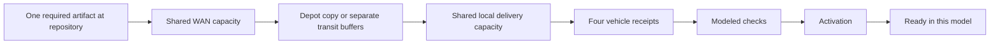

# FleetLab next design specification: one update, four vehicles

October 10, 2026 · Design for feedback · NF-04 is not implemented by this document.

## Decision and continuity

Build **NF-04: “One update. Four vehicles. Where is the wait?”** after the October 10 NF-03 visual release. Start with repeated download versus a cold shared cache; introduce preloading as a second question with its earlier work visible. Keep Home, Explore and About & limits, all existing lessons, the optional film, Fleet day, Street lab and City Explorer. Austin expansion remains paused.

This specification incorporates the owner's October 10 visual brief and the inspected NF-03 implementation. The accompanying `FLEETLAB_VISUAL_EXPERIENCE_HANDOFF_2026-10-10.md` records what actually shipped. Nothing here converts an analytical calculation into an executed result or clears SF's qualification hold.

**Product promise:** visitors can see what work is required, which resource or prerequisite is holding a vehicle, what changes between two choices, and what the result does not establish.

**Why this belongs in Network Flows:** a fleet's available service depends on a network of work and constrained resources. Software delivery gives a concrete example of shared-object reuse, upstream versus local capacity, prerequisite ordering and readiness deadlines. It is a bounded resource-flow lesson, not a min-cost-flow optimizer or a reconstruction of any operator's infrastructure.

## What a visitor should learn

| Visitor question | Mechanism to expose | Useful professional takeaway |
|---|---|---|
| Why download the same object four times? | Unique artifact identity versus independent transfer identity | Engineering: identify reusable work before changing a scheduler |
| Why is a downloaded vehicle still waiting? | Receipt → modeled checks → activation → ready | Product: define the actual completion criterion |
| Does a cache solve every delay? | Separate WAN and local shared capacities | Operations: identify the remaining bottleneck |
| Is a preloaded cache free? | Work before arrival and a separate accounting window | Fleet management: evaluate availability and resource use together |
| What should a depot partner provision? | Arrival/work distributions, useful link rates, local capacity and deadlines | Partnerships: request measurements before sizing a real facility |
| Did every vehicle benefit? | Per-vehicle status and full denominators | Reviewers: inspect exceptions and unfinished work, not only an average |

No real demand, fares, revenue, trip counts, injury rates, remote guidance rates or driving-safety outcomes are inferred. Monetary estimates require viewer-supplied unit prices and an explicit cost model in a later phase.

## Experience and visual language

The hosted route is provisionally `/network-flows/software-delivery/`. Explore will contain one card, labelled as an interactive synthetic model only after its implementation passes acceptance. Until then, avoid a dead “Run” button or a badge implying accepted results.

Use the existing ivory background, forest text and teal accent. Body copy is about 18 px; readable labels are at least 14 px. Controls target 44 px. Keep one question, one short scope line and one primary action above the first phone fold. Assumptions and exact records remain one disclosure away.

The desktop bench uses two aligned panels with a single time axis. Each panel has a repository, WAN connection, clearly named depot storage, local connection and four parked vehicle symbols. Distinguish **reusable cache** from **non-reusable transit buffers** in words. Cars do not travel along invented routes.

Dependency lines show logical order. Rate bars encode quantities on the same physical scale in both panels. Directional dots may move only while an accepted record shows positive transfer; their speed is illustrative, never a packet trace or throughput scale. Energy and driving are out of this lesson's mechanism.

On phones, show one selected arm with a Base/Comparison switch. Keep both final outcome summaries, the shared clock and the selected vehicle visible near the switch. Changing the visible arm, screen size or vehicle never runs a model or resets the clock. A text inspector always answers **“Why is this vehicle waiting?”** with the blocking task, remaining useful bytes or task time, current allocation and required next step.

Playback begins only after an explicit action. Provide Play/Pause, Restart, previous/next event, speed and keyboard-operable time scrubbing. Pause when hidden, on navigation, after editing inputs, and when reduced motion is enabled. Reduced motion presents steps and exact tables; it does not hide the explanation. Do not automatically loop or announce every frame.

## The first comparison and its storyboard

Default comparison: **four repeated downloads versus one cold shared cache**. Both begin with no useful depot copy, serve the same four requests and require the same artifact. Preloaded inventory is deliberately not the default control.

The figures below are **analytical fixture expectations**, not published simulation measurements.

| Shared simulated time | Cold cache | Repeated download | Narration |
|---:|---|---|---|
| 0 s | One WAN transfer begins | Four independent WAN transfers begin | Same required object and four consumers; different upstream work |
| 96 s | 12 GB cached; local delivery begins | 12 of 48 GB transferred in aggregate | Reuse removes repeated WAN work |
| 288 s | All four receive the object; checks begin | WAN transfer continues | Receipt is not readiness |
| 348 s | Checks pass; activation begins | WAN transfer continues | Required tasks remain separate |
| 378 s | Four ready in this model | 47.25 of 48 GB WAN transferred | The consequence is readiness timing |
| 384 s | Already ready | WAN complete; local delivery starts | Local work was not eliminated |
| 480 s | 4/4 ready by the target | 0/4 ready; 24/48 GB locally delivered | Evaluate both arms at the same deadline |
| 576 s | Already ready | Receipt complete; checks begin | Local delivery totals match |
| 636 s | Already ready | Checks pass; activation begins | Readiness still waits on activation |
| 666 s | Already ready | Four ready in this model | Inspect the entire completion path |

Offer a six-stop guided explanation: 0, 96, 288, 378, 480 and 666 seconds. All ten boundaries remain in the event table and previous/next-event navigation. Guided explanatory holds are not proportional durations. Continuous playback at 30× takes 22.2 seconds to reach 666 seconds; display that speed and the simulated clock.

After verified implementation, a supported conclusion would be: “In this fixture, shared caching uses 36 GB less WAN traffic and completes all four readiness chains 4 minutes 48 seconds earlier. Local delivery stays at 48 GB in both arms.” Do not generalize this to real fleet savings.

## Proposed frozen protocol

| Input | Candidate value |
|---|---|
| Requests | V1–V4, arrival at 0, identical required artifact identity, version and digest |
| Object size | 12,000,000,000 bytes; decimal GB |
| WAN useful capacity | 1 Gbit/s = 125,000,000 bytes/s aggregate |
| Local useful capacity | 2 Gbit/s = 250,000,000 bytes/s aggregate; same per-vehicle maximum |
| Allocation | Equal share over eligible transfers, deterministic remainder order by transfer ID |
| Transfer dependency | Complete-file store-and-forward; no local transfer before the relevant full receipt |
| Transit storage | Repeated arm can hold 48 GB of non-reusable buffers; storage contention excluded |
| Shared cache | One 12 GB artifact; no eviction optimization or multiple-object replacement policy |
| Vehicle prerequisites | Independent modeled checks of 60 s, then independent activation of 30 s; energy already satisfied |
| Target | Ready at or before 480 s counts as on time |
| Horizon | 2,400 s |
| Preload follow-on | Repository object available and fetch starts at −96 s; complete valid cache inventory at 0 |
| Accounting windows | Main [0, 2,400 s]; prefetch-inclusive [−96, 2,400 s] |

Freeze slot semantics before coding the engine. Proposed primary quantum is 1,000 ms; refinement is 250 ms. At each boundary: apply completions for the preceding slot, apply arrivals/inventory events, propagate zero-duration prerequisites, evaluate task eligibility, then allocate for the next half-open slot. Tasks becoming eligible at a boundary can receive the next slot's grant. There is no mid-slot reassignment. Work that finishes within a slot is recorded complete at its ending boundary. Readiness completion is processed before the inclusive deadline evaluation at the same boundary. The horizon permits completion events but starts no new service.

Use integer useful-byte counters. Convert capacity per quantum with explicit fractional-capacity carry; never silently round away capacity at every slot. Divide each resource's integer budget among eligible transfers with a stable order and declared per-transfer caps. Redistribution within the allocation decision and unused grant after early completion must be explicitly represented and independently checked. The exact engine contract must resolve this policy before fixture acceptance; no convenient accounting shortcut may change workload size.

Both arms must receive identical exogenous inputs. Primary comparisons use one quantum per pair. Report refinement differences for off-boundary arrivals and non-divisible sizes, including maximum completion-time difference and changed outcomes. Equality in the convenient base fixture is not a convergence proof.

## Records, verifiers and meaningful failures

Keep the existing boundary: contract → bounded engine → immutable record → independent verifier → accepted presentation projection → UI. The renderer consumes a shared accepted projection; it never recomputes verification, readiness or a winner score.

A versioned record needs scenario/model/policy/verifier identifiers; artifact and transfer IDs; request/vehicle IDs; initial inventory; time quantum and event ordering; grants and actual transferred bytes; task start/end/outcome; accounting windows; per-resource capacity and unused work; completion and horizon states; per-vehicle deadlines; and record/input digests. Bounds on requests, events, time horizon and bytes are part of input validation.

Maintain separate ledgers for:

1. **Unique required artifact bytes:** 12 GB in the default four-vehicle fixture.
2. **WAN transferred bytes:** repeated/cold/preloaded full-accounting totals 48/12/12 GB.
3. **Vehicle-local delivered bytes:** 48 GB in every default arm.
4. **Earlier inventory and work:** including obsolete objects and preload transfer, with no double counting.

Do not sum the two network ledgers and label the result “unique data.” Main-window zero WAN in a preloaded case must sit beside 12 GB before arrival and 12 GB for the full window.

| Condition | Correct behavior |
|---|---|
| Wrong cached version | Cache miss; retire obsolete object before replacement in this one-object model; preserve prior inventory accounting |
| V4 fails modeled checks | Valid failed outcome: show the other three vehicles; cold-cache on-time becomes 3/4; all-four readiness is not achieved |
| Pending at horizon | Keep the vehicle in denominators; null completion time; distinguish unfinished work from a completed late task |
| Independent verifier rejects record | Withhold accepted playback and derived success claims; retain previous accepted result clearly labelled if one exists |
| User edits while loading | Cancel stale job; mark old results “Previous setup”; replace atomically only after all new records are accepted |
| User cancels | Retain accepted data and time; do not display partially verified cells |

Modeled checks do not implement cryptographic signatures, anti-rollback, Uptane, actual software flashing or release authorization. Internally consistent records are not authenticated operator evidence.

## Acceptance matrix

| Fixture | Analytical all-ready expectation |
|---|---:|
| Four vehicles, repeated | 666 s |
| Four vehicles, cold cache | 378 s |
| Four vehicles, preloaded | 282 s after arrival; 378 s from prefetch start |
| One vehicle, repeated and cold | Both 234 s; no claimed reuse benefit |
| Four, cold, local link 0.25 Gbit/s | 1,722 s |
| Four, repeated, local link 0.25 Gbit/s | 2,010 s |

Require independent conservation checks, aggregate/per-transfer capacity checks, no service before arrival, no local receipt before WAN prerequisites, no readiness before successful tasks, unique completion, deadline ordering, exact horizon censoring, deterministic tie handling and repeated-record identity. Mutate grants, byte totals, inventory, task order, version/digest identities and timestamps to prove rejection. Do not share engine allocation helpers with the verifier.

UI acceptance covers invalid-record refusal, valid modeled-failure playback, pending/previous-state labels, stale completion, pure playback/seek/select/resize, common-scale rate marks, keyboard and touch targets, reduced/hidden motion and all four vehicles' outcomes. Measure cold load and compare latency on the actual tested device. Keep automated phone viewport evidence separate from physical Pixel, Safari, screen-reader and novice comprehension reviews.

## Delivery, assets and cost of fidelity

Reuse the small HTML/SVG bench approach from NF-03. The next route remains hosted-only; NF-01/NF-02 and all existing offline lessons are preserved. Offline maximum stays **2,621,440 bytes**, with **50,000 bytes reserved**. NF-04 route-local JS/CSS/fixtures target at most **350 KiB uncompressed**, excluding unchanged shared dependencies and media. Report both emitted size and measured transferred size; do not silently raise caps.

Blender is optional for an original still or a short setting shot. It does not become the simulation engine, and photorealism is not evidence of model adequacy. Prefer a small compressed poster with descriptive alternative text and a precise vector overlay. No generated text, topology, rate values or operator logos in the quantitative diagram. A video cannot replace keyboard controls or the inspectable record. Measure the asset's contribution separately and keep it out of the offline graph.

No new runtime backend, telemetry, paid API or 3D dependency is required for this lesson. MetaDrive or MuJoCo is warranted only when a later research question requires driving interactions or physical contact/actuation respectively; neither is needed to answer this resource-flow question.

## Proposed work packages

| Package | Deliverable | Exit |
|---|---|---|
| NF04-A | Contract, slot semantics, exact analytical fixtures and bounds | Review resolves accounting and event-order questions before engine work |
| NF04-B | Engine and independent verifier with negative fixtures | All six baseline fixtures and adversarial/censoring cases pass |
| NF04-C | Shared-clock two-arm bench and wait inspector | Same accepted record drives visual, table, time and export |
| NF04-D | Preload and wrong-version/failure counterexamples | Pre-window work and valid failed outcomes remain visible |
| NF04-E | Responsive/device review, source-bound packaging and release | Required automated gates, preview and production byte/header readback; human residuals explicit |

Later sequence: NF-05 availability and observation freshness; NF-06 true versus estimated work; NF-07 work classes and fairness; NF-09 downstream custody/acknowledgment; then NF-08 multiple depots and service planning. Introduce one uncertainty per study. Travel/service coupling needs its own calibrated or explicitly synthetic adapter rather than inferred miles-to-data or trips-to-revenue conversions.

Legacy queue reconciliation: **Q1** is broader painted-browser/device acceptance and remains partially complete; this release's targeted browser checks do not close all historical device/throttle/screen-reader items. **Q8** is the separate Scale-lab replay of one fleet-intake period and remains queued, not replaced by NF-03 playback. **N2** is the distinct finite-pickup/curb-study design with unresolved design gates; it is not NF-02 and is not implemented here. Source references are `CODEX_HANDOFF.md`, the Scale-lab September 27 handoff/design and the September 25–26 N2 design documents. SF map/source and human qualification and the stopped power study remain separate.

## Feedback prompt for ChatGPT or Fable

> Review this specification together with the October 10 implementation handoff and the current FleetLab capacity lesson. Distinguish what you actually opened from what the documents report. Judge whether a first-time visitor can explain the resource constraint and the difference between receipt and readiness. Review the two-arm default, mobile arm switch, wait inspector, pre-window accounting, slot semantics and failed-outcome handling. Find misleading visual encodings or unsupported operator claims. Separate must-fix correctness issues from optional visual refinements. For each finding, cite the screen, control or specification section; describe its visitor consequence; suggest the smallest effective change and an acceptance test. Do not propose additional cities, a large platform rewrite or physical driving simulation unless the question cannot be answered with this bounded model. No access to accounts or private operator data is required.

Feedback priorities: (1) is cold-cache versus repeated work a fair first comparison; (2) which first-screen words or visual elements can be removed; (3) can the phone view preserve a real comparison; (4) is the preload accounting comprehensible; (5) are any event/byte semantics still ambiguous; (6) does the AV relevance remain credible without implying proprietary knowledge?

## Recommendation

Proceed with NF04-A after feedback, retaining a small deterministic implementation and a visible causal explanation. Review the quantitative contract before adding artwork.

## Top risks + mitigations

- Cache benefit overstated → one-vehicle and slow-local-link counterexamples; full-window WAN accounting.
- Attractive motion conceals missing work → one accepted record, exact ledgers, task inspector and no-motion table.
- Synthetic checks mistaken for deployment assurance → separate modeled outcome, record validity, authenticity and permission.
- Scope expansion delays the lesson → ship the bounded two-arm lesson before multi-depot optimization or 3D scenes.

## Next 3 actions

1. Obtain one focused design review with the prompt above and prioritize findings by visitor consequence and correctness.
2. Resolve the proposed allocation/remainder and boundary rules, then freeze the NF-04 fixtures and independent-verifier criteria.
3. Implement and validate the record pipeline before connecting playback; publish only after the source-bound release checks.
